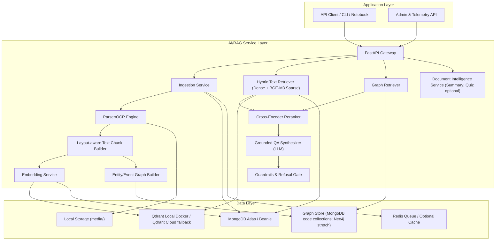
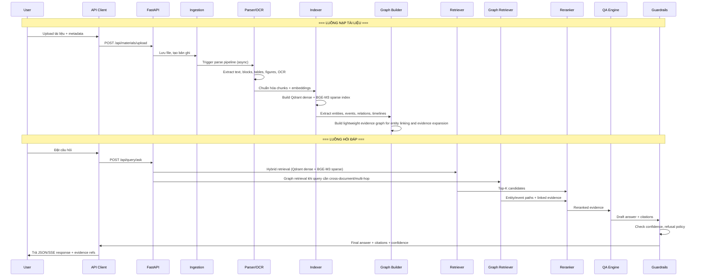
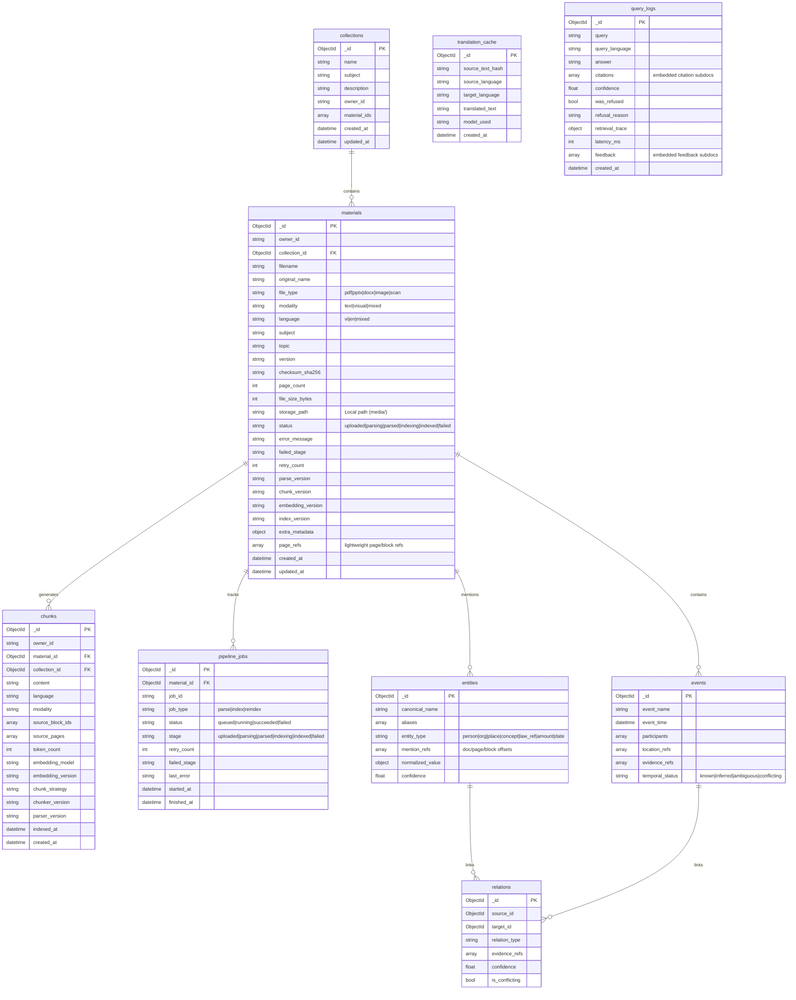
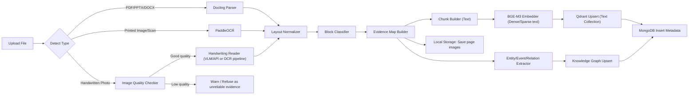
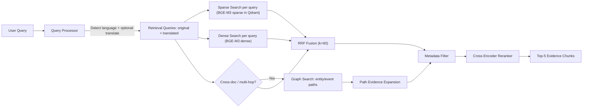

# KẾ HOẠCH TRIỂN KHAI: AGENTBOOK
## Graph RAG Document Intelligence for Cross-Document Reasoning

> [!IMPORTANT]
> Đây là kế hoạch triển khai chi tiết cho đồ án. Vui lòng review và phê duyệt trước khi bắt đầu code.

---

## 1. TỔNG QUAN DỰ ÁN

**Tên hệ thống**: `AgentBook` — Trợ lý Tri thức Tài liệu dùng Graph RAG  
**Mục tiêu**: Xây dựng nền tảng document intelligence grounded cho **hỗ trợ học tập tổng quát**, xử lý đa dạng tài liệu liên quan đến học tập (PDF, DOCX, PPTX, ảnh scan, ảnh chụp bài tập/ghi chú viết tay rõ nét, bảng tính đơn giản, infographic), hỗ trợ nguồn song ngữ EN-VI, trả lời bằng tiếng Việt kèm citation và evidence trace có cấu trúc. Điểm khác biệt chính là lớp **Graph Retrieval / Cross-Document Reasoning** để xử lý truy vấn phức tạp trên nhiều tài liệu có quan hệ chặt chẽ như giáo trình, slide bài giảng, đề cương, đề thi, bài tập, lời giải, ghi chú, handout, paper khoa học, luận văn, báo cáo kỹ thuật và bộ học liệu nhiều chương.

### 1.1. Định vị bài toán hỗ trợ học tập tại Việt Nam

AgentBook nên được trình bày như một hệ thống giải quyết bài toán tài liệu học tập thực tế tại Việt Nam, nơi dữ liệu thường ở trạng thái **PDF scan chất lượng không đồng đều, slide/giáo trình nhiều định dạng, ảnh chụp bài tập, đề thi, ghi chú cá nhân, thuật ngữ chuyên ngành song ngữ, công thức/bảng/hình nhiều, và thông tin phân tán qua nhiều nguồn**.

**Câu định vị demo:** AgentBook không chỉ là chatbot hỏi đáp tài liệu. Hệ thống tập trung vào trải nghiệm học tập thực tế: upload tài liệu lộn xộn, hỏi tiếng Việt trên nguồn tiếng Anh, xem mindmap tri thức, so sánh nhiều nguồn và kiểm chứng bài làm/claim bằng evidence có citation.

#### 1.1.1. Top 5 use case demo trọng tâm

Các use case dưới đây nên được viết theo kiểu có **Input / Output / Acceptance criteria** để dễ báo giá, chia task, test demo và bảo vệ trước hội đồng.

**UC1. Upload tài liệu học tập đa định dạng + ảnh viết tay rõ nét**

Input:
- `collection_id` hoặc thông tin tạo collection mới, ví dụ `Machine Learning`.
- File upload: 1 slide PDF tiếng Anh, 1 notes/giáo trình tiếng Việt, 1 ảnh bài tập hoặc ghi chú viết tay rõ nét.
- Metadata cơ bản: `subject`, `topic`, `source_type`, `owner_id`.

Output:
- `material_id`, `collection_id`, `status`, `job_id`.
- Parse/index status theo stage: `uploaded`, `parsing`, `parsed`, `indexing`, `indexed`, `failed`.
- Metadata/chunks/evidence refs đã lưu, gồm page/block/bbox/snippet khi có.
- Với ảnh viết tay: `image_quality_score`, `handwriting_confidence`, warning/refusal nếu không đủ rõ.

Acceptance criteria:
- Hệ thống nhận đúng file trong allowlist và reject file ngoài allowlist hoặc quá dung lượng.
- PDF/DOCX/PPTX/scan chữ in được parse/OCR và index vào đúng collection.
- Ảnh viết tay rõ nét đi qua `image_quality_checker.py` và `handwriting_reader.py`, không bị xử lý mặc định như scan chữ in.
- Ảnh mờ/nghiêng/tối/bóng hoặc confidence thấp phải trả cảnh báo/refusal, không lưu làm evidence chính.
- Pipeline status và lỗi job có thể xem lại qua API.

**UC2. Hỏi tiếng Việt trên tài liệu tiếng Anh + citation**

Input:
- `collection_id`.
- User query tiếng Việt, ví dụ: "Dropout giúp giảm overfitting như thế nào?"
- Tài liệu nguồn tiếng Anh đã index.

Output:
- `answer` tiếng Việt.
- `answer_language`, `query_language`, `translated_query`, `source_languages`.
- `citations[]` gồm `document_name`, `page`, `block_id`, `snippet_original`, `snippet_translated?`, `confidence`.

Acceptance criteria:
- Hệ thống trả lời bằng tiếng Việt.
- Ít nhất 1 citation trỏ về snippet tiếng Anh gốc.
- Citation giữ đúng document/page/block và không thay snippet gốc bằng bản dịch.
- Nếu evidence không đủ hoặc top reranker score dưới ngưỡng, hệ thống từ chối thay vì bịa.
- API latency mục tiêu: dưới 15 giây với corpus demo nhỏ 3-5 tài liệu khi dùng local LLM; dưới 8 giây khi dùng API fallback.

**UC3. Mindmap / Knowledge Graph từ bộ tài liệu**

Input:
- `collection_id` hoặc `material_id`.
- Tùy chọn `root_topic`, ví dụ `Regularization`.
- Tài liệu đã parse/index và có chunks/entities cơ bản.

Output:
- `nodes[]`, `edges[]`, `root_topic`, `evidence_refs[]`.
- Mỗi node chính có `label`, `type`, `summary`, `citations[]`.
- UI React Flow hiển thị graph/mindmap; click node mở evidence panel.

Acceptance criteria:
- Sinh được mindmap/graph tối thiểu với node trung tâm và các nhánh chính như `L1`, `L2`, `Dropout`, `Early Stopping`, `Overfitting`.
- Click node hiển thị explanation ngắn và citation/evidence liên quan.
- Có expand/collapse cơ bản hoặc giới hạn depth để graph không rối.
- Không yêu cầu Neo4j; MongoDB edge collections và JSON node-edge là đủ cho MVP.

**UC4. So sánh nhiều tài liệu / Cross-document reasoning**

Input:
- `collection_id` hoặc `material_ids[]`.
- Query so sánh, ví dụ: "So sánh cách slide và giáo trình giải thích regularization."
- Tùy chọn `dimensions[]`, ví dụ `definition`, `intuition`, `example`, `limitation`.

Output:
- Bảng so sánh dạng `comparison_table[]`.
- Mỗi ô có `value`, `source`, `citation`, `confidence`.
- Danh sách `conflicts[]` nếu các nguồn nói khác nhau.

Acceptance criteria:
- Trả về bảng có ít nhất 2 nguồn được so sánh khi evidence tồn tại.
- Mỗi ý quan trọng trong bảng phải có citation.
- Nếu một nguồn không có thông tin, ô tương ứng ghi rõ "không tìm thấy evidence" thay vì suy diễn.
- Hệ thống nêu được khác biệt/mâu thuẫn chính giữa slide, giáo trình, paper nếu evidence hỗ trợ.

**UC5. Kiểm chứng claim sai và kiểm tra bài làm/ảnh lời giải viết tay**

Input:
- `collection_id`.
- Nhánh A: claim của user, ví dụ "Theo slide, Dropout làm validation error tăng đúng không?"
- Nhánh B: ảnh lời giải viết tay rõ nét + câu hỏi "Tôi sai ở bước nào?"

Output:
- Với claim: `verdict`, `corrected_facts[]`, `citations[]`, `confidence`, `was_refused`.
- Với bài viết tay: các bước đọc được, bước nghi ngờ sai, evidence từ tài liệu liên quan, warning/refusal nếu ảnh/evidence không đủ.

Acceptance criteria:
- Claim sai phải bị bác bằng evidence, không trả lời theo tiền đề sai.
- Với ảnh viết tay, hệ thống chỉ đánh giá khi quality/confidence đủ ngưỡng.
- Nếu không đọc rõ ảnh hoặc tài liệu không có căn cứ đối chiếu, hệ thống phải refusal/cảnh báo không đủ bằng chứng.
- Câu trả lời phải có citation về tài liệu gốc khi đưa ra kết luận học thuật.

**Không đưa vào top 5 demo ăn tiền:** Audio overview, quiz/flashcard hoàn chỉnh, QLoRA fine-tune, Neo4j nâng cao, agent ReAct tự chọn tool, Excel/CSV phức tạp và Auto-Suggested FAQs. Các mục này có thể giữ là stretch/future work nhưng không nên làm loãng demo chính.

> [!NOTE]
> Ảnh bài tập/ghi chú viết tay chỉ nằm trong MVP ở mức **rõ nét, có confidence gate và có refusal khi không đủ chắc**. Không cam kết xử lý production cho chữ viết tay mờ, nghiêng, bóng, công thức quá phức tạp hoặc lời giải nhiều bước không có cấu trúc.

### 1.2. Tổng hợp repository RAG tham khảo cho AgentBook

> [!IMPORTANT]
> Phần này tích hợp từ tài liệu khảo sát repository do nhóm biên soạn, dùng làm cơ sở chọn stack cho đề tài Graph RAG tài liệu đa nguồn tiếng Việt. Mốc tham chiếu: tình trạng repo và mô tả chính thức trên GitHub vào tháng 4/2026.

Mục tiêu của phần khảo sát này không phải tìm một repo "làm được tất cả", mà để tách rõ từng lớp năng lực trong pipeline:
- Parsing tài liệu
- Retrieval và reranking
- Orchestration, verification, refusal
- Multimodal document understanding
- Production-readiness
- Mức độ phù hợp với tiếng Việt

#### 1.2.1. Định hướng sử dụng nhanh

| Nhóm vai trò | Repo nên ưu tiên học | Điểm hay nên học | Không nên kỳ vọng quá mức |
|:---|:---|:---|:---|
| **Nền tảng full pipeline** | `RAGFlow` | Ingestion, document QA, citation, quản trị knowledge base, triển khai tương đối nhanh | Không nên xem như lời giải duy nhất cho mọi use-case đặc thù |
| **Retrieval core** | Retrieval core tự viết, tham khảo `LlamaIndex` | Indexing, retrievers, query pipeline, extraction, node structure | Không đưa `LlamaIndex` làm dependency chính của MVP nếu project tree đang tự quản lý `retriever.py`, `vector_store.py`, `reranker.py` |
| **Workflow và guardrails** | `LangChain` / `LangGraph` | Orchestration, tool calling, verifier, refusal, multi-step flow | Không phải lớp parse hoặc OCR cốt lõi |
| **Parsing tài liệu** | `Docling`, `Unstructured` | Giữ layout, tables, figures, blocks, metadata mapping | Không tự giải quyết grounding và answer verification |
| **Học kỹ thuật nâng cao** | `rag_techniques` | Chunking, rerank, fusion, query rewrite, evaluation | Không phải framework production-ready hoàn chỉnh |
| **Tham khảo tiếng Việt** | `vnpr-rag`, `retrieval-backend-with-rag`, `Vietnamese-Law-Question-Answering-system` | Baseline tiếng Việt, embedding/rerank/eval, use-case nội địa | Không đủ thay thế framework lõi quốc tế cho enterprise multimodal |

#### 1.2.2. Danh sách 10 repository cần đọc

| Repo | Vai trò chính | Parsing | Retrieval | Orchestration | Multimodal | Production-ready | Phù hợp tiếng Việt |
|:---|:---|:---|:---|:---|:---|:---|:---|
| [`infiniflow/ragflow`](https://github.com/infiniflow/ragflow) | Nền tảng RAG full pipeline | Khá mạnh | Mạnh | Khá mạnh | Khá | Rất mạnh | Khá |
| [`NirDiamant/rag_techniques`](https://github.com/NirDiamant/rag_techniques) | Kho tài liệu kỹ thuật RAG | Thấp | Rất mạnh | Trung bình | Thấp đến trung bình | Thấp | Gián tiếp |
| [`run-llama/llama_index`](https://github.com/run-llama/llama_index) | Retrieval core và query pipeline | Khá | Rất mạnh | Khá mạnh | Khá mạnh | Mạnh | Khá |
| [`langchain-ai/langchain`](https://github.com/langchain-ai/langchain) | Orchestration và workflow | Thấp | Khá | Rất mạnh | Khá | Mạnh | Khá |
| [`Unstructured-IO/unstructured`](https://github.com/Unstructured-IO/unstructured) | ETL và preprocessing tài liệu | Mạnh | Thấp | Thấp | Khá | Khá mạnh | Khá |
| [`docling-project/docling`](https://github.com/docling-project/docling) | Parser tài liệu layout-aware | Rất mạnh | Thấp đến trung bình | Thấp | Mạnh | Khá mạnh | Khá |
| [`HKUDS/RAG-Anything`](https://github.com/HKUDS/RAG-Anything) | Multimodal RAG all-in-one | Khá mạnh | Khá mạnh | Khá | Rất mạnh | Trung bình | Khá |
| [`khangnguyenhuu/vnpr-rag`](https://github.com/khangnguyenhuu/vnpr-rag) | Baseline RAG tiếng Việt | Thấp đến trung bình | Khá | Trung bình | Thấp | Trung bình | Mạnh |
| [`bangoc123/retrieval-backend-with-rag`](https://github.com/bangoc123/retrieval-backend-with-rag) | Backend RAG và benchmark tiếng Việt | Thấp | Khá | Trung bình | Thấp | Trung bình | Mạnh |
| [`ngothanhnam0910/Vietnamese-Law-Question-Answering-system`](https://github.com/ngothanhnam0910/Vietnamese-Law-Question-Answering-system) | RAG domain-specific tiếng Việt | Trung bình | Khá | Trung bình | Thấp | Trung bình | Mạnh |

#### 1.2.3. Phân tích chi tiết từng repository

**1. RAGFlow**

Điểm mạnh:
- Rõ chất sản phẩm: có ingestion, knowledge base, query, citation và quản trị nguồn tri thức.
- Hợp cho document QA trên tài liệu doanh nghiệp dài, nhiều trang.
- Rất có giá trị nếu cần demo hoặc PoC nhanh mà không muốn tự lắp từng thành phần từ đầu.

Điểm hạn chế:
- Khi bài toán đi sâu vào verifier nhiều bước, structured extraction phức tạp hoặc refusal policy tùy biến mạnh, vẫn phải mở rộng riêng.
- Độ phức tạp vận hành cao hơn repo tutorial.
- Kém linh hoạt hơn stack ghép rời nếu muốn kiểm soát rất sâu từng bước parse, retrieve, rerank, verify.

Bài học nên lấy:
- Tư duy đóng gói RAG thành sản phẩm thực thụ thay vì notebook.
- Cách tổ chức knowledge base, workflow ingest và citation cho người dùng cuối.
- Cách chuyển từ "pipeline kỹ thuật" sang "hệ thống có thể vận hành và đánh giá".

Giá trị tham khảo cho AgentBook:
- Nên học mạnh phần product packaging, quản trị nguồn tri thức và quy trình hỏi đáp có citation.
- Không nên dùng làm backbone duy nhất nếu mục tiêu đề tài nhấn vào safe refusal, verification và tiếng Việt đa dạng.

**2. rag_techniques**

Điểm mạnh:
- Giải thích tốt các kỹ thuật retrieval, chunking, reranking, query rewrite, fusion và evaluation.
- Có giá trị sư phạm rất cao cho giai đoạn học và thiết kế thí nghiệm.
- Giúp tránh việc chọn kỹ thuật theo cảm tính.

Điểm hạn chế:
- Không phải framework production.
- Không tập trung vào vận hành, bảo mật, monitoring hoặc kiến trúc hệ thống lớn.
- Người mới dễ bị cuốn vào quá nhiều kỹ thuật mà chưa gắn với use-case thật.

Bài học nên lấy:
- Chỉ thêm kỹ thuật khi đo được cải thiện qua metric.
- Thiết kế ablation rõ ràng cho hybrid retrieval, reranking, chunking và refusal.
- Ưu tiên đo retrieval trước khi tối ưu generation.

Giá trị tham khảo cho AgentBook:
- Đây là repo nên đọc sớm để xây phần thực nghiệm và báo cáo khoa học.
- Không dùng trực tiếp làm xương sống hệ thống.

**3. LlamaIndex**

Điểm mạnh:
- Mạnh ở document representation, node structure, indexing, retrievers, response synthesis và query engine.
- Hệ sinh thái rộng, phù hợp khi muốn kiểm soát retrieval logic sâu.
- Hữu ích cho structured extraction và multi-source querying.

Điểm hạn chế:
- Dễ phức tạp nếu tận dụng quá nhiều abstraction cùng lúc.
- Không phải parser PDF scan/layout mạnh nhất nếu dùng riêng lẻ.
- Hệ sinh thái thay đổi nhanh, cần theo sát version và integration rules.

Bài học nên lấy:
- Phân tách rõ loader, node, retriever, synthesizer, evaluator.
- Xây retrieval core theo cấu trúc thay vì viết ad hoc.
- Giữ metadata tốt để phục vụ citation, filtering và downstream verifier.

Giá trị tham khảo cho AgentBook:
- Là nguồn tham khảo mạnh cho thiết kế retrieval core, node metadata và query engine.
- Không đưa vào dependency chính của MVP nếu project tree đang tự viết retrieval core; chỉ cân nhắc adapter sau khi core API ổn định.

**4. LangChain / LangGraph**

Điểm mạnh:
- Rất mạnh trong điều phối nhiều bước: retrieve, verify, rewrite, extract, refuse, draft.
- `LangGraph` đặc biệt hợp cho workflow có trạng thái, phân nhánh và recovery.
- Dễ gắn model, vector store, tool ngoài và business logic.

Điểm hạn chế:
- Nếu dùng thiếu kỷ luật, flow rất dễ rối và khó debug.
- Không phải parser tài liệu hay retrieval engine tốt nhất nếu đứng một mình.
- Có rủi ro agent hóa quá mức cho bài toán chỉ cần workflow RAG rõ ràng.

Bài học nên lấy:
- Biến verifier, policy gate và refusal thành node riêng.
- Tách orchestration khỏi parse/retrieval để dễ bảo trì.
- Chỉ dùng workflow nhiều bước cho khâu thực sự cần quyết định trạng thái.

Giá trị tham khảo cho AgentBook:
- Đây là lớp phù hợp nhất cho safe refusal, evidence verification và workflow beyond chatbot.

**5. Unstructured**

Điểm mạnh:
- Tốt cho ETL và preprocessing đa định dạng: PDF, HTML, DOCX, email, ảnh.
- Hữu ích cho ingestion pipeline rộng trong bối cảnh doanh nghiệp.
- Hỗ trợ chuẩn hóa dữ liệu trước khi chunk và index.

Điểm hạn chế:
- Không thay thế retrieval, grounding hoặc answer verification.
- Tài liệu layout quá khó vẫn cần tinh chỉnh hoặc parser khác.
- Chất lượng scan tiếng Việt vẫn phụ thuộc mạnh vào OCR engine.

Bài học nên lấy:
- Tách parsing/preprocessing khỏi retrieval.
- Đầu tư vào bước làm sạch và chuẩn hóa dữ liệu trước chunking.
- Thiết kế ingestion để chịu được nhiều định dạng file ngay từ đầu.

Giá trị tham khảo cho AgentBook:
- Nên tham khảo khi muốn mở rộng từ PDF tài liệu sang DOCX, HTML, email hoặc file hỗn hợp.

**6. Docling**

Điểm mạnh:
- Rất mạnh ở layout-aware parsing: heading hierarchy, tables, figures, page structure.
- Hợp cho bài toán evidence mapping từ answer về đúng trang, block, bảng hoặc hình.
- Tạo đầu ra sạch, giàu metadata cho downstream retrieval.

Điểm hạn chế:
- Không phải orchestration hay retrieval framework hoàn chỉnh.
- Muốn khai thác tốt cần hiểu kỹ schema đầu ra.
- Tài liệu scan tiếng Việt chất lượng thấp vẫn cần OCR và hậu xử lý nghiêm túc.

Bài học nên lấy:
- Giữ quan hệ giữa text, table, figure, page và section.
- Xây chunk theo layout thay vì cắt token thuần túy.
- Xem parser là nền của grounding chứ không chỉ là bước "extract text".

Giá trị tham khảo cho AgentBook:
- Đây là repo cần học sâu nhất ở tầng parsing.
- Rất phù hợp với mục tiêu evidence trace và citation đáng tin cậy.

**7. RAG-Anything**

Điểm mạnh:
- Định vị rõ là multimodal RAG all-in-one cho text, image, table, equation và document context.
- Có giá trị lớn ở góc nhìn kiến trúc multimodal thống nhất.
- Hữu ích để học cách không ép mọi modality về plain text quá sớm.

Điểm hạn chế:
- Hệ thống tham vọng lớn nên rủi ro tích hợp và bảo trì cao hơn.
- Độ production-ready cần kiểm chứng kỹ theo use-case thật.
- Khó nắm toàn bộ pipeline nếu mới bắt đầu.

Bài học nên lấy:
- Retrieval nên giữ thông tin bảng, hình, công thức và không gian tài liệu.
- Multimodal document understanding cần representation riêng cho từng modality.
- Kiến trúc all-in-one hữu ích để học, nhưng khi triển khai nên tách lớp rõ ràng.

Giá trị tham khảo cho AgentBook:
- Nên học như nguồn cảm hứng kiến trúc multimodal.
- Không nên chốt làm backbone duy nhất trước khi có benchmark nội bộ.

**8. VNPR-RAG**

Điểm mạnh:
- Gần bối cảnh tiếng Việt, giúp có baseline nhanh để chạy thử.
- Dễ tiếp cận hơn các framework lớn.
- Có ích khi quan sát lựa chọn embedding, retrieval và serving trong bối cảnh nội địa.

Điểm hạn chế:
- Hệ sinh thái và phạm vi nhỏ hơn nhiều so với các framework quốc tế.
- Không mạnh ở multimodal parsing, enterprise workflow hoặc verification nhiều tầng.
- Khả năng mở rộng cho use-case lớn còn hạn chế.

Bài học nên lấy:
- Dựng baseline tiếng Việt thực dụng càng sớm càng tốt.
- Đo hiệu quả retrieval nội địa trước khi đầu tư stack phức tạp.
- Tận dụng repo Việt như mốc so sánh thay vì thay thế lõi hệ thống.

Giá trị tham khảo cho AgentBook:
- Nên dùng làm baseline retrieval tiếng Việt và mốc báo cáo.

**9. retrieval-backend-with-rag**

Điểm mạnh:
- Backend RAG gọn, rõ, thực dụng.
- Phù hợp để học cách đo retrieval, reranking hoặc answer quality trong tiếng Việt.
- Dùng tốt như mốc đối chứng khi cần chứng minh hệ thống của mình tốt hơn baseline.

Điểm hạn chế:
- Phạm vi hẹp hơn framework lớn.
- Không nổi bật ở parsing tài liệu phức tạp hoặc multimodal grounding.
- Muốn có citation mạnh, verification và refusal vẫn phải bổ sung đáng kể.

Bài học nên lấy:
- Benchmark retrieval trước, trả lời sau.
- Giữ backend flow đơn giản, dễ debug, dễ đo.
- Dùng baseline nội địa để tăng sức thuyết phục cho phần thực nghiệm.

Giá trị tham khảo cho AgentBook:
- Rất hợp cho phần benchmark tiếng Việt và thiết kế thực nghiệm.

**10. Vietnamese-Law-Question-Answering-system**

Điểm mạnh:
- Gần với use-case tài liệu có tính quy định, cần căn cứ văn bản.
- Giúp học tư duy domain-specific RAG thay vì chatbot chung chung.
- Nhấn mạnh tính chính xác và hạn chế hallucination trong domain nhạy cảm.

Điểm hạn chế:
- Là repo use-case chuyên biệt, không thay thế được parser/retrieval stack tổng quát.
- Không mạnh ở multimodal enterprise documents như bảng, hình, slide.
- Một số quyết định kỹ thuật có thể tối ưu cho văn bản quy định hơn là tài liệu học tập - nghiên cứu.

Bài học nên lấy:
- Với domain nghiêm ngặt, evidence và refusal quan trọng không kém generation.
- Cần thiết kế policy theo domain thay vì dùng chung một prompt.
- Querying và data organization phải phản ánh cấu trúc văn bản nguồn.

Giá trị tham khảo cho AgentBook:
- Nên học ở góc độ policy, evidence và domain adaptation cho tiếng Việt.

#### 1.2.4. Kết luận kiến trúc rút ra cho AgentBook

Không có một repository nào bao phủ hoàn hảo toàn bộ bài toán multimodal RAG tiếng Việt. Kiến trúc phù hợp cho đồ án nên là kiến trúc ghép lớp, học đúng điểm mạnh lõi của từng repo:

| Lớp hệ thống | Chọn cho AgentBook | Học chủ yếu từ repo nào | Lý do |
|:---|:---|:---|:---|
| **Parsing/OCR** | `Docling` + OCR tiếng Việt phù hợp | `Docling`, `Unstructured` | Giữ layout, tables, figures, metadata và hỗ trợ dữ liệu doanh nghiệp đa định dạng |
| **Retrieval core** | Hybrid retrieval + reranker tự viết | `LlamaIndex`, `rag_techniques` | Học cấu trúc node/retriever/evaluator từ LlamaIndex, nhưng MVP tự viết core để dễ debug và khớp project tree |
| **Workflow/Verifier** | Stateful orchestration + refusal gate | `LangGraph`, `Vietnamese-Law-Question-Answering-system` | Tách node retrieve, verify, abstain, draft để kiểm soát hallucination |
| **Prototype nhanh** | Product packaging và knowledge-base workflow tham khảo | `RAGFlow` | Học cách biến pipeline thành hệ thống có luồng vận hành rõ ràng |
| **Baseline tiếng Việt** | Baseline retrieval và QA nội địa | `vnpr-rag`, `retrieval-backend-with-rag` | Làm đối chứng thực nghiệm cho báo cáo và tối ưu tiếng Việt |
| **Nâng tầm multimodal** | Representation cho bảng/hình/công thức | `RAG-Anything` | Tham khảo kiến trúc retrieval đa phương thức thay vì text-only |

Khuyến nghị chốt stack cho đồ án hiện tại:
- `Docling` làm parser chính cho PDF/PPTX/DOCX và các bảng tính Excel/CSV có cấu trúc.
- `PaddleOCR` làm OCR engine cho scan/chữ in (tối ưu cho máy cá nhân, chạy ổn trên CPU).
- Ảnh bài tập/ghi chú viết tay rõ nét đi qua `image_quality_checker.py` và `handwriting_reader.py`; có thể dùng VLM/API fallback hoặc handwriting OCR pipeline riêng, bắt buộc confidence gate trước khi lưu làm evidence.
- Retrieval MVP chốt theo hướng **Qdrant dense vector + BGE-M3 sparse vector + cross-encoder reranker**; MongoDB chỉ giữ metadata/filter/log và Atlas Search chỉ là fallback phụ nếu thật sự cần.
- FastAPI service flow là mặc định cho MVP; `LangGraph` chỉ dùng cho verifier/refusal loop nếu thật sự cần stateful branching. Quiz là stretch goal.
- Dùng repo Việt Nam làm baseline so sánh, không dùng làm backbone cuối.

> [!NOTE]
> `LlamaIndex` được dùng như tài liệu tham khảo kiến trúc, không phải dependency chính của MVP. Project tree hiện tại chọn hướng tự viết retrieval core (`retriever.py`, `vector_store.py`, `reranker.py`, `query_processor.py`, `indexer.py`) để kiểm soát rõ dense/sparse search, RRF fusion, metadata filter và evidence trace.

### 1.3. Tổng quan các chức năng cốt lõi (Core Features)

Nhìn từ góc độ năng lực hệ thống, AgentBook được cấu thành từ 4 mảng module chức năng chính:

**1. Module Quản trị Tài liệu Tri thức (Document Knowledge Management)**
- Cho phép người dùng upload đa định dạng tài liệu học tập/nghiên cứu (PDF, DOCX, PPTX, ảnh scan, ảnh chụp bài tập/ghi chú viết tay rõ nét, XLS/CSV đơn giản).
- Tự động bóc tách (OCR, Parsing) và giữ nguyên cấu trúc phân cấp (Tiêu đề, Bảng biểu, Hình ảnh, Công thức Toán học).
- Tổ chức không gian nguồn tri thức theo collection/môn học/chủ đề/chương/bài/loại tài liệu/tác giả/giảng viên.

**2. Module WorkSpace & RAG (Trợ lý Hỏi đáp Đa phương thức)**
- **Grounded QA API**: Hỏi đáp grounded bằng tiếng Việt, trả về full response trước trong MVP; streaming SSE là tối ưu hậu MVP.
- **Source-Bounding**: API nhận `material_ids`, `collection_id` hoặc metadata filters để chỉ trả lời trong phạm vi nguồn được chọn, giảm nhiễu từ môn học, chương, bài, đề thi hoặc bộ tài liệu không liên quan.
- **Cross-Document Graph Retrieval**: Truy xuất cùng một thông tin từ nhiều file, liên kết khái niệm/công thức/phương pháp/bài tập/chủ đề/tác giả/mốc thời gian thành đồ thị tri thức để trả lời câu hỏi cần nhiều bước suy luận.
- **Entity & Event Reasoning**: Hiểu quan hệ giữa khái niệm, công thức, ví dụ, bài tập, kết quả và nguồn tài liệu; phát hiện khi người dùng nhầm thuật ngữ, nhầm công thức, nhầm số liệu hoặc đặt câu hỏi dẫn dắt trái với tài liệu.
- **Evidence Trace & Citation**: Mọi câu trả lời của AI đều bắt buộc trả về minh chứng có cấu trúc gồm `doc_id`, `page`, `block_id`, `bbox`, `snippet`, confidence và graph trace nếu có.
- **Contradiction & Refusal Gate**: AI tự động từ chối "Tôi không biết" nếu câu hỏi nằm ngoài luồng, đồng thời cảnh báo khi claim của người dùng mâu thuẫn với evidence hoặc không tồn tại trong corpus.

**3. Module Document Intelligence mở rộng**
- **Mindmap / Knowledge Graph View**: Sinh topic graph từ collection và cho phép click node để xem explanation + citation/evidence.
- **Summary / Study Guide**: Tóm tắt grounded và sinh study guide ngắn từ tài liệu/collection để hỗ trợ đọc nhanh và làm nền cho mindmap; đây là chức năng phụ, không phải top 5 demo chính.
- **Audio Overview (Podcast, stretch goal)**: Định hướng chuyển tóm tắt văn bản thành file ghi âm (MP3) nếu còn thời gian.
- **Auto-Quiz / Flashcard**: Quiz/flashcard hoàn chỉnh là stretch goal sau khi summary/study guide grounded ổn định.
- **Document Intelligence Pack**: Tóm tắt toàn bộ bộ tài liệu, tóm tắt tài liệu cụ thể, trích xuất timeline, chuẩn hóa thông tin rải rác thành bảng và so sánh nhiều tài liệu theo cùng một tiêu chí.

**4. Module Quản trị Hệ thống (Admin & Telemetry)**
- **Telemetry API**: Endpoint thống kê lưu lượng câu hỏi, số lượng tài liệu, trạng thái parse/index và lỗi pipeline.
- **Log Metrics**: Nhật ký truy vết các truy vấn không thành công, thời gian trễ (Latency) và phản hồi Feedback đánh giá (Like/Dislike) từ người dùng.

### 1.4. Phân định phạm vi MVP và Stretch Goal

| Nhóm năng lực | MVP bắt buộc | Stretch goal nếu còn thời gian |
|:---|:---|:---|
| **Ingestion** | PDF/PPTX/DOCX + scan/in máy cơ bản + ảnh bài tập/ghi chú viết tay rõ nét có confidence gate, evidence trace theo page/block/bbox | Ảnh viết tay mờ/nghiêng/phức tạp, Excel/CSV phức tạp, công thức toán nâng cao |
| **Retrieval** | Qdrant dense + BGE-M3 sparse + reranker | Visual document retrieval bằng `jina-clip-v2` hoặc ColPali late-interaction |
| **Graph Retrieval** | Lightweight evidence graph bằng MongoDB edge collections, entity linking và path evidence expansion | Neo4j traversal, graph visualization / path explorer, graph explainability nâng cao |
| **Reasoning** | Cross-document compare, timeline, false-premise detection ở mức rule + LLM verifier | Planner ReAct nhiều vòng và agent tự chọn tool hoàn toàn |
| **Generation** | Grounded answer + citation + refusal | QLoRA LLM format tuning |
| **Learning utilities** | Summary grounded | Quiz, flashcard, audio overview |
| **Client** | Upload/status + chat/citation + evidence viewer + mindmap/graph demo bằng React Flow | Giao diện hoàn chỉnh |

### 1.5. Chiến lược Compute-local, Storage-hybrid

Do phần cứng local hạn chế, plan không ép toàn bộ hệ thống chạy offline 100%. Mục tiêu là **compute local nhiều nhất có thể**, còn storage và hạ tầng nặng dùng mô hình hybrid để đảm bảo đồ án hoàn thành đúng tiến độ. Cách gọi này tránh gây hiểu nhầm rằng mọi dữ liệu và dịch vụ đều phải self-host hoàn toàn trên máy cá nhân.

| Thành phần | Mặc định ưu tiên | Khi phần cứng local không đủ |
|:---|:---|:---|
| **Backend API** | FastAPI chạy local | Không cần cloud |
| **Redis / Queue** | Redis Docker local | Giảm worker concurrency nếu máy yếu |
| **Vector Store** | Qdrant Docker local cho corpus nhỏ | Qdrant Cloud nếu vector/image index quá nặng |
| **Document DB** | MongoDB Atlas | Giữ Atlas để tránh tốn RAM/disk và lỗi setup Mongo local |
| **File Storage** | Local filesystem `media/`, `data/processed` | Không dùng MinIO trong MVP |
| **LLM trả lời** | Local Ollama/Qwen/Llama quantized nếu chạy được | API fallback Gemini/OpenAI-compatible khi local quá chậm |
| **Embedding/OCR batch** | Local cho corpus nhỏ | Colab/Kaggle cho OCR/embedding/fine-tune batch |
| **Fine-tune / QLoRA** | Không bắt buộc local | Chỉ chạy Kaggle/Colab nếu đủ thời gian và GPU |

---

## 2. KIẾN TRÚC HỆ THỐNG

### 2.1. Tổng quan kiến trúc 3 lớp



### 2.2. Luồng End-to-End



---

## 3. TECH STACK CHI TIẾT

### 3.1. Backend (Python)

| Thành phần | Công nghệ | Lý do chọn |
|:---|:---|:---|
| **API Framework** | FastAPI | Hợp nhất với Python AI pipeline, dễ viết API, dễ nối OCR/embedding/RAG. |
| **Task Queue** | Celery + Redis | Cần để xử lý file nặng ở background. Background nghĩa là chạy ngầm, không làm API bị đứng. |
| **Document Parser** | Docling | Tối ưu nhất cho PDF/DOCX/PPTX vì nó xử lý layout, bảng, reading order, công thức, hình ảnh và xuất Markdown/JSON có cấu trúc. |
| **OCR Engine** | PaddleOCR | Chỉ dùng cho scan/chữ in: slide scan, giáo trình scan, đề bài in máy, bảng/caption rõ chữ. Tối ưu cho máy không GPU mạnh và chạy CPU ổn. |
| **Handwriting Understanding** | VLM/API fallback hoặc handwriting OCR pipeline riêng | Dùng cho ảnh bài tập/ghi chú viết tay rõ nét. Không giả định PaddleOCR xử lý tốt chữ viết tay; luôn chạy qua image quality check và confidence gate trước khi dùng làm evidence. |
| **Multimodal Embedding** | Không dùng trong MVP | Đưa `jina-clip-v2` hoặc ColPali xuống stretch goal để tránh phải thiết kế image vector collection, image-text fusion, evidence viewer và visual retrieval evaluation quá sớm. |
| **Text Embedding** | BAAI/bge-m3 | Chọn duy nhất cái này vì nó hỗ trợ đa ngôn ngữ, dense retrieval, sparse retrieval và văn bản dài. Dense retrieval là tìm theo ngữ nghĩa; sparse retrieval là tìm theo từ khóa. |
| **Reranker** | BAAI/bge-reranker-v2-m3 | Hợp nhất với bge-m3, mạnh cho đa ngôn ngữ. Reranker là bước xếp hạng lại tài liệu đã tìm được để chọn đoạn đúng nhất. |
| **LLM Generation** | Qwen3 4B qua Ollama | Cân bằng tốt nhất giữa chạy local và chất lượng. Qwen3 có nhiều size nhỏ như 0.6B, 1.7B, 4B, 8B…, phù hợp máy cá nhân hơn các model lớn. |
| **Vector Store** | Qdrant | Tối ưu cho RAG vì hỗ trợ hybrid search: kết hợp vector ngữ nghĩa và sparse/từ khóa trong cùng hệ thống. |
| **Graph Retrieval** | MongoDB edge collections | Giảm hạ tầng ban đầu; graph trong MVP là evidence graph hỗ trợ retrieval, không xem là knowledge graph tuyệt đối. |
| **Information Extraction** | LLM structured extraction | Trích xuất khái niệm, phương pháp, mô hình, dataset theo schema. |
| **Document DB** | MongoDB + Beanie | Tối ưu cho tài liệu vì lưu JSON/chunk/entity linh hoạt hơn SQL trong giai đoạn đầu. |
| **File Storage** | Local File System | Tối ưu chi phí, dễ demo, không cần S3/Cloud sớm. |
| **Task Broker** | Redis 7 | Message broker cho Celery queue. |
| **Evaluation** | Custom retrieval metrics + RAGAS | Retrieval dùng Recall@k/MRR/nDCG và ablation trước; RAGAS chỉ hỗ trợ đánh giá faithfulness, answer relevancy, context precision. |
| **Notebooks** | Jupyter local + Colab/Kaggle | Môi trường test và xử lý data. |

> [!TIP]
> **Tại sao MongoDB Atlas vẫn giữ dù ưu tiên local?**
> - Đây là ràng buộc thực tế do phần cứng local hạn chế: tránh phải chạy thêm MongoDB container nặng cùng lúc với Qdrant, Redis, OCR và LLM.
> - Free tier 512MB đủ cho giai đoạn MVP nếu corpus được giới hạn và page images lưu ở filesystem, không nhét vào MongoDB.
> - **Flexible schema**: Mỗi loại block (table, figure) có fields khác nhau. Hỗ trợ **Nested documents** cho evidence map.
> - **Atlas Text Search**: Chỉ giữ như fallback phụ hoặc công cụ kiểm thử lexical; retrieval chính của MVP là Qdrant dense + BGE-M3 sparse để tránh nhập nhằng giữa BM25/lexical và sparse vector.
> - Cách triển khai này nên được mô tả là **compute-local, storage-hybrid** thay vì "offline toàn phần": file gốc và parsed JSON giữ local, vector store ưu tiên local, còn document metadata/index chạy trên Atlas free tier.

### 3.2. Frontend / Client Technology

> [!NOTE]
> Giữ lựa chọn công nghệ frontend/client để phục vụ demo và kiểm thử API, nhưng **không đặt yêu cầu thiết kế giao diện, mockup, layout, design system hoặc màn hình hoàn chỉnh** trong phạm vi plan.

| Thành phần | Công nghệ | Lý do chọn |
|:---|:---|:---|
| **Frontend** | React + Vite + Zustand + TanStack Query | Stack gọn, nhanh, hợp dashboard upload file/chat RAG. |
| **Markdown/PDF Render** | react-markdown / pdf.js | Render câu trả lời và kiểm tra evidence refs. |
| **Mindmap/Graph UI** | React Flow | Dễ làm knowledge graph/mindmap hơn Cytoscape trong MVP. |

Frontend MVP phục vụ 5 use case demo trọng tâm, gồm 4 vùng chính: **Upload + status**, **Chat hỏi đáp + citation**, **Evidence viewer**, và **Mindmap/Graph bằng React Flow**. `GraphPage`, `MindmapPage`, `KnowledgeGraphView`, `MindmapView` chỉ cần đủ cho demo node-edge, click node xem evidence panel và expand/collapse cơ bản; không cần UI hoàn chỉnh hoặc Neo4j backend phức tạp.

### 3.3. DevOps & Tooling

| Thành phần | Công nghệ |
|:---|:---|
| **Containerization** | Docker + Docker Compose |
| **CI/CD** | GitHub Actions (lint, test, build) |
| **Logging** | Loguru (Python) + structured JSON |
| **Tracing** | OpenTelemetry (optional, tuỳ thời gian) |

---

## 4. CẤU TRÚC DỰ ÁN

> [!NOTE]
> Đây là **MVP tree** để bắt đầu code, tránh tạo quá nhiều file rỗng. Các phần agent planner, quiz/audio, QLoRA và client demo đầy đủ chỉ tạo khi thật sự bước vào phase tương ứng.

```
d:\GenAI\DoAn01\
│
├── config/                               # ⚙️ Centralized configuration (YAML)
│   ├── model_config.yaml                 #   LLM providers, embedding models, parameters
│   ├── logging_config.yaml               #   Logging setup, levels, formatters
│   ├── retrieval_config.yaml             #   RRF k, top_k, max_hops, reranker candidate caps
│   └── guardrails_config.yaml            #   Refusal thresholds, confidence policies
│
├── data/                                 # 📦 Local data artifacts (gitignored)
│   ├── raw/                              #   Original uploaded files
│   ├── processed/                        #   Parsed outputs (blocks, pages JSON)
│   ├── cache/                            #   Cached LLM responses & intermediates
│   ├── embeddings/                       #   Generated vector embeddings (backup)
│   └── vectordb/                         #   Qdrant snapshots / local DB files
│
├── notebooks/                            # 📓 Notebook cho tác vụ nặng / thí nghiệm
│   ├── 01_parse_and_index.ipynb          #   Batch parse/OCR + embeddings
│   ├── 02_eval_retrieval.ipynb           #   Retrieval metrics + ablation A1/A2/A5
│   ├── 03_eval_qa.ipynb                  #   QA/RAGAS + refusal/claim verification
│   └── 04_model_adaptation.ipynb         #   Fine-tune/calibration nếu đủ dữ liệu
│
├── backend/                              # 🐍 FastAPI Backend
│   ├── src/
│   │   ├── main.py                       #   App entry point, lifespan events
│   │   ├── dependencies.py               #   FastAPI DI (DB, LLM clients, stores)
│   │   ├── database.py                   #   MongoDB connection (Motor + Beanie init)
│   │   │
│   │   ├── api/                          #   🌐 API Layer (routes only, no logic)
│   │   │   └── v1/
│   │   │       ├── router.py             #     Router aggregation
│   │   │       └── endpoints/
│   │   │           ├── materials.py      #     Upload, metadata, status, parse, index
│   │   │           ├── query.py          #     Ask, summarize, compare, timeline, verify
│   │   │           ├── graph.py          #     Entity lookup, graph path explorer
│   │   │           ├── mindmap.py        #     Mindmap tree/outline from document graph
│   │   │           ├── evidence.py       #     Evidence trace data
│   │   │           └── admin.py          #     Metrics, logs, health
│   │   │
│   │   ├── core/                         #   🧠 LLM Abstraction & Model Factory
│   │   │   ├── base_llm.py              #     Common LLM interface (abstract class)
│   │   │   ├── gemini_client.py          #     Google Gemini API client
│   │   │   ├── openai_client.py          #     OpenAI GPT client
│   │   │   ├── local_llm.py             #     Local/self-hosted models (Ollama)
│   │   │   ├── model_factory.py          #     Model selection factory (config-driven)
│   │   │   ├── config.py                 #     Pydantic Settings loader
│   │   │   ├── security.py              #     API key, CORS, rate limit, upload safety
│   │   │   └── exceptions.py            #     Custom exception handlers
│   │   │
│   │   ├── prompts/                      #   📝 Prompt templates
│   │   │   ├── qa_grounded.txt           #     Grounded QA system prompt
│   │   │   ├── summarizer.txt            #     Summary system prompt
│   │   │   ├── study_guide.txt           #     Study guide / revision outline prompt
│   │   │   └── extractor.txt             #     Entity/event extraction prompt
│   │   │
│   │   ├── processing/                   #   🔧 Document Processing Pipeline
│   │   │   ├── docling_parser.py        #     PDF/PPTX/DOCX structured parsing
│   │   │   ├── ocr_engine.py            #     PaddleOCR for printed scans / machine-printed text
│   │   │   ├── handwriting_reader.py    #     VLM/OCR pipeline for clear handwritten images
│   │   │   ├── image_quality_checker.py #     Blur/skew/brightness/shadow checks before OCR/VLM
│   │   │   ├── layout_normalizer.py     #     Reading order, block classification
│   │   │   ├── evidence_mapper.py       #     Build page → block → bbox mapping
│   │   │   ├── entity_extractor.py      #     Structured extraction + entity resolution
│   │   │   ├── event_extractor.py       #     Extract events, dates, actors, outcomes
│   │   │   ├── chunking.py             #     Layout-aware text splitting strategies
│   │   │   ├── tokenizer.py            #     Tokenization utilities (token counting)
│   │   │   └── preprocessor.py          #     Text cleaning & normalization (VI/EN)
│   │   │
│   │   ├── rag/                          #   🔍 RAG Core Components
│   │   │   ├── embedder.py              #     BGE-M3 embedding generation (dense+sparse)
│   │   │   ├── retriever.py             #     Hybrid retrieval (RRF fusion)
│   │   │   ├── graph_builder.py         #     Build entity-event-document graph
│   │   │   ├── graph_store.py           #     Mongo edge collections; Neo4j adapter optional
│   │   │   ├── graph_retriever.py       #     Multi-hop graph retrieval
│   │   │   ├── mindmap_builder.py       #     Build hierarchical topic map from docs/entities
│   │   │   ├── vector_store.py          #     Qdrant vector DB interface
│   │   │   ├── lexical_store.py         #     Optional MongoDB text-search fallback, not main retrieval
│   │   │   ├── indexer.py               #     Document indexing orchestration
│   │   │   ├── reranker.py              #     Cross-encoder reranking
│   │   │   ├── metadata_filter.py       #     Filter by modality, language, doc
│   │   │   └── query_processor.py       #     Language detect, cross-lingual rewrite, dual-query retrieval
│   │   │
│   │   ├── inference/                    #   ⚡ Inference Orchestration
│   │   │   ├── inference_engine.py      #     RAG pipeline orchestration
│   │   │   ├── response_parser.py       #     Output parsing & citation formatting
│   │   │   └── confidence_scorer.py     #     Compute answer confidence score
│   │   │
│   │   ├── guardrails/                   #   🛡️ Safety & Quality Control
│   │   │   ├── refusal_gate.py          #     Refuse when evidence insufficient
│   │   │   ├── confidence_policy.py     #     Threshold-based policies
│   │   │   ├── claim_verifier.py        #     Detect false premise / swapped entity / wrong date
│   │   │   ├── contradiction_detector.py #    Compare conflicting evidence across docs
│   │   │   └── source_restriction.py    #     Only answer from loaded corpus
│   │   │
│   │   ├── schemas/                      #   📋 Pydantic Request/Response Models
│   │   │   ├── material.py              #     Material request/response models
│   │   │   ├── query.py                 #     Query request/response models
│   │   │   ├── evidence.py              #     Evidence models
│   │   │   ├── graph.py                 #     Entity, relation, path response models
│   │   │   ├── mindmap.py               #     Topic tree / mindmap response models
│   │   │   └── admin.py                 #     Admin metrics models
│   │   │
│   │   ├── models/                       #   🗄️ Beanie Document Models (MongoDB)
│   │   │   ├── material.py              #     Material document
│   │   │   ├── collection.py            #     Workspace/collection ownership + material_ids
│   │   │   ├── chunk.py                 #     Chunk document (with embedded blocks)
│   │   │   ├── pipeline_job.py          #     Async parse/index job status and retry trace
│   │   │   ├── translation_cache.py     #     Optional snippet translation cache
│   │   │   ├── knowledge_graph.py       #     Entity, Event, Relation documents
│   │   │   ├── query_log.py             #     QueryLog document
│   │   │   └── feedback.py              #     Feedback document
│   │   │
│   │   ├── services/                     #   🔗 Business Logic Orchestration
│   │   │   ├── material_service.py       #     Material CRUD + pipeline trigger
│   │   │   ├── query_service.py          #     RAG query orchestration
│   │   │   ├── summary_service.py        #     Grounded summary
│   │   │   ├── study_guide_service.py    #     Grounded study guide from document/collection
│   │   │   ├── mindmap_service.py        #     Generate topic outline/mindmap from graph + chunks
│   │   │   └── admin_service.py          #     Metrics aggregation
│   │   │
│   │   └── tasks/                        #   ⏳ Async Background Tasks
│   │       └── celery_tasks.py          #     Parse/index/embed async workers
│   │
│   ├── tests/                            #   🧪 Tests (mirror src/ structure)
│   │   ├── test_processing/
│   │   ├── test_rag/
│   │   ├── test_inference/
│   │   └── test_api/
│   │
│   ├── Dockerfile
│   ├── requirements.txt
│   └── .env.example
│
├── frontend/                             # 🖥️ Client demo tối thiểu (làm dần sau Core API)
│   ├── src/
│   │   ├── api/
│   │   │   └── client.ts                 #   Typed API wrapper cho upload/query/graph/mindmap
│   │   ├── pages/
│   │   │   ├── ChatPage.tsx              #   Query + grounded answer + citations
│   │   │   ├── GraphPage.tsx             #   Knowledge graph/path explorer
│   │   │   └── MindmapPage.tsx           #   Topic overview / outline tree
│   │   ├── components/
│   │   │   ├── EvidencePanel.tsx         #   Show doc/page/block/snippet/bbox refs
│   │   │   ├── KnowledgeGraphView.tsx    #   Lightweight graph visualization
│   │   │   └── MindmapView.tsx           #   Lightweight mindmap/tree visualization
│   │   └── main.tsx
│   ├── package.json
│   └── vite.config.ts
│
├── evaluation/                           # 📊 Evaluation & Ablation (tách ra root)
│   ├── datasets/
│   │   ├── gold_qa_pairs.json           #   100-150 gold QA pairs
│   │   ├── unanswerable.json            #   30-50 unanswerable queries
│   │   ├── cross_lingual.json           #   30-50 VI query → EN evidence
│   │   ├── visual_qa.json              #   20-30 table/figure questions
│   │   ├── cross_document.json          #   Cross-document QA
│   │   ├── multi_hop_graph.json         #   Entity/event multi-hop QA
│   │   ├── false_premise.json           #   Noisy/false premise queries
│   │   └── timeline.json                #   Timeline reconstruction queries
│   ├── run_eval.py                      #   Evaluation runner
│   ├── metrics.py                       #   Custom metric implementations
│   ├── ablation_configs/                #   Config for each ablation study
│   │   ├── full_eval.yaml
│   │   ├── a1_hybrid_vs_vector.yaml
│   │   ├── a2_flat_vs_layout.yaml
│   │   ├── a3_no_rerank_vs_rerank.yaml
│   │   ├── a4_no_refusal_vs_refusal.yaml
│   │   ├── a5_hybrid_vs_graph.yaml
│   │   └── a6_no_claim_verifier_vs_claim_verifier.yaml
│   └── results/                         #   Saved evaluation results
│
├── scripts/                              # 🛠️ Automation Scripts
│   ├── setup_env.ps1                     #   Windows setup
│   ├── run_tests.ps1                     #   Test execution
│   ├── index_corpus.py                   #   Batch parse/index/embed
│   ├── smoke_test_api.py                 #   Minimal API client for local demo
│   └── seed_data.py                      #   Seed DB with test data
│
├── docs/                                 # 📖 Project documentation
│   ├── architecture.md
│   ├── api_spec.md
│   ├── evaluation_report.md
│   └── SETUP.md                         #   Installation & setup guide
│
├── docker-compose.yml                    # 🐳 Multi-service orchestration
├── .gitignore
└── README.md                             # 📄 Project overview & usage
```

### 4.1. Notebooks — Local nhẹ, Colab/Kaggle cho tác vụ nặng

| Notebook | Mục đích | Chạy ở đâu | GPU cần |
|:---|:---|:---|:---|
| `01_parse_and_index` | Batch parse/OCR + build embeddings cho corpus nhỏ | Local trước; Colab/Kaggle nếu nặng | T4 nếu OCR/embedding nặng |
| `02_eval_retrieval` | Retrieval metrics + ablation A1/A2/A5 | Local / Colab Free | CPU OK |
| `03_eval_qa` | QA/RAGAS + refusal/claim verification | Local / Colab Free | CPU OK; cần LLM API nếu local chậm |
| `04_model_adaptation` | Fine-tune/calibration nếu dữ liệu đủ sạch | Kaggle/Colab là chính | T4/L4/A100 nếu fine-tune |

> [!TIP]
> **Workflow notebook ↔ backend**: Notebooks kết nối MongoDB Atlas và Qdrant local/cloud qua config. Kết quả (embeddings, parsed data) được ghi trực tiếp vào DB/vector store, backend đọc ra để serve. Không cần copy file qua lại.

### 4.2. Agentic mở rộng — Chỉ tạo sau MVP

Trong MVP không tạo package `agents/` riêng. `query_service.py` gọi trực tiếp các module `retriever`, `graph_retriever`, `summary_service`, `claim_verifier`. Khi core API ổn định mới wrap các năng lực này thành Tool để tránh sinh nhiều lớp trung gian chưa dùng.

**Điểm mở rộng sau MVP:**

| Mở rộng | Cách làm | Effort |
|:---|:---|:---|
| Multi-step QA (query cần nhiều lần retrieve) | Thêm `agents/` + `Planner` với ReAct loop | Package mới |
| Cross-document reasoning | Wrap `graph_retriever` thành `GraphReasoningTool` | 1 tool mới |
| Timeline reconstruction | Wrap event graph thành `TimelineTool` | 1 tool mới |
| Claim verification / false-premise handling | Wrap `claim_verifier` thành `ContradictionTool` | 1 tool mới |
| Conversational memory | Thêm `MemoryStore` (MongoDB collection) | 1 collection + 1 service |
| Tool-use via function calling | LLM chọn tool qua function calling API | Config + tools |

**Intent routing cho AgentBook queries:**

| Loại truy vấn | Dấu hiệu | MVP handler |
|:---|:---|:---|
| Tóm tắt tất cả tài liệu | "tổng hợp bộ tài liệu", "tóm tắt toàn bộ", "overview tất cả file" | `summary_service` + `retriever` |
| Tóm tắt tài liệu cụ thể | Có tên file/source rõ ràng | `summary_service` + metadata filter |
| Truy vấn cùng một thông tin từ nhiều file | "ở các tài liệu khác nhau nói gì về X" | `graph_retriever` + comparison formatter |
| So sánh / tổng hợp xuyên tài liệu | Có nhiều nguồn, nhiều tiêu chí hoặc yêu cầu bảng | `query_service` structured response |
| Multi-hop reasoning | Cần nối phương pháp → dataset → metric → paper → kết luận | `graph_retriever` + evidence expansion |
| Quan hệ thực thể | Hỏi phương pháp nào dùng dataset nào, paper nào báo cáo metric nào | `graph_retriever` |
| Kiểm chứng claim / phát hiện mâu thuẫn | Người dùng khẳng định một kết quả, metric, dataset hoặc năm công bố | `claim_verifier` |
| Timeline | "diễn biến", "trình tự", "trước/sau", "mốc thời gian" | event graph + temporal sorting |
| Trích xuất chuẩn hóa | Yêu cầu bảng khái niệm, phương pháp, dataset, metric, kết quả, tác giả | extractor + structured output parser |

### 4.3. So sánh cấu trúc

| Pattern | Áp dụng trong AgentBook | Ghi chú |
|:---|:---|:---|
| `config/` (YAML) | ✅ `model_config`, `retrieval_config`, `guardrails_config` | Config-driven, dễ switch |
| `core/` (LLM factory) | ✅ `base_llm.py` → `model_factory.py` | Abstract + factory |
| `prompts/` | ✅ prompt `.txt` theo tác vụ | Gọn, dễ chỉnh prompt |
| `rag/` | ✅ retriever + embedder + vector_store | Qdrant local/cloud dense + BGE-M3 sparse; MongoDB metadata/filter/log |
| `processing/` | ✅ parser + chunking + tokenizer | Local cho corpus nhỏ, notebook cloud cho batch nặng |
| `inference/` | ✅ engine + response_parser | Orchestration layer |
| `agents/` | ⏭️ chưa tạo trong MVP | Chỉ thêm khi cần planner/tool calling |
| `notebooks/` | ✅ 4 notebooks gộp theo mục tiêu | Cloud GPU cho tác vụ nặng, tránh notebook rời rạc |
| `models/` | ✅ Beanie ODM thay SQLAlchemy | MongoDB documents |

---

## 5. THIẾT KẾ CƠ SỞ DỮ LIỆU (MongoDB)

> [!IMPORTANT]
> Dùng **MongoDB** thay PostgreSQL. Lý do: tài liệu học tập - nghiên cứu thường có cấu trúc **bán cấu trúc** (text, heading, bảng, hình, công thức, caption, reference, appendix; mỗi loại block có schema khác nhau, evidence map lồng nhau). MVP lưu metadata, chunks, entities/events/relations và evidence refs trong MongoDB; parsed page/block JSON có thể lưu ở `data/processed` hoặc tách collection nếu tài liệu dài để tránh giới hạn 16MB/document. Dùng **Beanie** (async ODM, Pydantic v2 native) thay SQLAlchemy.

### 5.1. MongoDB Collections



### 5.2. Document Schema chi tiết

**Collection `materials`** — Tài liệu nguồn (metadata + page/block refs):

```json
{
  "_id": "ObjectId",
  "owner_id": "user_demo",
  "collection_id": "ObjectId → collections._id",
  "filename": "lecture_regularization.pdf",
  "original_name": "Lecture 05 - Regularization.pdf",
  "file_type": "pdf",
  "modality": "mixed",
  "language": "vi",
  "subject": "Machine Learning",
  "topic": "Regularization and Overfitting",
  "version": "v1.0",
  "checksum_sha256": "abc123...",
  "page_count": 42,
  "file_size_bytes": 2048576,
  "storage_path": "materials/lecture_regularization.pdf",
  "status": "indexed",
  "error_message": null,
  "failed_stage": null,
  "retry_count": 0,
  "parse_version": "docling-2026-04",
  "chunk_version": "layout_v1",
  "embedding_version": "bge-m3-v1",
  "index_version": "qdrant_dense_sparse_v1",
  "extra_metadata": { "course_id": "ML-101", "source_type": "lecture_note" },

  "pages": [
    {
      "page_number": 14,
      "image_path": "pages/abc123/page_14.png",
      "width": 1920,
      "height": 1080,
      "ocr_confidence": 0.95,
      "blocks": [
        {
          "block_id": "blk-001",
          "block_index": 0,
          "block_type": "heading",
          "content": "2.1 Regularization",
          "language": "vi",
          "bbox": { "x1": 100, "y1": 50, "x2": 600, "y2": 90 },
          "ocr_confidence": 0.98,
          "reading_order": 0
        },
        {
          "block_id": "blk-002",
          "block_index": 1,
          "block_type": "paragraph",
          "content": "Dropout randomly disables a subset of activations during training to reduce co-adaptation and improve generalization...",
          "language": "vi",
          "bbox": { "x1": 100, "y1": 100, "x2": 800, "y2": 200 },
          "ocr_confidence": 0.92,
          "reading_order": 1
        },
        {
          "block_id": "blk-003",
          "block_index": 2,
          "block_type": "table",
          "content": "| Method | Validation Error |\n|---|---|\n| Baseline | 12.4% |\n| Dropout | 9.8% |...",
          "language": "vi",
          "bbox": { "x1": 100, "y1": 220, "x2": 800, "y2": 400 },
          "ocr_confidence": 0.88,
          "reading_order": 2,
          "extra": { "table_id": "tbl-01", "rows": 5, "cols": 2 }
        }
      ]
    }
  ],

  "created_at": "2026-04-18T00:00:00Z",
  "updated_at": "2026-04-18T01:00:00Z"
}
```

> [!TIP]
> **Lưu ý schema**: Không nên nhúng toàn bộ `pages[] → blocks[]` cho tài liệu dài vì MongoDB giới hạn 16MB/document. MVP chỉ embedded metadata gọn cho tài liệu nhỏ; với tài liệu dài cần tách `pages`/`blocks` thành collection riêng hoặc lưu parsed JSON trong `data/processed` rồi MongoDB chỉ giữ refs. Cách này tránh vỡ document khi PDF nhiều trang hoặc OCR sinh nhiều bbox.

**Collection `collections`** — Không gian tài liệu/workspace/notebook:

```json
{
  "_id": "ObjectId",
  "name": "Machine Learning",
  "subject": "Machine Learning",
  "description": "Tài liệu môn học ML gồm giáo trình, slide, bài tập và paper tham khảo",
  "owner_id": "user_demo",
  "material_ids": ["ObjectId → materials._id"],
  "created_at": "2026-04-18T00:00:00Z",
  "updated_at": "2026-04-18T01:00:00Z"
}
```

**Collection `chunks`** — Chunks đã index (tham chiếu đến blocks):

```json
{
  "_id": "ObjectId",
  "owner_id": "user_demo",
  "material_id": "ObjectId → materials._id",
  "collection_id": "ObjectId → collections._id",
  "content": "Dropout randomly disables a subset of activations during training to reduce co-adaptation and improve generalization...",
  "language": "vi",
  "modality": "text",
  "source_block_ids": ["blk-001", "blk-002"],
  "source_pages": [14],
  "token_count": 128,
  "embedding_model": "BAAI/bge-m3",
  "embedding_version": "bge-m3-v1",
  "chunk_strategy": "heading_split",
  "chunker_version": "layout_v1",
  "parser_version": "docling-2026-04",
  "indexed_at": "2026-04-18T01:00:00Z",
  "created_at": "2026-04-18T01:00:00Z"
}
```

> [!IMPORTANT]
> **Versioning parse/index**: `parse_version`, `chunk_version`, `embedding_version` và `index_version` phải được lưu ở metadata/chunk payload. Khi đổi chunking strategy hoặc embedding model, hệ thống phải re-index các chunks cũ thay vì trộn vector sinh từ cấu hình khác nhau trong cùng một Qdrant collection.

**Collection `pipeline_jobs`** — Trạng thái Celery job và retry/error trace:

```json
{
  "_id": "ObjectId",
  "material_id": "ObjectId → materials._id",
  "job_id": "celery-task-uuid",
  "job_type": "parse",
  "status": "running",
  "stage": "parsing",
  "retry_count": 1,
  "failed_stage": null,
  "last_error": null,
  "started_at": "2026-04-18T00:10:00Z",
  "finished_at": null
}
```

Job lifecycle tối thiểu: `uploaded → parsing → parsed → indexing → indexed → failed`. Khi job fail, lưu `retry_count`, `last_error`, `failed_stage`, `job_id`, `started_at`, `finished_at` để demo và debug không bị mù lỗi.

**Collection `translation_cache` (optional)** — Cache bản dịch snippet/evidence đã dùng:

```json
{
  "_id": "ObjectId",
  "source_text_hash": "sha256-of-original-snippet",
  "source_language": "en",
  "target_language": "vi",
  "translated_text": "Dropout vô hiệu hóa ngẫu nhiên một phần activation trong quá trình huấn luyện...",
  "model_used": "qwen3-4b-or-api-fallback",
  "created_at": "2026-04-18T01:00:00Z"
}
```

MVP **không dịch toàn bộ tài liệu trước khi index**. Hệ thống lưu tài liệu gốc, embedding trực tiếp nội dung gốc, và chỉ dịch/diễn giải các snippet cần hiển thị trong câu trả lời. Cache này chỉ dùng để tiết kiệm LLM/API khi cùng một đoạn evidence được hỏi lại nhiều lần.

**Collections `entities`, `events`, `relations`** — Đồ thị tri thức phục vụ AgentBook:

```json
{
  "entities": {
    "_id": "ObjectId",
    "canonical_name": "Dropout",
    "aliases": ["dropout regularization", "dropout layer"],
    "entity_type": "method",
    "mention_refs": [
      { "material_id": "ObjectId", "page": 3, "block_id": "blk-021", "span": [10, 21] }
    ],
    "normalized_value": null,
    "confidence": 0.91
  },
  "events": {
    "_id": "ObjectId",
    "event_name": "Dropout reported lower validation error than baseline",
    "event_time": "2014-06-01T00:00:00Z",
    "participants": ["entity:dropout", "entity:baseline"],
    "evidence_refs": [
      { "material_id": "ObjectId", "page": 7, "block_id": "blk-044" }
    ],
    "temporal_status": "known"
  },
  "relations": {
    "_id": "ObjectId",
    "source_id": "entity:abc",
    "target_id": "event:dropout-validation-result",
    "relation_type": "reported_in",
    "evidence_refs": [
      { "material_id": "ObjectId", "page": 7, "block_id": "blk-044" }
    ],
    "confidence": 0.88,
    "is_conflicting": false
  }
}
```

> [!NOTE]
> Với MVP có thể lưu graph bằng MongoDB edge collections (`entities`, `events`, `relations`) để giảm hạ tầng. Nếu demo tập trung mạnh vào truy vấn multi-hop, có thể bật Neo4j Community cho traversal và path explanation rõ hơn.
>
> Chất lượng graph trong MVP không được xem như tri thức tuyệt đối. Entity/event/relation extraction dùng LLM + rule-based baseline nên chấp nhận một tỷ lệ nhiễu nhất định; mục tiêu chính là cải thiện retrieval và evidence expansion cho truy vấn cross-document. Trong quá trình tạo dataset đánh giá nên có một tập nhỏ `gold graph` được rà tay để kiểm tra entity linking, relation direction và timestamp normalization. Việc tối ưu "graph purity" ở mức cao được để cho future work, còn MVP tập trung chứng minh hiệu quả qua ablation A5 và các case study multi-hop.

**Collection `chat_sessions`** — Lưu trữ ngữ cảnh đa lượt (Conversational Memory):

```json
{
  "_id": "ObjectId",
  "session_id": "string (UUID)",
  "user_id": "string (optional)",
  "history": [
    { "role": "user", "content": "Dropout giúp giảm overfitting bằng cơ chế nào?" },
    { "role": "ai", "content": "Theo giáo trình, regularization giúp giảm overfitting bằng cách thêm penalty vào hàm mất mát..." },
    { "role": "user", "content": "Kết quả validation error có cải thiện không?" }
  ],
  "created_at": "2026-04-18T01:00:00Z",
  "updated_at": "2026-04-18T01:05:00Z"
}
```

**Collection `query_logs`** — Logs query + feedback embedded:

```json
{
  "_id": "ObjectId",
  "query": "Dropout giúp giảm overfitting bằng cơ chế nào và validation error có cải thiện không?",
  "query_language": "vi",
  "answer": "Theo slide bài giảng, regularization giúp giảm overfitting bằng cách thêm penalty vào hàm mất mát; paper tham khảo cũng báo cáo xu hướng tương tự trên tập validation...",
  "citations": [
    {
      "material_id": "ObjectId",
      "doc_name": "Lecture 05 - Regularization.pdf",
      "page": 14,
      "block_id": "blk-002",
      "block_type": "paragraph",
      "content_snippet": "Dropout randomly disables a subset of activations during training to reduce co-adaptation...",
      "bbox": { "x1": 100, "y1": 100, "x2": 800, "y2": 200 },
      "role": "primary",
      "source_language": "vi",
      "confidence": 0.92
    }
  ],
  "confidence": 0.89,
  "was_refused": false,
  "refusal_reason": null,
  "retrieval_trace": {
    "top_k": 5,
    "scores": [0.92, 0.85, 0.78, 0.65, 0.52],
    "latency_ms": 145
  },
  "latency_ms": 965,
  "feedback": [
    {
      "rating": "helpful",
      "comment": "Trả lời chính xác",
      "created_at": "2026-04-18T02:00:00Z"
    }
  ],
  "created_at": "2026-04-18T01:30:00Z"
}
```

### 5.3. MongoDB Indexes

MongoDB indexes phục vụ metadata/filter/log. Atlas Search nếu tạo thì chỉ dùng để kiểm thử lexical fallback, không phải retrieval chính của MVP.

```json
// Atlas Search Index Configuration (tạo qua MongoDB Atlas API hoặc script)
{
  "name": "default",
  "mappings": {
    "dynamic": false,
    "fields": {
      "content": {
        "type": "string",
        "analyzer": "lucene.standard"
      }
    }
  }
}
```

```javascript
// Compound indexes cho query phổ biến
db.materials.createIndex({ owner_id: 1, collection_id: 1, status: 1, language: 1, subject: 1 });
db.collections.createIndex({ owner_id: 1, name: 1 });
db.chunks.createIndex({ owner_id: 1, collection_id: 1, material_id: 1, language: 1, modality: 1 });
db.pipeline_jobs.createIndex({ material_id: 1, status: 1, started_at: -1 });
db.query_logs.createIndex({ created_at: -1 });
```

### 5.4. Qdrant Collection Schema

```json
{
  "collection_name": "agentbook_chunks",
  "vectors": {
    "dense": { "size": 1024, "distance": "Cosine" }
  },
  "sparse_vectors": {
    "bge_m3_sparse": { "modifier": "idf" }
  },
  "payload_schema": {
    "owner_id": "keyword",
    "collection_id": "keyword",
    "material_id": "string",
    "chunk_id": "string",
    "language": "keyword",
    "modality": "keyword",
    "subject": "keyword",
    "topic": "keyword",
    "page_numbers": "integer[]",
    "block_types": "keyword[]",
    "token_count": "integer",
    "parser_version": "keyword",
    "chunker_version": "keyword",
    "embedding_model": "keyword",
    "embedding_version": "keyword",
    "index_version": "keyword"
  }
}
```

> [!TIP]
> **Hybrid search chốt cho MVP**: Qdrant local hoặc Qdrant Cloud lưu **dense vectors + BGE-M3 sparse vectors** trong cùng collection. MongoDB giữ metadata/filter/log và chỉ dùng Atlas Search như fallback kiểm thử, không phải nguồn retrieval chính. Không gọi sparse vector của Qdrant là BM25 để tránh nhầm với lexical BM25 truyền thống.

---

## 6. THIẾT KẾ API

### 6.1. Bảng Endpoint

| Endpoint | Method | Mục đích | Request | Response |
|:---|:---|:---|:---|:---|
| `/api/v1/materials/upload` | POST | Upload tài liệu | `multipart/form-data` + metadata JSON | `{ doc_id, status }` |
| `/api/v1/materials/{id}` | GET | Lấy metadata | — | `{ metadata, version, page_count, status }` |
| `/api/v1/materials/{id}/status` | GET | Trạng thái pipeline | — | `{ status, stage, progress, error }` |
| `/api/v1/materials/{id}/suggested-questions` | GET | Lấy câu hỏi gợi ý sau indexing | — | `{ questions[] }` |
| `/api/v1/materials/{id}/parse` | POST | Trigger parse/OCR | `{ force_reparse: bool }` | `{ parse_job_id }` |
| `/api/v1/materials/{id}/index` | POST | Trigger index | `{ force_reindex: bool }` | `{ index_job_id }` |
| `/api/v1/collections` | POST/GET | Tạo/lấy workspace/collection | `{ name, subject?, material_ids[] }` | `{ collection_id, materials[] }` |
| `/api/v1/collections/{id}` | GET/PATCH | Metadata collection và danh sách tài liệu | `{ name?, description?, material_ids? }` | `{ collection }` |
| `/api/v1/query/ask` | POST | Hỏi đáp grounded | `{ query, session_id?, filters?, top_k? }` | `{ answer, citations[], confidence, was_refused, session_id }` |
| `/api/v1/query/summarize` | POST | Tóm tắt một tài liệu/phạm vi cụ thể | `{ material_id, scope }` | `{ summary, citations[] }` |
| `/api/v1/query/study-guide` | POST | Sinh study guide grounded từ tài liệu/collection | `{ material_id?, collection_id?, scope?, format? }` | `{ overview, key_concepts[], outline[], citations[] }` |
| `/api/v1/query/summarize-all` | POST | Tóm tắt toàn bộ workspace/notebook | `{ material_ids[], mode }` | `{ summary, source_breakdown[], citations[] }` |
| `/api/v1/query/compare` | POST | So sánh thông tin xuyên tài liệu | `{ material_ids[], topic, dimensions[] }` | `{ comparison_table[], conflicts[], citations[] }` |
| `/api/v1/query/timeline` | POST | Truy vết diễn biến sự kiện | `{ material_ids[], entity_or_topic }` | `{ events[], ordering_confidence, citations[] }` |
| `/api/v1/query/verify-claim` | POST | Kiểm chứng claim người dùng | `{ claim, material_ids[] }` | `{ verdict, corrected_facts[], conflicts[], citations[] }` |
| `/api/v1/query/quiz` | POST | Sinh quiz từ evidence (stretch goal) | `{ material_id, num_questions }` | `{ questions[], evidence[] }` |
| `/api/v1/graph/entities` | GET | Tìm thực thể đã chuẩn hóa | `q?, type?, material_id?` | `{ entities[] }` |
| `/api/v1/graph/path` | POST | Lấy đường suy luận entity/event | `{ source, target, max_hops }` | `{ paths[], evidence_refs[] }` |
| `/api/v1/evidence/{doc_id}/{page}` | GET | Dữ liệu evidence trace | — | `{ doc_id, page, blocks[], bbox_refs[], source_path }` |
| `/api/v1/admin/metrics` | GET | Telemetry metrics | — | `{ total_docs, failed, query_stats, retrieval_stats }` |

### 6.2. Chuẩn hóa Response

```json
{
  "success": true,
  "message": "Query answered successfully",
  "data": {
    "answer": "Theo các tài liệu được cung cấp, dropout giúp giảm overfitting bằng cách vô hiệu hóa ngẫu nhiên một phần activation trong lúc huấn luyện, qua đó giảm co-adaptation giữa các đặc trưng...",
    "answer_language": "vi",
    "query_language": "vi",
    "translated_query": "How does dropout help reduce overfitting?",
    "source_languages": ["en"],
    "citations": [
      {
        "doc_id": "abc-123",
        "doc_name": "Lecture_05_Regularization.pdf",
        "page": 14,
        "block_id": "blk-456",
        "block_type": "paragraph",
        "snippet_original": "Dropout randomly disables a subset of activations during training to reduce co-adaptation...",
        "snippet_translated": "Dropout vô hiệu hóa ngẫu nhiên một phần activation trong quá trình huấn luyện để giảm co-adaptation...",
        "bbox": { "x1": 120, "y1": 340, "x2": 680, "y2": 420 },
        "role": "primary",
        "source_language": "en",
        "confidence": 0.92
      }
    ],
    "confidence": 0.89,
    "was_refused": false,
    "metadata": {
      "retrieval_time_ms": 145,
      "generation_time_ms": 820,
      "total_evidence_blocks": 4,
      "sources_used": ["vi", "en"],
      "retrieval_queries": [
        "Dropout giúp giảm overfitting như thế nào?",
        "How does dropout help reduce overfitting?"
      ],
      "graph_trace": [
        {
          "path": ["entity:Cong_ty_A", "relation:participant_in", "event:contract_signing_2024_06_12"],
          "confidence": 0.87
        }
      ],
      "conflicts": []
    }
  },
  "error": null
}
```

> [!NOTE]
> **Giới hạn evidence trace/bbox**: Với PDF text-native, PDF render page image và OCR output, hệ thống có thể giữ `page`, `block_id`, `snippet` và `bbox` khá rõ. Với DOCX/PPTX sau chuyển đổi, MVP cam kết block-level citation và snippet trước; bbox chính xác phụ thuộc vào bước render/convert sang page image nên không phải lúc nào cũng đảm bảo tuyệt đối.

### 6.3. Security & Upload Safety

MVP cần chính sách bảo mật upload rõ ràng, vì hệ thống nhận file người dùng và chạy parser/OCR nền:

- Chỉ cho upload file trong allowlist: `pdf`, `docx`, `pptx`, `png`, `jpg`, `jpeg`, `csv`, `xlsx`; `csv/xlsx` chỉ hỗ trợ dạng đơn giản trong MVP.
- Giới hạn dung lượng file MVP, mặc định **20MB/file**; file lớn hơn cần cấu hình riêng hoặc batch notebook.
- Kiểm tra MIME type và magic bytes cơ bản, không chỉ kiểm tra extension.
- Đổi tên file bằng UUID hoặc checksum SHA-256; không dùng trực tiếp filename người dùng gửi làm path lưu trữ.
- Chống path traversal bằng cách resolve absolute path và ép mọi file nằm trong `media/` hoặc `data/processed/`.
- Không lưu API key trong code; dùng `.env`/secret manager và `.env.example` chỉ chứa placeholder.
- CORS chỉ mở cho frontend local hoặc domain demo được cấu hình rõ.
- Rate limit endpoint `/api/v1/query/ask` và `/api/v1/materials/upload` để tránh spam LLM, parser/OCR và Celery worker.
- Mọi upload và truy vấn phải lọc theo `owner_id`/`collection_id`; query không được retrieve ngoài collection/workspace của user hiện tại để tránh đọc nhầm tài liệu người khác.

---

## 7. PIPELINE RAG CHI TIẾT

### 7.1. Ingestion Pipeline



**Phạm vi OCR trong domain hỗ trợ học tập:**
- **PaddleOCR trong MVP**: chỉ chịu trách nhiệm slide scan, giáo trình scan, đề bài/bài tập in máy, handout/lab sheet scan, bảng/caption/sơ đồ trong tài liệu học tập có chữ in rõ.
- **Handwriting Understanding trong MVP có kiểm soát**: ảnh chụp bài tập viết tay, ghi chú tay, lời giải viết tay rõ nét đi qua `image_quality_checker.py` trước; nếu đạt ngưỡng mới gọi `handwriting_reader.py` bằng VLM/API fallback hoặc handwriting OCR pipeline riêng.
- **Evidence policy cho viết tay**: kết quả đọc chữ viết tay chỉ được dùng làm evidence chính khi `image_quality_score`, `ocr_confidence` hoặc `verifier_confidence` đạt ngưỡng cấu hình; nếu thấp hơn ngưỡng, hệ thống chỉ hiển thị ảnh gốc và cảnh báo "ảnh viết tay không đủ rõ để trích dẫn đáng tin cậy".
- **Không cam kết trong MVP**: chữ viết tay quá mờ/nghiêng, nhiều ký hiệu toán phức tạp, hình bị bóng sáng, giấy nhàu hoặc lời giải nhiều bước không có cấu trúc rõ.

**Chi tiết Chunk Builder (Layout-Aware) — Tham khảo `Docling`; visual retrieval là stretch goal**:
- **Visual evidence trong MVP**: bảng/hình/scan được Docling/PaddleOCR parse thành text, caption, block metadata và bbox trước khi đưa vào LLM. Không chạy image embedding trong MVP.
- **Visual Document Retrieval (stretch goal)**: Nếu còn thời gian mới thêm `jina-clip-v2` hoặc ColPali, kèm image vector collection, image-text fusion, evidence viewer và bộ đánh giá visual retrieval riêng.
- **Math/Equation Handling (Nougat)**: Bắt các khối block công thức Toán học/Hóa học, dịch sang LaTeX để bảo toàn cấu trúc khi đọc lên thay vì bị OCR làm nát bét.
- **Hierarchical Chunking (Parent-Child)**: Tách đoạn lớn (Parent) và cắt nhỏ (Child) để Embed.
- **Table/Figure handling**: Bảng và Hình được tóm tắt nội dung bằng LLM (Table/Image Summarization), nhưng vẫn giữ nguyên HTML để truy xuất.
- **Overlap & Metadata**: 50 tokens overlap. Kèm `block_ids[]`, `page_numbers[]`, `modality` (text/image/equation).
- **Entity/Event Graph Extraction**: Mỗi block sau khi chuẩn hóa sẽ chạy structured extraction để lấy `entities`, `events`, `relations`, `dates`, `methods`, `datasets`, `metrics`, `scores`, `authors`. Tất cả mention đều gắn ngược về `material_id`, `page`, `block_id`, `bbox` để graph query trả được evidence trace chính xác.

### 7.2. Retrieval Pipeline



**RRF (Reciprocal Rank Fusion)**:
```
Score(doc) = Σ 1 / (k + rank_i)  where k = 60
```

**Query Processor (Tối ưu hóa gọn nhẹ cho MVP)**:
1. **Image Query Handle trong MVP**: Nếu user upload ảnh rõ chữ in (vd: trang giáo trình, slide, đề bài in máy hoặc bảng kết quả scan), ảnh đi qua PaddleOCR/Docling-style normalization để tạo text block + bbox rồi mới retrieve bằng BGE-M3 dense/sparse. Image embedding bằng `jina-clip-v2`/CLIP và ColPali chỉ là stretch goal. Ảnh bài tập/ghi chú viết tay không đi qua PaddleOCR mặc định; phải qua image quality check, `handwriting_reader.py` và confidence gate trước khi dùng làm evidence.
2. **Cross-lingual dual-query retrieval**: Nếu user hỏi tiếng Việt nhưng corpus hoặc collection có nhiều tài liệu tiếng Anh, `query_processor.py` giữ query gốc tiếng Việt và tạo thêm `translated_query` tiếng Anh. Hệ thống search bằng cả hai query qua BGE-M3 dense/sparse, gộp kết quả bằng RRF, rồi rerank. Không dịch toàn bộ tài liệu trước.
3. **LLM Query Analyzer (1-pass)**: Để tránh độ trễ (latency) quá cao khi chạy Local LLM, hệ thống gộp chuỗi phân tích vào *duy nhất 1 lần gọi Prompt* thay vì xé lẻ (Loại bỏ HyDE và Decomposition):
   - Rewrite câu hỏi độc lập (dựa vào `session_id`).
   - Detect `query_language`, quyết định `answer_language`, và tạo `translated_query` khi cần.
   - Bóc tách Auto-Metadata Filter (Tác giả, Năm).
   - Phân loại Định tuyến - Query Routing (thuật ngữ/chữ hiếm → ưu tiên BGE-M3 sparse, câu hỏi ngữ nghĩa → dense+sparse, hình ảnh rõ chữ → OCR/parse thành text trước).

Ví dụ cross-lingual payload nội bộ:

```json
{
  "original_query": "Dropout giúp giảm overfitting như thế nào?",
  "query_language": "vi",
  "translated_query": "How does dropout help reduce overfitting?",
  "answer_language": "vi",
  "retrieval_queries": [
    "Dropout giúp giảm overfitting như thế nào?",
    "How does dropout help reduce overfitting?"
  ]
}
```

**Cross-lingual evidence policy:**
- Tài liệu nguồn giữ nguyên ngôn ngữ gốc, ví dụ tiếng Anh.
- Citation chính luôn trỏ về `snippet_original`, `doc_name`, `page`, `block_id`, `bbox` của tài liệu gốc.
- `snippet_translated` tiếng Việt chỉ là bản dịch hỗ trợ đọc hiểu, không thay thế evidence gốc.
- LLM có thể đọc evidence tiếng Anh và trả lời tiếng Việt theo `answer_language`.

**Reranker latency guardrail:**
- Cross-encoder reranker không được nhận toàn bộ candidates từ dense + sparse + graph search. MVP chỉ đưa tối đa **10-15 chunks** tốt nhất sau RRF/metadata filter/path expansion vào reranker.
- Output cuối cho generation giữ **Top 3-5 evidence chunks**. Nếu chạy CPU chậm, giảm `rerank_input_k` trước khi giảm chất lượng parser/retriever.
- Các ngưỡng nên cấu hình trong `retrieval_config.yaml`, ví dụ:

```yaml
retrieval:
  dense_top_k: 20
  sparse_top_k: 20
  graph_top_k: 10
  rerank_input_k: 15
  final_top_k: 5
  graph_max_hops: 2
```

### 7.2.1. Graph Retrieval cho AgentBook / Cross-Document Reasoning

Graph Retrieval là lớp khắc phục điểm yếu của RAG thuần vector: vector search thường tìm các đoạn giống câu hỏi, nhưng yếu khi câu trả lời cần nối nhiều mảnh evidence rải rác qua nhiều văn bản. AgentBook thêm một đồ thị `Document → Block → Entity/Event → Relation → Evidence` để trả lời các truy vấn phức tạp.

**Giới hạn triển khai trong MVP:** Graph extraction không nhằm xây một knowledge graph hoàn hảo ngay từ đầu. MVP chấp nhận graph baseline có nhiễu, miễn traversal vẫn giúp mở rộng evidence tốt hơn vector-only retrieval. Vì vậy, entity linking, event normalization và contradiction flags được đánh điểm `confidence`; một tập nhỏ case quan trọng sẽ được rà tay khi dựng bộ eval để tránh tối ưu mù vào graph sai.

**Watch-out kỹ thuật bắt buộc xử lý:**
- **Graph extraction noise**: LLM có thể tạo node rời rạc cho cùng một thực thể, ví dụ `Công ty ABC` và `ABC Corp`. Extraction phải dùng structured outputs theo Pydantic/instructor-style schema; dữ liệu sai schema bị reject hoặc retry trước khi lưu.
- **Entity resolution trước khi lưu graph**: Sau extraction cần một bước linking/dedup cơ bản bằng normalized name, alias table, fuzzy matching và embedding similarity. Chỉ sau khi gom alias mới tạo/cập nhật node `entities`.
- **MongoDB `$graphLookup` giới hạn độ sâu**: MVP giới hạn `max_hops` mặc định là `2`, tối đa `2` cho API public. Truy vấn sâu hơn dùng workflow lặp retrieve → verify trong application layer thay vì ép MongoDB traversal sâu.
- **Graph confidence policy**: Relation/event có `confidence` thấp không được dùng làm evidence chính; chỉ dùng để gợi ý mở rộng retrieval hoặc trả về kèm cảnh báo.

**Các loại node/edge chính:**

| Thành phần | Ví dụ | Mục đích |
|:---|:---|:---|
| `Document` | giáo trình A, paper B, chương 3, slide tuần 5 | Giới hạn nguồn và version |
| `Block` | đoạn, bảng, hình, công thức, caption | Neo evidence về đúng trang/bbox |
| `Entity` | khái niệm, phương pháp, mô hình, dataset, metric, tác giả, thuật ngữ | Chuẩn hóa tên và alias |
| `Event` | công bố paper, chạy thí nghiệm, cập nhật dataset, thay đổi kết quả benchmark | Truy vết diễn biến theo thời gian |
| `Relation` | đề xuất, sử dụng dataset, báo cáo metric, kế thừa, so sánh với | Hỗ trợ multi-hop reasoning |

**Quy trình trả lời graph query:**
1. Detect intent: query có dấu hiệu so sánh nhiều tài liệu, hỏi quan hệ, timeline, kiểm chứng claim, hoặc cần nối nhiều thực thể.
2. Entity linking: map tên trong câu hỏi sang `canonical_name` và `aliases`; nếu người dùng hoán đổi tên mô hình/dataset/metric/tác giả, hệ thống giữ giả thuyết nhưng không chấp nhận claim ngay.
3. Graph traversal: tìm path ngắn và path có confidence cao giữa các node liên quan, ví dụ `Method → evaluated_on → Dataset → reported_in → Document`; MVP chỉ traversal `max_hops <= 2`.
4. Evidence expansion: lấy lại blocks gốc từ từng edge/node trên path, sau đó rerank bằng cross-encoder.
5. Claim verification: so sánh claim người dùng với facts trong graph theo entity/date/number/order/source.
6. Grounded synthesis: trả lời kèm path reasoning ngắn, citation theo từng bước, và cảnh báo nếu có mâu thuẫn.

**Graph Visualization / Path Explorer (phục vụ demo và debug, không bắt buộc cho MVP):**
- Hệ thống đã có endpoint `/api/v1/graph/path`; vì vậy có thể dựng thêm một lớp trực quan hóa nhẹ để hiển thị `nodes`, `edges`, `evidence_refs` và đường suy luận được dùng khi trả lời.
- Mục đích chính là **explainability**, **debug entity/relation extraction** và **trình diễn multi-hop reasoning** cho hội đồng; nó không làm tăng chất lượng retrieval nếu graph backend chưa tốt.
- Mức tối thiểu nên có là JSON path explorer hoặc bảng path + evidence; đồ họa interactive đầy đủ chỉ là stretch goal.

**Mindmap / Topic Overview (phục vụ định hướng nội dung, làm dần sau Core API):**
- Mindmap là lớp trực quan tổng quan theo chủ đề/chương/khái niệm, khác với knowledge graph chi tiết theo quan hệ thực thể.
- Endpoint tối thiểu có thể là `/api/v1/mindmap/{material_id}` hoặc `/api/v1/mindmap/workspace/{workspace_id}`, trả về cây `topic -> subtopic -> evidence_refs`.
- MVP chỉ cần xuất JSON/tree view; giao diện mindmap interactive trong `frontend/` triển khai sau khi upload/query/evidence/graph path đã chạy ổn.

**Nhiễu cần xử lý chủ động:**
- Người dùng khẳng định sai một sự kiện có thật trong tài liệu.
- Người dùng hoán đổi tên mô hình, dataset, metric, tác giả hoặc thuật ngữ.
- Người dùng nhầm con số, năm công bố, điểm benchmark, thứ hạng hoặc đơn vị đo.
- Người dùng đưa sai thứ tự thời gian hoặc nhầm mốc trước/sau.
- Người dùng đặt câu hỏi dẫn dắt về thông tin không có trong tài liệu.
- Câu hỏi cần gom evidence từ nhiều văn bản thay vì một chunk đơn lẻ.

Khi phát hiện claim sai, câu trả lời không chỉ nói "không tìm thấy", mà phải chỉ rõ phần nào sai và dẫn evidence đúng. Ví dụ: "Tài liệu không nói mô hình A đạt 92% accuracy trên dataset X; evidence tìm thấy là 89.7% F1 trên dataset Y, còn 92% thuộc baseline B trong bảng thí nghiệm khác."

### 7.3. Grounded Synthesis & Visual Evidence Handling

MVP dùng **Grounded QA Synthesizer (LLM)** với Qwen3 4B qua Ollama hoặc API fallback. Qwen3 4B local được xem là LLM text, không ghi là VLM trong core QA. Nếu evidence đến từ bảng/hình/scan chữ in, hệ thống ưu tiên biến chúng thành text/caption/table markdown + metadata + bbox bằng Docling/PaddleOCR trước khi đưa vào LLM. Nếu evidence đến từ ảnh viết tay rõ nét, hệ thống dùng `handwriting_reader.py` riêng và chỉ đưa kết quả vào LLM khi confidence gate đạt ngưỡng. VLM thật sự như Qwen2-VL/Llama-3.2-Vision chỉ là fallback cho handwriting/visual understanding hoặc stretch goal khi có đủ tài nguyên và dataset đánh giá.

```text
SYSTEM PROMPT:
Bạn là trợ lý tri thức tài liệu. Trả lời CHỈ dựa trên evidence được cung cấp.
- Với mỗi phần trả lời, trích dẫn [Nguồn: doc_name, trang X, block Y].
- Nếu evidence không đủ, trả lời: "Tôi không tìm thấy đủ bằng chứng..."
- KHÔNG dùng kiến thức riêng ngoài evidence.

EVIDENCE (Văn bản):
{top_k_text_chunks}

EVIDENCE (Bảng/Hình/Scan đã OCR/parse):
{table_markdown_or_ocr_blocks_with_bbox}

QUESTION:
{user_query}
```

### 7.4. Self-Reflection & Guardrails (FastAPI Flow; `LangGraph` optional)

Bổ sung bước **Critique (Kiểm định ngược)** trước khi trả kết quả cuối cùng cho User. Tuy nhiên, Refusal Gate không được phụ thuộc hoàn toàn vào LLM nhỏ vì model local quantized có thể từ chối sai hoặc bỏ qua evidence. MVP dùng cơ chế hai lớp: rule-based gate trước, LLM verifier sau. Chỉ chuyển bước này sang `LangGraph` khi workflow bắt đầu cần branching/retry rõ ràng.

| Điều kiện / Kỹ thuật | Hành vi / Xử lý |
|:---|:---|
| **Answer Hallucination Check** | LLM tự kiểm tra: "Câu do tôi vừa tra lời có được support 100% bởi evidence không?". Nếu Không (Sinh bịa) → Buộc generate lại và lọc bỏ phần bịa (`LangGraph` validation loop). |
| **Top-1 reranker score < 0.3** | Refuse Gate: Trả lời "Không tìm thấy tài liệu liên quan", chặn từ khâu retrieval (`rag_techniques`). |
| Tất cả evidence cùng 1 source nhưng confidence < 0.5 | Warning + hiển thị evidence để user tự kiểm tra. |
| OCR confidence trung bình < 0.6 cho evidence chính | Cảnh báo văn bản scan mờ + Cung cấp link xem ảnh gốc. |
| Image quality thấp cho ảnh viết tay | Không gọi handwriting reader hoặc không lưu kết quả làm evidence chính; hiển thị ảnh gốc + cảnh báo ảnh mờ/nghiêng/tối/bóng. |
| Handwriting reader confidence thấp | Không dùng làm evidence chính; chỉ hiển thị ảnh gốc + cảnh báo "ảnh viết tay không đủ rõ để trích dẫn đáng tin cậy". |
| Evidence từ nhiều version mâu thuẫn | Cảnh báo Data Conflict + Hiển thị cả hai version/source. |
| Claim của user sai entity/date/number | Không trả lời theo tiền đề sai; trích evidence đúng và ghi rõ phần bị sai. |
| Query dẫn dắt về thông tin không có trong corpus | Refuse + nêu các thông tin gần nhất có evidence, không suy diễn. |
| Graph path thiếu một mắt xích evidence | Trả lời phần đã chứng minh được, đánh dấu phần không đủ bằng chứng. |
| Hai tài liệu cùng nói về một kết quả nhưng khác metric/dataset/năm công bố | Data Conflict + bảng so sánh theo source, metric, dataset, value, confidence. |
| Query ngoài phạm vi corpus (off-topic) | Intent recognition: Từ chối "Câu hỏi ngoài phạm vi tài liệu". |

**Refusal policy tối thiểu:**
- Rule-based hard stop: nếu `top1_reranker_score < 0.3`, không gọi generation thường; trả refusal có evidence gần nhất nếu có.
- LLM verifier dùng few-shot rõ cho 3 nhóm: đủ evidence, thiếu evidence, evidence mâu thuẫn với claim.
- Nếu rule-based và LLM verifier bất đồng, ưu tiên hành vi an toàn: trả lời phần có evidence và đánh dấu phần chưa đủ chứng cứ, thay vì suy diễn.
- Các ngưỡng nằm trong `guardrails_config.yaml` để dễ tune bằng evaluation set `Unanswerable` và `False-Premise`.

### 7.5. Tối ưu API & Hiệu năng vận hành

Trong phạm vi đồ án, các tối ưu dưới đây được chia thành **MVP cần thiết** và **hậu MVP / nice-to-have** để tránh tăng độ phức tạp quá sớm.

1. **Giao thức Streaming (SSE - Server-Sent Events) — hậu MVP nếu cần demo mượt hơn**: 
   - Không bắt buộc trong các phase đầu. MVP có thể trả về full response sau khi grounded synthesizer, citation formatting và refusal logic đã ổn định.
   - Chỉ bật `StreamingResponse` sau khi pipeline answer + citation không còn lỗi lệch trích dẫn, vì streaming sớm dễ làm phức tạp việc ghép answer deltas với evidence trace.

2. **Semantic Caching (Bộ nhớ đệm ngữ nghĩa) — nice-to-have**:
   - Chỉ có ý nghĩa rõ khi số lượng truy vấn lặp lại đủ lớn hoặc hệ thống có nhiều người dùng.
   - Không đưa vào tiêu chí hoàn thành MVP và không ảnh hưởng đến ablation study. Nếu còn thời gian, Redis có thể cache theo embedding similarity cho các câu hỏi gần trùng lặp.

3. **Windowing cho Chat History (`ConversationSummaryBufferMemory`) — triển khai khi bật chat multi-turn**:
   - Nếu MVP chỉ cần truy vấn đơn lượt hoặc hội thoại ngắn, có thể chưa cần memory phức tạp.
   - Khi bật chat multi-turn thực sự, hệ thống giữ nguyên văn $k$ lượt gần nhất và tóm tắt phần cũ hơn để tránh vượt context window. Đây là tối ưu hợp lý hơn semantic caching trong bối cảnh đồ án.

### 7.6. Các nguyên lý lấy cảm hứng từ Google NotebookLM

Nhằm tiếp cận chuẩn mực của một "AI Research Assistant" thực thụ như Google NotebookLM, hệ thống áp dụng **Source-Bounding** vào MVP. Các tính năng phụ như Auto-Suggested FAQs và Audio Overview chỉ là hậu MVP, không nằm trong top 5 use case demo.

1. **Source-Bounding (Đóng gói không gian truy xuất)**:
    - **Vấn đề**: RAG truyền thống thường Retrieve trên toàn bộ Database gốc (Global Index), dẫn đến rủi ro "bắt" nhầm thông tin từ môn học, paper, chương hoặc bộ tài liệu không liên quan nhưng có keyword tương tự.
    - **Giải pháp**: API nhận `material_ids[]` hoặc `collection_id` để gom thành một "Notebook" logic. Hệ thống dùng `Metadata Filter` ghép chặt vào Qdrant và MongoDB để chỉ giới hạn tìm kiếm trong những Document IDs được chọn. Trả lời chệch ra ngoài → kích hoạt Refusal Gate.

2. **Auto-Suggested FAQs (hậu MVP, không thuộc top 5 demo)**:
    - **Cơ chế**: Ngay khi một tài liệu PDF được parse/index thành công ngầm qua Celery, hệ thống tự động kích hoạt một prompt chạy qua LLM: *"Dựa vào tài liệu này, hãy sinh ra 3 câu hỏi cốt lõi nhất mà người dùng nên hỏi"*. 
    - Kết quả được lưu vào metadata hoặc endpoint `/api/v1/materials/{id}/suggested-questions` để client nào cũng có thể dùng, không phụ thuộc vào giao diện.

3. **Audio Deep Dive / Podcast (stretch goal, không thuộc top 5 demo)**:
    - Để tham khảo tính năng Audio Overview của NotebookLM, hệ thống mở sẵn cửa cho Summary API / Document Intelligence Service. Nếu có thời gian, có thể đưa phần Summary qua một local TTS engine gọn (như *Kokoro-82M* hoặc *Coqui XTTS*) để xuất thành một đoạn ghi âm ngắn tổng hợp nội dung tài liệu.

## 8. KẾ HOẠCH ĐÁNH GIÁ

### 8.1. Bộ dữ liệu đánh giá

| Dataset | Mô tả | Số lượng |
|:---|:---|:---|
| **Gold QA Pairs** | Câu hỏi + câu trả lời chuẩn + evidence block ID (Held-out test set, tuyệt đối không dùng để Train) | 100-150 pairs |
| **Unanswerable Set** | Câu hỏi ngoài phạm vi corpus | 30-50 pairs |
| **Cross-lingual Set** | Câu hỏi tiếng Việt, evidence tiếng Anh, câu trả lời chuẩn tiếng Việt, citation đúng page/block gốc | 30-50 pairs |
| **Visual QA Set** | Câu hỏi liên quan đến bảng, hình, infographic | 20-30 pairs |
| **Cross-Document Set** | Câu hỏi cần gom evidence từ 2-5 tài liệu, gồm so sánh, tổng hợp, truy xuất cùng một thông tin | 40-60 pairs |
| **Multi-hop Graph Set** | Câu hỏi cần nối entity → event → document hoặc event → timeline → conclusion | 30-50 pairs |
| **False-Premise / Noise Set** | Câu hỏi cố tình sai tên mô hình, sai dataset, sai metric, sai năm công bố, sai thứ tự thời gian hoặc hỏi dẫn dắt | 40-60 pairs |
| **Timeline Set** | Câu hỏi yêu cầu diễn biến sự kiện theo nhiều nguồn | 20-30 pairs |

### 8.2. Metrics

| Nhóm | Metric | Mục đích |
|:---|:---|:---|
| **Retrieval** | Recall@k, MRR@k, nDCG@k | Đo chất lượng truy xuất trước generation |
| **Reranking** | MRR trước/sau rerank, Hit@k trước/sau rerank | Đo reranker có cải thiện thứ hạng evidence thật hay không |
| **QA Quality** | Faithfulness, Answer Relevancy, Context Precision, Answer F1, Exact Match | Đo chất lượng câu trả lời; RAGAS chỉ là một phần, không gánh toàn bộ evaluation |
| **Evidence/Citation** | Citation Accuracy, Evidence Precision, Evidence Recall, Context Precision | Đo citation đúng source/page/block/snippet |
| **Refusal** | False Accept Rate, False Refusal Rate, Refusal Precision/Recall, Hallucination Rate | Đo khả năng từ chối và tránh từ chối sai |
| **Graph Retrieval** | Path Evidence Accuracy, Multi-hop Answer Accuracy, Entity Linking Accuracy, Relation F1 | Đo khả năng tìm đúng thực thể, quan hệ, path evidence và câu trả lời multi-hop |
| **Cross-Document Reasoning** | Cross-doc Answer F1, Source Coverage, Conflict Detection F1 | Đo tổng hợp/so sánh xuyên nhiều tài liệu |
| **Timeline** | Temporal Ordering Accuracy, Date Normalization Accuracy | Đo truy vết mốc thời gian và diễn biến |
| **Claim Verification** | False-Premise Detection F1, Numeric/Date Correction Accuracy | Đo khả năng phát hiện claim sai trong câu hỏi |
| **Cross-lingual** | Cross-lingual F1 (query VI → evidence EN → answer VI) | Đo chất lượng xuyên ngôn ngữ |
| **Latency** | P50, P95, P99 latency (ms) | Đo hiệu năng |

File `evaluation/datasets/cross_lingual.json` nên có cấu trúc tối thiểu:

```json
{
  "question_vi": "Dropout giúp giảm overfitting như thế nào?",
  "evidence_language": "en",
  "expected_answer_vi": "Dropout giúp giảm overfitting bằng cách vô hiệu hóa ngẫu nhiên một phần activation trong quá trình huấn luyện...",
  "gold_citation": {
    "doc_name": "Lecture_05_Regularization.pdf",
    "page": 14,
    "block_id": "blk-002"
  }
}
```

### 8.3. Ablation Studies (6 thí nghiệm)

| # | Thí nghiệm | Biến so sánh | Metric chính |
|:---|:---|:---|:---|
| **A1** | Dense-only vs Qdrant Hybrid Retrieval | BGE-M3 sparse branch off vs on | Recall@5, Recall@10, Evidence Recall |
| **A2** | Flat chunking vs Layout-aware chunking | 512-token fixed vs heading/table-aware | Evidence Precision, Answer F1 |
| **A3** | No reranking vs Cross-encoder reranking | Skip reranker vs BGE-reranker | nDCG@10, Recall@5 |
| **A4** | No refusal gate vs With refusal gate | Guardrails off vs on | Refusal Precision/Recall, Hallucination Rate |
| **A5** | Hybrid RAG only vs Hybrid + Graph Retrieval | Tắt/bật graph traversal | Cross-doc Answer F1, Path Recall@K |
| **A6** | No claim verifier vs With claim verifier | Tắt/bật false-premise detection | False-Premise Detection F1, Hallucination Rate |

### 8.4. Baseline tham chiếu từ repository khảo sát

Để phần đánh giá có giá trị học thuật hơn, nên so sánh hệ thống đề xuất với các baseline đại diện cho từng trường phái:

| Nhóm baseline | Repo tham chiếu | Mục đích so sánh | Kết quả mong đợi |
|:---|:---|:---|:---|
| **Tiếng Việt tối giản** | `vnpr-rag` | So sánh retrieval/QA cơ bản trên dữ liệu tiếng Việt | Chứng minh lợi ích của layout-aware parsing và reranking |
| **Backend RAG gọn** | `retrieval-backend-with-rag` | So sánh kiến trúc backend, metric retrieval và tính gọn của pipeline | Chứng minh hybrid retrieval + evidence mapping cải thiện đo được |
| **Full-pipeline productized** | `RAGFlow` | So sánh tốc độ dựng demo và mức hoàn thiện workflow knowledge base | Chỉ ra lợi thế của kiến trúc tùy biến cho verifier và refusal |
| **Framework retrieval** | `LlamaIndex` | So sánh mức độ linh hoạt của retrieval core | Chứng minh lựa chọn retrieval của đồ án có cơ sở kiến trúc |
| **Multimodal reference** | `RAG-Anything` | So sánh mức độ xử lý bảng/hình/công thức | Xác định phạm vi multimodal nào đồ án thực sự đạt được |

Ba câu hỏi đánh giá nên trả lời rõ trong báo cáo:
1. Vì sao không dùng một repo all-in-one duy nhất?
2. Hệ thống đề xuất cải thiện điều gì so với baseline tiếng Việt đơn giản?
3. Thành phần nào đóng góp lớn nhất: parsing tốt hơn, retrieval tốt hơn hay verifier tốt hơn?

---

## 9. LỘ TRÌNH TRIỂN KHAI 12 TUẦN

### Phase 1: Foundation (Tuần 1-2)

| Tuần | Task | Deliverable |
|:---|:---|:---|
| **1** | Setup project structure (backend + notebooks + scripts) | Docker Compose chạy được (FastAPI + Qdrant + Redis) |
| **1** | Thiết kế MongoDB collections + Beanie models | Collections created, seed data |
| **1** | Chốt corpus v1 (chọn 3-5 tài liệu đại diện) | Raw corpus folder |
| **2** | Implement Upload API + Material CRUD | POST/GET materials endpoints hoạt động |
| **2** | Setup Local storage integration | File upload → media/ → metadata in MongoDB |
| **2** | Implement API smoke-test client tối thiểu (`scripts/smoke_test_api.py`) | Script gọi được health/material/query API |

### Phase 2: Parse & Index Baseline (Tuần 3-4)

| Tuần | Task | Deliverable |
|:---|:---|:---|
| **3** | Implement Docling parser integration | PDF/PPTX → blocks + text extraction |
| **3** | Implement PaddleOCR for printed images/scans (notebook `01`) | Slide/giáo trình/đề bài in máy → text + bbox + confidence |
| **3** | Implement image quality checker + handwriting reader | Ảnh viết tay rõ nét đi qua VLM/API fallback hoặc handwriting OCR pipeline; ảnh mờ/nghiêng/tối/bóng bị refusal/cảnh báo |
| **3** | Layout normalizer + evidence map builder | Structured blocks in MongoDB |
| **4** | Entity/Event/Relation extractor baseline | Entities, events, relations linked to block IDs |
| **4** | Implement chunk builder (layout-aware) | Chunks with metadata in MongoDB |
| **4** | Implement BGE-M3 embedding service (backend + notebook `01`) | Dense + sparse vectors |
| **4** | Implement Qdrant indexer local/cloud + graph edge collections | Searchable index (Qdrant dense + BGE-M3 sparse + graph metadata) |
| **4** | Celery task cho async parse/index pipeline | Background processing hoạt động |

### Phase 3: Core RAG (Tuần 5-6) — **Demo 1**

| Tuần | Task | Deliverable |
|:---|:---|:---|
| **5** | Implement hybrid retriever (RRF fusion) | Retrieval API hoạt động |
| **5** | Implement graph retriever MVP (entity/event traversal) | Cross-document paths + evidence expansion |
| **5** | Implement cross-encoder reranker | Reranked results |
| **5** | Implement grounded synthesizer + prompt templates | Answer generation |
| **6** | Implement citation formatter + confidence scorer | Answers with citations |
| **6** | Implement comparison structured outputs | Bảng so sánh nhiều tài liệu, mỗi ô có citation |
| **6** | Implement standard query endpoint + API examples | **🎯 Demo 1: Hỏi đáp có citation qua API** |
| **6** | Implement evidence trace endpoint | Evidence refs trả đúng `doc/page/block/bbox` |
| **6** | Mindmap/graph JSON endpoint tối thiểu | Topic tree/node-edge từ document/chunks/entities, có evidence refs |

### Phase 4: Beyond Chatbot & Evaluation (Tuần 7-8) — **Demo 2**

| Tuần | Task | Deliverable |
|:---|:---|:---|
| **7** | Query processor (language detect, translated query, dual-query RRF), Refusal guardrails | Safe cross-lingual retrieval: query VI → evidence EN → answer VI |
| **7** | Claim verifier + contradiction detector | Phát hiện câu hỏi sai tiền đề, sai số/ngày/entity |
| **7** | Entity resolution baseline + graph confidence policy | Alias dedup, confidence threshold cho graph evidence |
| **7** | Implement summary + study guide APIs | `/query/summarize` và `/query/study-guide` grounded; quiz endpoint là stretch goal |
| **8** | Build Gold QA + Cross-document + False-premise datasets | Baseline metrics |
| **8** | Implement RAGAS & run Ablation A1 + A2 + A5 | Ablation phase 1 results |
| **8** | Frontend demo skeleton: upload/status + chat/citation + evidence panel + React Flow graph/mindmap | UI đủ chạy 5 use case demo trọng tâm |
| **8** | **🎯 Demo 2: Core API hoàn chỉnh + Mốc Metrics đầu tiên** | |

### Phase 5: Model Adaptation & Hardening (Tuần 9-10) — **Demo 3**

| Tuần | Task | Deliverable |
|:---|:---|:---|
| **9** | Chuẩn bị dataset model adaptation + hard negatives | QA instruction set MVP + retrieval pairs |
| **9** | Calibrate retrieval thresholds; fine-tune BGE-M3 chỉ khi dữ liệu đủ sạch | Báo cáo base-vs-domain calibration hoặc BGE-M3-Finetuned |
| **10** | QLoRA LLM Generation chỉ khi còn thời gian/GPU | Qwen/Llama LoRA weights hoặc prompt-only baseline |
| **10** | Đánh giá hiệu năng model-adapted/calibrated so với base | Báo cáo chênh lệch % cải thiện |
| **10** | **🎯 Demo 3: RAG nâng cấp bằng model adaptation hoặc calibration** | |

### Phase 6: Polish & Final Report (Tuần 11-12) — **Final**

| Tuần | Task | Deliverable |
|:---|:---|:---|
| **11** | Implement telemetry/admin APIs + feedback logging | Metrics, parse/index status, feedback logs |
| **11** | Run Ablation A3 + A4 + A6 (reranking, refusal gate, claim verifier) | Complete ablation results |
| **12** | Performance optimization + bug fixes | Stable system |
| **12** | Write evaluation report + architecture docs | Documentation |
| **12** | Hoàn thiện graph/mindmap demo | React Flow node-edge, click node xem evidence, expand/collapse cơ bản |
| **12** | Record demo video | **🎯 Final deliverables** |

---

## 10. CHIẾN LƯỢC DATASET & FINE-TUNING

Để hệ thống không chỉ là "RAG chắp vá" mà có khả năng thích nghi với tài liệu học tập tiếng Việt, cần tự xây dựng dataset đánh giá và dataset huấn luyện nhẹ. Với định vị AgentBook, ưu tiên dữ liệu **liên quan đến học tập**: giáo trình, slide bài giảng, đề cương, đề thi, bài tập, lời giải, ghi chú, handout, lab sheet, paper khoa học, luận văn, báo cáo kỹ thuật, course notes và tài liệu tham khảo song ngữ. Fine-tune là hướng ưu tiên nếu dữ liệu đủ sạch và có GPU; nếu không, dataset vẫn dùng để calibrate retriever, prompt, threshold và guardrails.

### 10.1. Thu thập dữ liệu thô (Scraping/Crawling)
- **Domain chính cho MVP**: Hỗ trợ học tập trong một hoặc vài môn cụ thể để demo rõ, ví dụ `Trí tuệ nhân tạo`, `Cơ sở dữ liệu`, `Toán cao cấp`, `Lập trình Python` hoặc môn học nhóm đang có tài liệu. Hệ thống vẫn được thiết kế để mở rộng sang mọi tài liệu liên quan học tập.
- **Nguồn chính cho MVP**: slide bài giảng, giáo trình mở, đề cương, đề thi mẫu, bài tập, lời giải, handout, lab sheet, course notes, paper/thesis/report công khai và tài liệu tham khảo đã được phép sử dụng.
- **Nguồn phụ**: Tài liệu tiếng Việt do nhóm tự biên soạn/tóm tắt từ nguồn công khai, ghi chú học tập cá nhân đã ẩn thông tin riêng tư, bộ câu hỏi ôn tập và tài liệu song ngữ EN-VI để kiểm thử cross-lingual retrieval.
- **Xử lý bản quyền**: Chỉ dùng tài liệu public/open-access hoặc tài liệu nhóm có quyền sử dụng; lưu rõ `license`, `source_url`, `access_date`, `author`, `course_or_venue` trong metadata.
- **Xử lý thô**: Ném file qua pipeline phù hợp: `Docling` cho PDF/PPTX/DOCX, `PaddleOCR` cho scan/chữ in, và `image_quality_checker.py` + `handwriting_reader.py` cho ảnh viết tay rõ nét. Kết quả được chuẩn hóa thành chunks sạch có đầy đủ Hierarchical Metadata (tên chương, section, bảng, hình, caption, trang).

### 10.2. Dataset cho Embedding (Contrastive Learning - BGE-M3)
Đổi một embedding model từ tổng quát sang domain hỗ trợ học tập tiếng Việt cần dữ liệu **Triplets**: `(query, positive_doc, negative_doc)`.
- **Cách sinh tự động (Synthetic Generation)**:
  1. Dùng LLM API đọc từng chunk và đóng vai sinh viên đặt 3 câu hỏi tương ứng: câu hỏi định nghĩa, câu hỏi giải thích, câu hỏi vận dụng/bài tập hoặc so sánh.
  2. *Positive_doc*: Chính là chunk gốc chứa câu trả lời.
  3. *Hard Negative_doc*: Đây là điểm mấu chốt để model phân biệt độ chính xác. Hệ thống dùng lexical search hoặc sparse retrieval để tìm các chunk *có chứa từ khóa giống câu hỏi nhưng KHÔNG chứa câu trả lời thực sự*. Kỹ thuật này gọi là **Hard Negative Mining**.
- **Ví dụ triplet**:
  ```json
  {
    "query": "Dropout giúp giảm overfitting bằng cơ chế nào?",
    "positive_doc": "Dropout randomly sets a fraction of activations to zero during training, preventing co-adaptation of features...",
    "negative_doc": "Batch normalization normalizes layer inputs using mini-batch statistics..."
  }
  ```
- **Mục tiêu quy mô**: MVP sinh **1,000 - 3,000 Triplets** sạch; stretch goal tăng lên **5,000 - 10,000 Triplets**. Chạy trong notebook `04_model_adaptation.ipynb` nếu chọn fine-tune embedding (sử dụng `MultipleNegativesRankingLoss` để tối ưu hàm mất mát).

### 10.3. Dataset cho LLM Generation (QLoRA Instruction Tuning)
Việc Fine-tune LLM ở đây **không phải để nhồi nhét kiến thức**, mà để dạy LLM quy cách: "Luôn định dạng câu trả lời kèm Trích Dẫn, dựa 100% vào Context và biết nói Không khi thiếu thông tin". Đây là stretch goal; MVP có thể dùng prompt template + evaluator thay cho QLoRA.
- **Cấu trúc JSONL Format (Chuẩn ChatML)**:
  ```json
  [
    {"role": "system", "content": "Bạn là trợ lý tri thức tài liệu. Chỉ trả lời dựa vào Context. Phải trích dẫn [Nguồn]. Nếu không có thông tin, hãy từ chối."},
    {"role": "user", "content": "Câu hỏi: {query}\nContext: {evidence_chunks}"},
    {"role": "assistant", "content": "{answer with citations}"}
  ]
  ```
- **Phân bổ Dataset (Class Balance)**:
  - `70% Grounded QA`: LLM sinh ra câu trả lời dựa trên context, cuối câu có `[Nguồn: Tài liệu XY, Trang Z]`.
  - `20% Refusal (Từ chối)`: Đưa vào query nhưng nhét Context là một "Hard Negative" không liên quan. Ép LLM phải học cách trả lời: *"Dựa vào tài liệu cung cấp, tôi không tìm thấy thông tin..."* để diệt tận gốc Hallucination.
  - `10% Conversational`: Các câu hỏi mang tính chất tiếp nối (Memory).
- **Mục tiêu quy mô**: MVP sinh **500 - 1,000 Q&A Pairs** để đánh giá/prompt tuning; stretch goal **2,000 - 3,000 Q&A Pairs** cho QLoRA. Chạy trong notebook `04_model_adaptation.ipynb` nếu chọn fine-tune (dùng `Unsloth` để tối ưu VRAM cho LoRA).
- **Nguyên tắc Data Leakage**: Tập dữ liệu dùng để Fine-tune (Train set) phải độc lập hoàn toàn với tập *Gold QA Pairs* (Test set) dùng để đánh giá ở Mục 8.

---

## 11. QUYẾT ĐỊNH TRIỂN KHAI (FINALIZED)

> [!IMPORTANT]
> ### Các quyết định công nghệ đã được chốt:
> 
> 1. **AI Models (Model Adaptation)**: Ưu tiên fine-tune hoặc calibrate Embedding Model (BGE-M3) trước. QLoRA cho LLM Generation là stretch goal, chỉ làm khi dataset đủ sạch và GPU đủ.
> 2. **LLM Provider**: Chạy Local Model cho demo/offline nếu máy đáp ứng; giữ API fallback là bắt buộc để đảm bảo tiến độ và chất lượng đánh giá khi local inference quá chậm.
> 3. **Frontend/Client Technology**: Sử dụng Vite + React cho client demo tối thiểu hoặc test harness; graph/mindmap UI tách tab riêng và làm dần sau Core API.
> 4. **MongoDB**: Sử dụng MongoDB Atlas (cloud, free tier 512MB) để giảm tải phần cứng local và tiết kiệm effort cài đặt.
> 5. **Retrieval MVP**: Qdrant dense + BGE-M3 sparse là nguồn retrieval chính; MongoDB giữ metadata/filter/log, Atlas Search chỉ là fallback phụ.
> 6. **Scope MVP**: Core RAG + evidence trace + lightweight evidence graph là ưu tiên. Quiz, audio, VLM/image embedding và QLoRA LLM là stretch goal sau khi Core RAG ổn định.
> 7. **Notebooks**: Notebook ưu tiên chạy local cho eval nhẹ; Kaggle/Colab là kênh bắt buộc cho tác vụ OCR/embedding/fine-tune nặng.

> [!WARNING]
> ### Rủi ro cần lưu ý (Updated):
> 
> - **Graph extraction noise**: LLM dễ tách sai alias/thực thể hoặc tạo relation thiếu nhất quán. Bắt buộc dùng structured outputs + entity resolution trước khi lưu graph.
> - **Visual retrieval scope creep**: Không đưa `jina-clip-v2`/ColPali vào MVP nếu chưa có image evidence viewer và visual retrieval eval; trước mắt OCR/parse ảnh thành text + metadata.
> - **Upload security**: File upload phải qua allowlist, size limit, MIME check, safe filename và workspace isolation trước khi trigger parser/OCR.
> - **MongoDB graph traversal cost**: `$graphLookup` phù hợp MVP nhỏ nhưng không nên traversal sâu. Giới hạn `graph_max_hops <= 2`; query sâu hơn xử lý bằng application workflow.
> - **Cross-encoder latency**: BGE reranker chạy CPU chậm nếu candidate quá lớn. Giới hạn `rerank_input_k <= 15`, final evidence `top_k <= 5`.
> - **Refusal hallucination**: LLM nhỏ có thể từ chối sai hoặc trả lời quá đà. Dùng rule-based threshold + few-shot LLM verifier, không để LLM tự quyết một mình.
> - **Dữ liệu model adaptation**: Cần chuẩn bị dataset QA Instruction chất lượng cao (Positive/Negative pairs cho Embedding, và Instruction/Response cho LLM nếu QLoRA). Nếu dữ liệu rác, model fine-tune sẽ kém hơn model gốc (Catastrophic Forgetting).
> - **Chi phí/Phần cứng Fine-tune**: Training LLM 7B dù dùng QLoRA vẫn cần GPU ít nhất 16GB VRAM (Kaggle T4 x2 hoặc Colab Pro).
> - **LLM Local Inference**: Đòi hỏi VRAM cao (>= 8GB) lúc inference.
> - **Thời gian parse**: Parse corpus lớn (>100 trang) có thể mất 10-30 phút.

---

## 12. VERIFICATION PLAN

### Automated Tests
```bash
# Unit tests
pytest backend/tests/ -v --cov=backend/src

# API integration tests  
pytest backend/tests/test_api/ -v

# Evaluation pipeline
python evaluation/run_eval.py --config evaluation/ablation_configs/full_eval.yaml
```

### Manual Verification
- Demo end-to-end flow qua API client/Postman/notebook
- Upload 3-5 tài liệu → Parse → Index → Query → Verify citations
- Test cross-lingual: Query tiếng Việt trên tài liệu tiếng Anh, answer tiếng Việt, citation trỏ snippet tiếng Anh gốc
- Test refusal: Hỏi câu ngoài phạm vi → verify refuse
- Kiểm tra evidence trace: citation trả đúng `doc_id`, `page`, `block_id`, `bbox`, `snippet`

---

## 13. PHÂN TÍCH TÍNH KHẢ THI (FEASIBILITY STUDY)

Để bảo vệ thành công trước hội đồng chuyên môn, hệ thống đã được thiết kế có tính toán rủi ro cao nhất, đảm bảo tính khả thi trên 3 phương diện:

### 13.1. Khả thi về Tài nguyên & Tài chính (Phần cứng & API)
- **Vấn đề**: Việc chạy Local LLM lớn, Vision Encoder (ColPali) và Fine-tune (LoRA) đòi hỏi GPU mạnh, dễ vượt quá khả năng máy cá nhân. Sinh dataset lớn cũng có thể tốn chi phí API nếu không giới hạn quy mô.
- **Giải pháp chứng minh khả thi**: 
  - **Fine-tuning / calibration**: Sử dụng Kaggle/Colab GPU session khi còn quota cho `04_model_adaptation` nếu làm fine-tune. Nếu không đủ GPU, dùng dataset để calibrate retrieval threshold, prompt và guardrails.
  - **Inference Server**: Khi chạy thực tế, ưu tiên Qwen3 4B qua Ollama/GGUF quantized; nếu laptop không đáp ứng ổn định về RAM hoặc tốc độ sinh token, chuyển sang API fallback mà không đổi luồng retrieval/evidence.
  - **Data Generation**: Dùng model API giá rẻ theo batch nhỏ, ưu tiên 1,000-3,000 triplets sạch trước. Chỉ mở rộng lên 10,000 triplets khi chất lượng sinh dữ liệu và ngân sách đã được kiểm soát.

### 13.2. Khả thi về Thời gian (Roadmap 12 Tuần)
- **Vấn đề**: Multimodal RAG có quá nhiều thành phần phức tạp để hoàn thành trong 12 tuần (đọc PDF đa luồng, vector database, graph retrieval, streaming).
- **Giải pháp chứng minh khả thi**:
  - **Không phát minh lại Bánh Xe (No Reinventing the Wheel)**: Sử dụng các công cụ state-of-the-art dạng "plug-and-play" thay vì code chay thuật toán. Dùng `Docling` lấy ngay layout/schema thay vì tự train model nhận diện bảng. Dùng `FastAPI` + client tối thiểu thay vì đầu tư vào giao diện hoàn chỉnh.
  - Giữ MongoDB Atlas và Qdrant Cloud fallback để giảm tải máy local; local chỉ cần chạy FastAPI, Redis, Qdrant nhỏ và client/test harness.
  - Phân tách lõi thành các milestone rõ ràng: nếu trễ ở Phase 5 (model adaptation/QLoRA), hệ thống MVP ở Phase 3-4 (Hỏi đáp grounded + evidence trace + graph retrieval MVP) vẫn hoạt động nguyên vẹn để nộp báo cáo.

### 13.3. Phương án Dự phòng (Fallback Plan)
Trường hợp xấu nhất xảy ra (Local GPU quá yếu), kiến trúc đã chuẩn bị luồng Fallback:
- *Nếu Local LLM quá chậm*: Đổi file config `model_config.yaml` để Backend chuyển hướng gọi API Gemini/OpenAI-compatible thay thế. Luồng RAG (Retrieval + Evidence) không hề thay đổi.
- *Nếu ColPali Vision quá nặng*: Tự động lùi về (graceful degradation) hướng chỉ index Text + Bảng thông qua Docling, tạm tắt phân vùng Search Hình ảnh.
- *Nếu query translation làm nhiễu*: Vẫn giữ query gốc tiếng Việt trong dual-query retrieval; có thể giảm weight hoặc tắt translated branch bằng `retrieval_config.yaml` mà không cần re-index tài liệu.

---

## 14. CHECKLIST HOÀN THIỆN ĐỒ ÁN

| Hạng mục | Tiêu chí | Status |
|:---|:---|:---|
| **Dữ liệu** | Corpus đủ sạch, metadata thống nhất, có tập unanswerable | ⬜ |
| **Parsing** | Kiểm tra thủ công trên tập đại diện, gồm PDF EN, notes VI và ảnh viết tay rõ nét; citation trỏ đúng trang/block | ⬜ |
| **Indexing** | Có Qdrant dense + BGE-M3 sparse index, versioned payload, hỗ trợ re-index | ⬜ |
| **Entity Resolution** | Structured extraction chạy qua schema, alias/entity dedup trước khi lưu graph | ⬜ |
| **QA** | Câu trả lời có citation, confidence, không vượt ngoài evidence | ⬜ |
| **Summary/Study Guide** | `/query/summarize` và `/query/study-guide` grounded hoạt động; quiz là stretch goal | ⬜ |
| **Refusal** | Từ chối đúng khi query ngoài phạm vi hoặc evidence quá yếu | ⬜ |
| **Cross-lingual** | Dual-query retrieval hoạt động: query VI + translated EN, answer VI, citation/snippet gốc EN đúng page/block | ⬜ |
| **Evidence Trace** | Citation trả đúng doc/page/block/bbox/snippet, truy được evidence gốc | ⬜ |
| **Handwriting Gate** | Ảnh viết tay rõ nét xử lý được ở mức demo; ảnh mờ/confidence thấp trả cảnh báo hoặc refusal | ⬜ |
| **Telemetry** | Metrics API, parse/index status, error logs | ⬜ |
| **Upload Security** | Allowlist định dạng, 20MB/file, MIME check, safe filename, path traversal guard, rate limit query/upload | ⬜ |
| **Collections/Workspace** | Có `collections` model, `owner_id`, `collection_id`, material isolation và metadata filter | ⬜ |
| **Graph Retrieval** | Entity/event extraction, graph paths `max_hops <= 2` và cross-document evidence expansion hoạt động ở mức MVP | ⬜ |
| **Mindmap** | Có endpoint JSON/tree/node-edge cho topic overview từ material/workspace, liên kết được evidence refs | ⬜ |
| **Graph/Mindmap UI** | React Flow hiển thị node-edge, click node mở evidence panel, expand/collapse cơ bản | ⬜ |
| **Reranker Budget** | `rerank_input_k <= 15`, final evidence Top 3-5, không timeout trên CPU/local | ⬜ |
| **Ablation** | 6 ablation studies hoặc tối thiểu A1-A5 có kết quả và so sánh rõ ràng | ⬜ |
| **API** | Core endpoints hoạt động, response format thống nhất | ⬜ |
| **Client tối thiểu** | Gọi được upload/query/compare/verify/mindmap API để demo 5 use case trọng tâm | ⬜ |
| **Notebooks** | 4 notebooks MVP chạy được: eval nhẹ local, batch nặng trên Colab/Kaggle | ⬜ |
| **Agent-ready** | Không bắt buộc trong MVP; chỉ cần core services dễ wrap thành tools sau này | ⬜ |
| **Docker** | `docker-compose up` chạy FastAPI + Redis + Qdrant local nhỏ; MongoDB dùng Atlas | ⬜ |
| **Báo cáo** | Kiến trúc, API, use case, metrics, ablation, giới hạn | ⬜ |
| **Demo Video** | E2E demo flow kèm narration | ⬜ |
