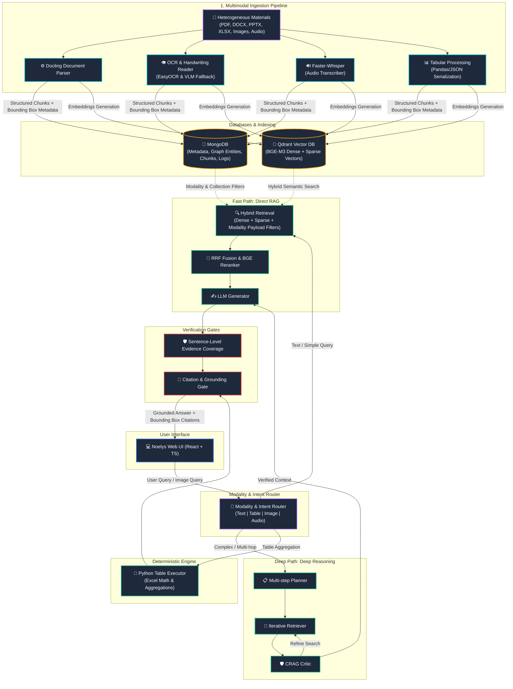

<h1 align="center">📚 AgentBook / Noelys</h1>

<p align="center">
  <strong>AgentBook</strong> is an enterprise-grade, multimodal, multi-model RAG (Retrieval-Augmented Generation) system designed for evidence-grounded question answering over complex heterogeneous learning materials.
</p>



<p align="center">
  <a href="https://fastapi.tiangolo.com"></a>
  <a href="https://reactjs.org"></a>
  <a href="https://www.typescriptlang.org"></a>
  <a href="https://www.mongodb.com"></a>
  <a href="https://qdrant.tech"></a>
  <a href="https://redis.io"></a>
  <a href="https://docs.celeryq.dev"></a>
  
</p>

---

## ✨ Core Pillars

AgentBook is not a generic "vector search + LLM" wrapper. It is engineered from the ground up for strict citation grounding, deterministic data extraction, and modality-aware routing.

*   📂 **Multimodal Ingestion**: Parses PDFs, Word (`.docx`), PowerPoints (`.pptx`), Spreadsheets (`.xlsx`, `.csv`), audio transcripts (`.mp3`, `.wav`), scanned pages, figures, and handwritten notes.
*   🔍 **Hybrid Semantic Retrieval**: BGE-M3 dense and sparse hybrid search with Reciprocal Rank Fusion (RRF) and Cross-Encoder reranking.
*   🧠 **Dynamic Routing & Agentic Reasoning**: Features a dual-mode engine:
    *   **Fast RAG**: Direct, low-latency pipeline for straightforward queries.
    *   **Deep Reasoning**: Dynamically activated state machine for multi-hop or complex queries.
*   🔢 **Deterministic Table Execution**: Aggregates, filters, and calculates spreadsheet data programmatically in Python instead of relying on unreliable LLM arithmetic.
*   🛡️ **Hallucination Guardrails**: Sentence-Level Evidence Coverage (SLEC) verifies every generated sentence against retrieved source coordinates (`bbox`, page, block ID) and automatically censors or flags unsupported claims.
*   🇻🇳 **Cross-Lingual Alignment**: Accepts Vietnamese queries over English knowledge bases, performs cross-lingual retrieval, and returns sources in their original language.

---

## 🚀 Quick Start

### 📋 Prerequisites
- **Python** >= 3.12
- **Node.js** >= 18
- **Docker Desktop** (for MongoDB, Qdrant, and Redis)

### ⚡ Start All Services
Launch the entire system locally with a single PowerShell script:
```powershell
.\start_all.ps1
```

Once up, the system is exposed at:
- **Frontend App (Noelys)**: [http://localhost:5173](http://localhost:5173)
- **Backend Swagger API Docs**: [http://localhost:8000/docs](http://localhost:8000/docs)
- **Qdrant Vector DB Dashboard**: [http://localhost:6333/dashboard](http://localhost:6333/dashboard)

---

## 🛠️ Repository Layout

```text
.
├── backend/                  # FastAPI Application
│   ├── src/
│   │   ├── agentic/          # Bounded agentic state-machine & planners
│   │   ├── api/              # Thin FastAPI route handlers
│   │   ├── core/             # App configs, security, LLM clients
│   │   ├── guardrails/       # SLEC, citation alignment, quality gates
│   │   ├── models/           # MongoDB Beanie ODM models
│   │   ├── processing/       # Ingestion, OCR, handwriting readers, spreadsheets
│   │   ├── rag/              # BGE-M3 embedding, Qdrant retrieval, RRF, reranking
│   │   └── tasks/            # Celery async jobs
│   └── tests/                # Comprehensive unit/integration tests
├── frontend/                 # React 18, TypeScript, Vite, Tailwind CSS
│   └── src/
│       ├── components/       # Studio, Workspace, Evidence & Graph panels
│       └── pages/            # Core views and canvas workspaces
├── config/                   # Centralized model, retrieval, & guardrails YAML configs
└── docs/                     # Documentation, assets, and design roadmaps
```

---

## ⚙️ Advanced Configuration & Guide

<details>
<summary><b>🔌 Environment Variables (<code>backend/.env</code>)</b></summary>

Copy `backend/.env.example` to `backend/.env` and adjust the variables:

```env
AGENTBOOK_APP_ENV=development
MONGODB_URI=mongodb://localhost:27017
AGENTBOOK_MONGODB_DATABASE=agentbook
AGENTBOOK_QDRANT_URL=http://localhost:6333
AGENTBOOK_REDIS_URL=redis://localhost:6379/0

# LLM Selection (local vs API)
AGENTBOOK_LLM_DEFAULT_PROVIDER=local
AGENTBOOK_LLM_LOCAL_MODEL=qwen2.5:7b
AGENTBOOK_OLLAMA_BASE_URL=http://localhost:11434

# For Cloud/OpenAI compatible models:
# AGENTBOOK_LLM_DEFAULT_PROVIDER=openai_compatible
# AGENTBOOK_OPENAI_BASE_URL=https://api.openai.com/v1
# OPENAI_API_KEY=your_key_here
# AGENTBOOK_OPENAI_MODEL=gpt-4o-mini
```
</details>

<details>
<summary><b>🎛️ Performance & RAG Tuning (<code>config/*.yaml</code>)</b></summary>

All system thresholds and prompts live in the `config/` directory.

- **`config/model_config.yaml`**: Configures Ollama, OpenAI-compatible APIs, embedding/reranking paths, OCR, visual models, and Whispers.
- **`config/retrieval_config.yaml`**: Controls search width knobs (`dense_top_k`, `sparse_top_k`), routing parameters, table routing heuristics, and agentic reasoning thresholds.
- **`config/guardrails_config.yaml`**: Establishes SLEC coverage thresholds, refusal gates, and claims evaluation.

| Setting | Type | Description |
|---|---|---|
| `retrieval.agentic_rag_enabled` | Boolean | Global default toggle for Deep Reasoning availability |
| `retrieval.dense_top_k` | Integer | Retrieval width for dense semantic search |
| `retrieval.rerank_input_k` | Integer | Top candidates passed to cross-encoder |
| `sentence_coverage.refuse_below` | Float | Fallback score below which a query is rejected |
</details>

<details>
<summary><b>📮 Main API Endpoints</b></summary>

API endpoints are versioned under `/api/v1`.

| Method | Endpoint | Purpose |
|---|---|---|
| `POST` | `/query/ask` | Non-streaming grounded QA query |
| `POST` | `/query/ask-stream` | Server-Sent Events (SSE) streaming query |
| `POST` | `/query/ask-image` | Multimodal query using image input |
| `POST` | `/query/ask-graph` | Graph-based conceptual retrieval query |
| `POST` | `/materials/upload` | Upload a single training document |
| `POST` | `/collections` | Create/group logical document collections |
| `POST` | `/graph/mindmap` | Generate visual knowledge map |
| `GET` | `/health` | Live backend health verification |
</details>

<details>
<summary><b>🧪 Testing & Verification</b></summary>

Run localized tests quickly:
```powershell
python -m pytest backend/tests/test_core backend/tests/test_guardrails/test_refusal_policy.py backend/tests/test_rag/test_query_router.py -q
```

Or execute the complete backend suite:
```powershell
python -m pytest backend/tests -q
```

To verify the production compilation of the React frontend:
```powershell
cd frontend
npm run build
```
</details>

<details>
<summary><b>⚠️ Known Engineering Risks</b></summary>

- **Resource Overheads**: Running BGE-M3 models, rerankers, OCR pipelines, and local LLMs requires a machine with dedicated VRAM. CPU-only execution will result in significant latency.
- **Stale Cache / local DBs**: Do not commit local SQLite/Qdrant vector stores, database credentials, or generated files in the repository.
- **Encoding Integrity**: Ensure all documents are UTF-8 clean. Corrupted characters will damage search accuracy and routing confidence.
</details>

---

## 📄 License
Licensed under the [Apache License 2.0](LICENSE).
