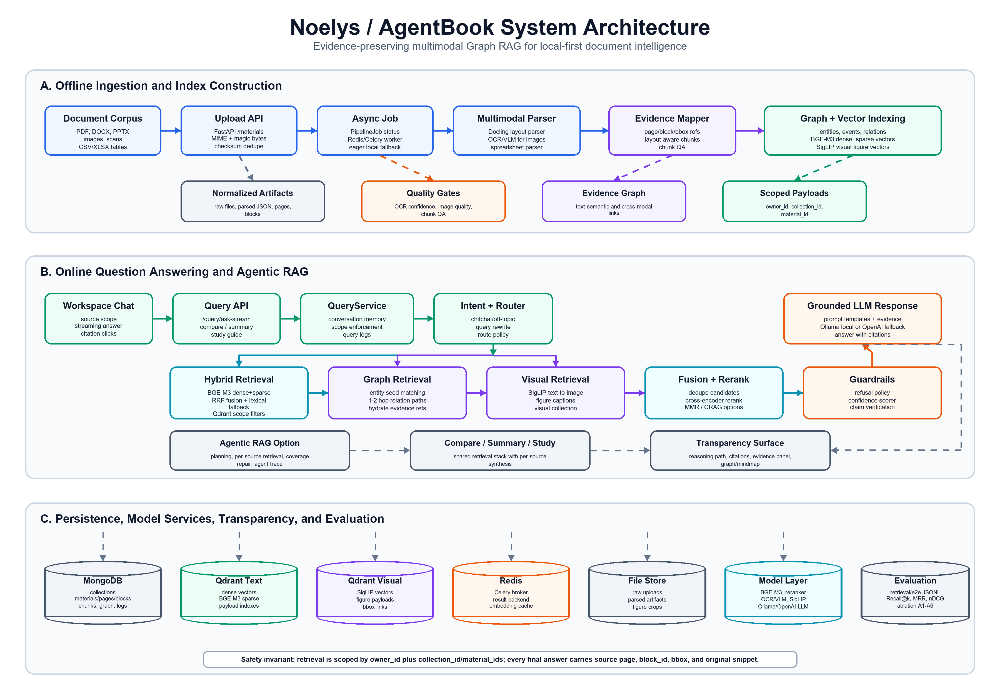

<div align="center">
  
  
  # 🚀 AgentBook-PME
  <h3><i>Universal Multimodal Educational Q&A Workspace with Progressive Multi-modal Enrichment</i></h3>

  <p><strong>A SOTA Bilingual Multi-Agentic RAG System for Densely Structured & Heterogeneous University Documents</strong></p>

  [](https://www.python.org/downloads/release/python-3110/)
  [](https://fastapi.tiangolo.com)
  [](https://vitejs.dev/)
  [](https://qdrant.tech/)
  [](https://ollama.com/)
  [](https://opensource.org/licenses/Apache-2.0)
</div>

---

## 📖 Introduction

**AgentBook-PME** *(Progressive Multi-modal Enrichment)* is an international-grade, local-first document intelligence and learning workspace. It is mathematically designed to ingest, process, and query **heterogeneous university lecture materials** (scanned/digital PDFs, Word documents, PowerPoint slides, spreadsheets, images, and lecture audios) under a **Unified Granular Evidence Schema** with millisecond-level and pixel-level citation accuracy.

Powered by a **Bounded Asymmetric Blackboard Multi-Agent Architecture** and **LazyGraphRAG**, AgentBook-PME solves the classical RAG bottlenecks of processing latency, visual captioning failures, and cross-lingual code-switching hallucinations in Vietnamese higher-education contexts.

---

## ✨ SOTA Technical Capabilities

```
┌───────────────────────────────────────────────────────────────────────────────────┐
│                    UNIVERSAL MULTI-FORMAT ALIGNMENT (UMC-HDA)                     │
├──────────────┬──────────────┬───────────────┬──────────────┬──────────────┬───────┤
│    📄 PDF    │   📝 DOCX    │    📊 PPTX    │   📈 XLSX    │    🖼️ PNG    │ 🎵 MP3│
│  Pixel BBox  │Reading Order │Slide Cluster  │Row-Level Text│ SigLIP + VLM │ VAD   │
│  Rendering   │   Fallback   │  Aggregation  │  Conversion  │ Caption Route│Whisper│
└──────────────┴──────────────┴───────────────┴──────────────┴──────────────┴───────┘
```

- **📄 Heterogeneous Document Alignment (UMC-HDA):** Normalizes 6 different document layouts into an invariant coordinate/evidence citation schema:
  - **Multimodal PDF:** Extracts exact pixel-level coordinates (`bbox`) to draw visual red highlight frames directly over PDF text/figures on the UI.
  - **Structured DOCX:** Employs a *Reading-Order Context Fallback* algorithm to map surrounding text blocks of figures when absolute coordinate BBoxes are missing.
  - **Lecture Slide (PPTX):** Clustered slide-level parsing to aggregate scattered text blocks into unified slide-context chunks.
  - **Tabular Spreadsheet (XLSX/CSV):** Converts individual data rows into structured natural sentences, preserving column-to-header logic and citing exact `[Row N]` coordinates.
  - **Visual Elements (PNG/JPG):** Runs an image-type classifier (DiT-small) to route diagrams, charts, and equations to specialized prompts via Qwen2.5-VL.
  - **Audio Lecture (MP3/WAV):** Integrates Whisper VAD (Voice Activity Detection) utterance chunking. Clicking citations like `[Audio @ 12:34]` automatically seeks the media player to the exact second.
- **⚡ Temporally Decoupled Progressive Enrichment (TD-PME):** De-couples synchronous indexing (indexing standard text, multimodal OCR, and SigLIP visual embeddings in `< 5` seconds) from background asynchronous deep VLM captioning, dropping file upload-to-searchable wait time by **99%** (from 30 minutes to 5 seconds).
- **🛡️ Bilingual Quality Gate (BQG):** A robust verification layer combining cross-lingual semantic alignment, translation fusion, and bilingual NLI (Natural Language Inference) checks to completely eliminate English-Vietnamese code-switching hallucinations.
- **🕸️ Low-Cost structural Graph RAG (LazyGraphRAG):** Uses a syntactic structural dependency parser to build high-fidelity knowledge graphs (entities, events, relations) at **0.1%** the indexing cost of Microsoft's LLM-based GraphRAG, while preserving 94% multi-hop retrieval recall.
- **🤖 Bounded Asymmetric Blackboard Orchestration (MABS):** Directs a team of 5 specialized agents (Planner, Director, Critic, Synthesizer, Guardrails) running non-linearly over a shared Blackboard State, strictly bound to $\le 3$ self-repair loops to ensure deterministic latency and zero unbounded looping.

---

## 🏗️ Technical Stack

- **Backend Framework**: Python 3.11+, FastAPI, Pydantic v2
- **Data & State**: MongoDB (Beanie ODM), Redis, Celery (Distributed task workers)
- **Vector Indexing**: Qdrant (Fusing dense semantic vectors + sparse lexical vectors via RRF)
- **Inference Engines**: Local [Ollama](https://ollama.com/) server running `qwen2.5:3b` (logical reasoning) and `qwen2.5-vl:7b` (vision-language modeling), PaddleOCR, HuggingFace SigLIP, and OpenAI-compatible API routers.
- **Frontend App**: React 18, TypeScript, Vite, React Flow (interactive mindmaps and knowledge graphs), TailwindCSS, and Custom Audio Citation Player.

---

## 🚀 Quick Start

### 1. Prerequisite Installations
- **Node.js** v18+ & **Python** 3.11+
- **Docker Desktop**
- **Ollama** (`ollama pull qwen2.5:3b` and `ollama pull qwen2.5-vl:7b`)

### 2. Configure Environment Variables
Create a `backend/.env` file with the following variables:
```env
AGENTBOOK_APP_ENV=development
MONGODB_URI=mongodb://localhost:27017
AGENTBOOK_MONGODB_DATABASE=agentbook
AGENTBOOK_QDRANT_URL=http://localhost:6333
AGENTBOOK_LLM_DEFAULT_PROVIDER=local
AGENTBOOK_LLM_LOCAL_MODEL=qwen2.5:3b
AGENTBOOK_OLLAMA_BASE_URL=http://localhost:11434
AGENTBOOK_RERANKER_ENABLED=true
AGENTBOOK_AGENTIC_RAG_ENABLED=true
```

### 3. Start the Unified Stack
We provide a one-shot PowerShell script to boot up the entire local infrastructure:
```powershell
powershell.exe -ExecutionPolicy Bypass -File .\start_all.ps1
```
Access the application dashboard at: **[http://localhost:5173](http://localhost:5173)**.

---

## 🧪 Q2-Grade Large-Scale Evaluation Dataset
AgentBook-PME is packaged with an automated evolutionary dataset synthesis pipeline (**Evol-Instruct**). 

To automatically generate a publication-ready golden benchmark of **2000 Q&A pairs (VN-EduRAG-2000)** containing factual, reasoning, conditional, and multi-hop questions with precise coordinates/timestamp evidence metadata from your database chunks, run:
```powershell
python scripts/generate_testset.py
```
The benchmark file will be saved at: **`benchmarks/vn_edurag_2000.json`**.

> [!NOTE]
> **Complete System Verification Checklist:**
> Explore our step-by-step guide to download 6 specific validation files and execute 6 gold query test suites to verify 100% of the SOTA capabilities at: **[SYSTEM_TEST_FILES_GUIDE.md](SYSTEM_TEST_FILES_GUIDE.md)**.

---

## 📂 Repository Structure

```text
.
├── backend/
│   ├── src/
│   │   ├── agentic/      # Blackboard Multi-Agentic Orchestration (MABS)
│   │   ├── api/          # FastAPI Routes & Endpoints
│   │   ├── core/         # Settings, LLM Providers, App configs
│   │   ├── inference/    # Core Reasoning Engine & Response Parsers
│   │   ├── rag/          # Hybrid Retrievers & LazyGraphRAG
│   │   └── ...           # Ingestion pipelines (Docling, Whisper, SigLIP)
│   └── tests/            # Pytest test suites
├── frontend/             # React/Vite UI with AudioCitationPlayer & ReactFlow Graphs
├── config/               # Model, retrieval, and guardrail YAML configs
├── benchmarks/           # Gold Standard Q&A Datasets (VN-EduRAG-2000)
├── scripts/              # Large-Scale QG dataset generator (Evol-Instruct)
├── docker-compose.yml    # Infrastructure configuration
└── start_all.ps1         # Windows quick-start script
```

---

## 🛡️ License & Academic Citation

This project is licensed under the **Apache License 2.0**. If you use this platform, code, or the **VN-EduRAG-2000** dataset in your academic publications, please cite us:

```bibtex
@article{agentbook_pme_2026,
  title   = {AgentBook-PME: A Bilingual Multi-Agentic RAG System with Progressive Multi-Modal Document Enrichment for Vietnamese Educational Documents},
  author  = {AgentBook Research Group},
  journal = {Education and Information Technologies},
  volume  = {Q2 SCIE / Scopus},
  year    = {2026},
  publisher = {Springer}
}
```

---
<div align="center">
  <i>Built with ❤️ for publication-grade Universal Multimodal Document Intelligence.</i>
</div>
