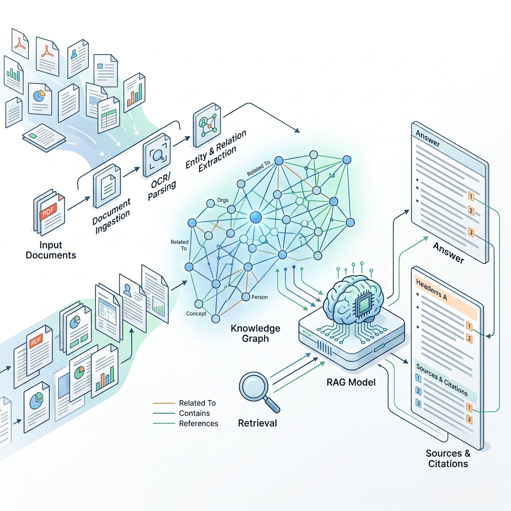
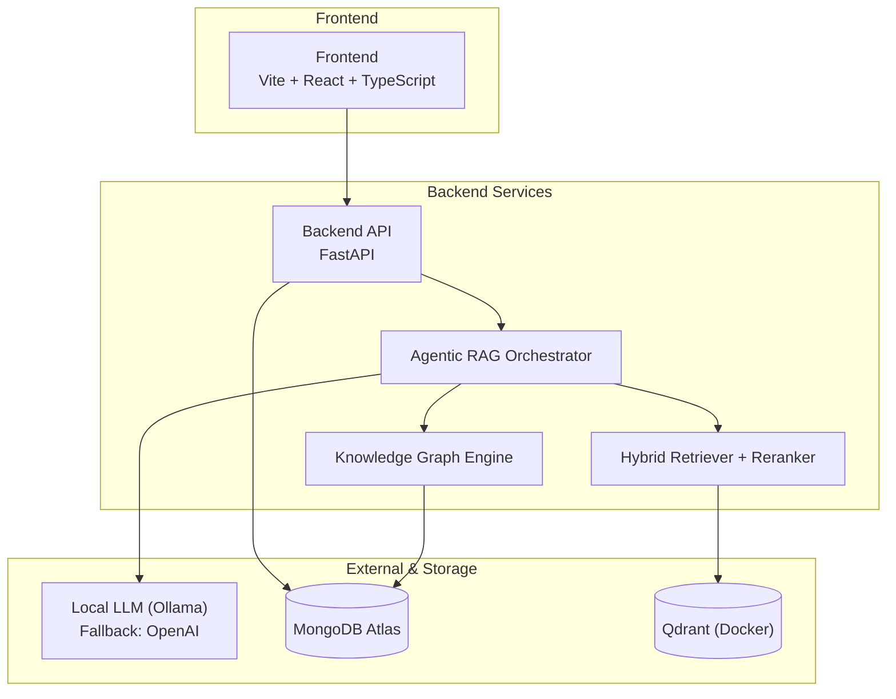
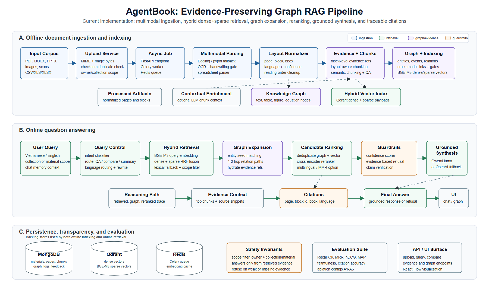

<div align="center">
  
  
  <h1>🌟 Noelys (AgentBook Platform)</h1>
  <p><strong>Next-Generation Agentic Document Intelligence Platform</strong></p>

  <p>
    <a href="https://github.com/nvtanphat/AgentBook-Platform/stargazers"></a>
    <a href="https://github.com/nvtanphat/AgentBook-Platform/network/members"></a>
    <a href="https://github.com/nvtanphat/AgentBook-Platform/issues"></a>
    
    
  </p>

  <p>
    <i>An advanced, local-first intelligent Q&A learning platform utilizing Hybrid RAG, Graph RAG, and Agentic Orchestration.</i>
  </p>
</div>

---

## 📖 Overview

**Noelys** is an open-source Document Intelligence platform tailored for educational and analytical use cases. By leveraging the power of **Hybrid RAG**, **Knowledge Graphs (Graph RAG)**, and **Agentic Orchestration**, Noelys delivers highly accurate, grounded, and comprehensive answers across a variety of document formats.

The project is designed with a **local-first approach**, ensuring data privacy and offline capability using local LLMs (via Ollama), while supporting scalable deployment through FastAPI, Vite, MongoDB Atlas, and Qdrant.

## ✨ Key Features

- 🧠 **Agentic RAG Engine**: Enabled by default, featuring dynamic retrieval planning, multi-query generation, per-source execution, coverage verification, automatic retrieval repair, reranking, synthesis, and claim verification.
- 📚 **Comprehensive Document Support**: Ingest and interrogate PDF, DOCX, PPTX, CSV, XLSX, and Images. Includes robust OCR for scanned PDFs and multimodal pipelines.
- 🎯 **Hybrid Retrieval & Reranking**: Combines BGE-M3 dense and sparse vectors with Reciprocal Rank Fusion (RRF) and BGE-reranker-v2-m3 for state-of-the-art context retrieval.
- 🕸️ **Knowledge Graph & Mindmap**: Automated entity and relationship extraction. Traverse knowledge networks visually with React Flow.
- 🔍 **Granular Citations**: Every answer is backed by precise citations, including document name, page, text block, bounding box, and confidence scores.
- 📊 **Advanced Analytical Tools**: Generate automated study guides, multi-source comparison tables, and basic contradiction detection.
- 🌐 **Multilingual**: Optimized for both Vietnamese and English.

## 🏗️ Architecture

Noelys is built on a modern, decoupled tech stack optimized for performance and AI workflows.



<div align="center">
  
</div>

## 🚀 Getting Started

### Prerequisites

Ensure you have the following installed on your system:
- **Windows PowerShell** (or equivalent bash shell on Linux/macOS)
- **Python** 3.11 or higher
- **Node.js** 18 or higher
- **Docker Desktop** (for vector database)
- **MongoDB Atlas** cluster (or local MongoDB)
- **Ollama** running locally

### Model Configuration

The default local LLM defined in `config/model_config.yaml` is `qwen2.5:3b`.
Install and start the model via Ollama:

```powershell
ollama pull qwen2.5:3b
ollama serve
```

### Environment Setup

1. Copy the example `.env` file to configure your backend:
```powershell
Copy-Item backend\.env.example backend\.env
```

2. Update `backend/.env` with your critical variables:
```env
MONGODB_URI=mongodb+srv://<your-cluster-url>
AGENTBOOK_MONGODB_DATABASE=agentbook
AGENTBOOK_QDRANT_URL=http://localhost:6333
AGENTBOOK_AGENTIC_RAG_ENABLED=true
AGENTBOOK_LLM_DEFAULT_PROVIDER=local
AGENTBOOK_LLM_LOCAL_MODEL=qwen2.5:3b
AGENTBOOK_OLLAMA_BASE_URL=http://localhost:11434
```

*(Note: The startup script will automatically check Qdrant and patch the `.env` if the Qdrant URL is misconfigured.)*

### One-Click Startup (Recommended for Windows)

Use the provided PowerShell script to bootstrap the entire environment:

```powershell
powershell.exe -ExecutionPolicy Bypass -File .\start_all.ps1
```

**What this script does:**
1. Cleans up existing processes on ports `8000` and `5173`.
2. Starts **Qdrant** via `docker compose up -d qdrant`.
3. Waits for Qdrant health checks (`http://localhost:6333/readyz`).
4. Launches the **FastAPI Backend** (`http://localhost:8000`).
5. Launches the **React Frontend** (`http://localhost:5173`).
6. Logs output to `*.out.log` and `*.err.log`.

**Access URLs:**
- 🖥️ **Web App**: [http://localhost:5173](http://localhost:5173)
- 🔌 **API Endpoints**: [http://localhost:8000](http://localhost:8000)
- 📖 **API Docs (Swagger)**: [http://localhost:8000/docs](http://localhost:8000/docs)
- 🗄️ **Qdrant Dashboard**: [http://localhost:6333/dashboard](http://localhost:6333/dashboard)

---

## 🛠️ Manual Installation

If you prefer to start services individually:

**1. Qdrant Vector DB:**
```powershell
docker compose up -d qdrant
```

**2. FastAPI Backend:**
```powershell
cd backend
pip install -r requirements.txt
python -m uvicorn src.main:app --port 8000
```

**3. Frontend (Vite):**
```powershell
cd frontend
npm install
npm run dev
```

## 🔌 API Reference

| Endpoint | Method | Description |
|---|---|---|
| `/health` | `GET` | Health check for backend services |
| `/api/v1/materials/upload` | `POST` | Upload a single document |
| `/api/v1/materials/batch_upload`| `POST` | Batch upload multiple documents |
| `/api/v1/materials` | `GET` | Retrieve list of ingested documents |
| `/api/v1/query/ask` | `POST` | Standard Agentic RAG Q&A |
| `/api/v1/query/ask-stream` | `POST` | Streaming Agentic RAG Q&A (SSE) |
| `/api/v1/query/compare` | `POST` | Aspect-based document comparison |
| `/api/v1/query/summarize` | `POST` | Document summarization |
| `/api/v1/query/study-guide` | `POST` | Generate automated study guides |
| `/api/v1/graph` | `POST` | Knowledge graph retrieval |
| `/api/v1/graph/mindmap` | `POST` | Concept mindmap generation |

## 🤖 Inside Agentic RAG

When `AGENTBOOK_AGENTIC_RAG_ENABLED=true`, Noelys uses an advanced multi-step reasoning pipeline (located in `backend/src/agentic/`):

1. **`plan_query`**: Analyzes user intent and selects the optimal retrieval plan.
2. **`retrieve_multi_query` / `retrieve_text`**: Gathers raw evidence.
3. **`retrieve_per_source`**: Ensures all relevant document sources are queried.
4. **`trace_graph`**: Leverages the Knowledge Graph for complex relational queries.
5. **`verify_coverage`**: Analyzes which information gaps still exist.
6. **`repair_retrieval`**: Triggers secondary searches to fill identified gaps.
7. **`rerank_evidence`**: Re-orders all retrieved contexts based on relevance.
8. **`synthesize_answer`**: Prompts the LLM to formulate the final answer.
9. **`verify_claims`**: Cross-checks the generated answer against the cited evidence.

*The frontend UI surfaces this process in real-time with status badges, reasoning traces, and verification indicators.*

## 🧪 Testing & Development

### Running Backend Tests
Ensure the integrity of the core logic and agentic modules:
```powershell
python -m pytest backend\tests\test_agentic backend\tests\test_inference\test_query_endpoint.py -q
python -m pytest backend\tests\test_inference backend\tests\test_rag -q
```

### Building Frontend for Production
```powershell
npm.cmd --prefix frontend run build
```
*(Note: Large chunks warnings during Vite minification are normal and do not affect the build integrity.)*

### Troubleshooting
- **Backend not starting:** Check `backend.err.log` or test `http://127.0.0.1:8000/health`.
- **Frontend not starting:** Check `frontend.err.log`.
- **Qdrant issues:** Run `docker compose ps` to check container status.
- **Ollama/Model errors:** Run `ollama list` to verify the model is downloaded.
- **Port conflicts:** Find blocking processes using `Get-NetTCPConnection -LocalPort 8000,5173,6333 -State Listen`.

## 📜 License & Notes
- Currently, local execution operates in eager mode, bypassing the need for an external Redis/Celery worker queue for synchronous tasks.
- Ensure all text files (especially prompts) are saved in UTF-8 to prevent Vietnamese Mojibake rendering issues.

---
<div align="center">
  <i>Developed with ❤️ for Document Intelligence</i>
</div>
