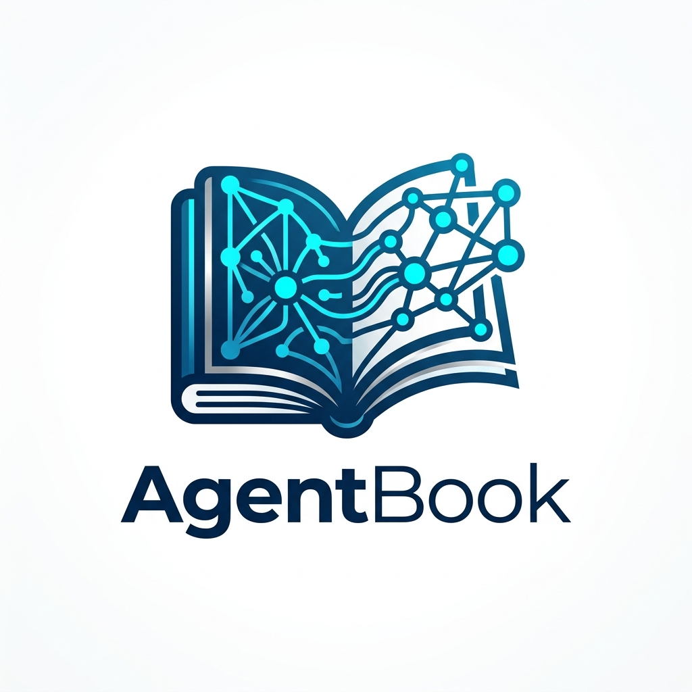
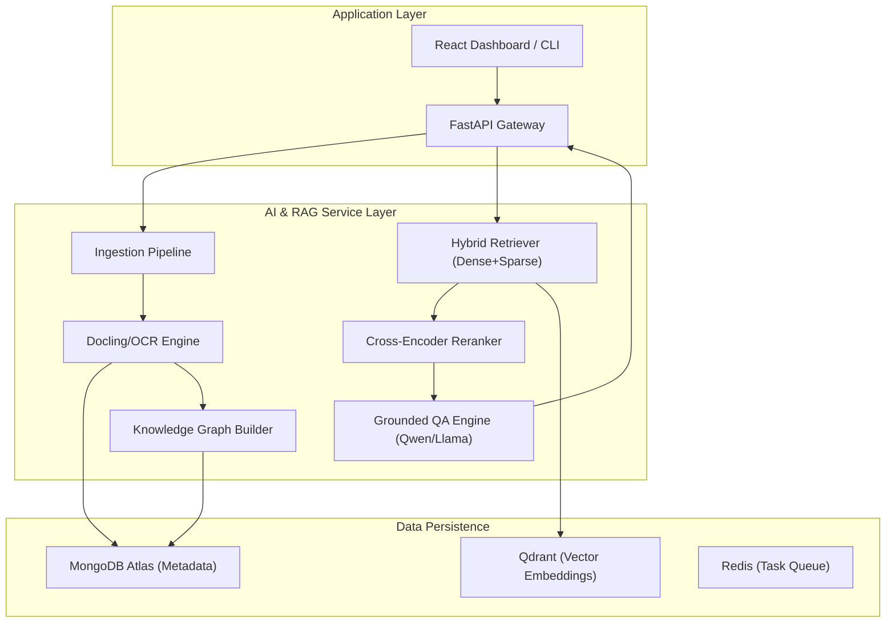

<div align="center">
  
  <h1>🚀 AgentBook-Platform</h1>
  <p><b>Graph RAG Document Intelligence for Advanced Cross-Document Reasoning</b></p>

  [](https://www.python.org/)
  [](https://fastapi.tiangolo.com/)
  [](https://reactjs.org/)
  [](https://qdrant.tech/)
  [](https://www.mongodb.com/)
  [](LICENSE)
</div>

---

## 🌟 Overview

**AgentBook** is a state-of-the-art Document Intelligence platform that goes beyond simple keyword search. By leveraging **Graph RAG** technology, it transforms static documents (PDFs, PPTXs, Images) into a dynamic Knowledge Graph. This allows users to perform **Cross-Document Reasoning**, trace evidence with pinpoint accuracy, and explore complex topics through interactive mindmaps.

Designed specifically for the Vietnamese academic and research context, AgentBook handles bilingual (EN-VI) sources, scanned documents, and even clear handwritten notes.

## ✨ Key Features

- **🔍 Hybrid & Graph Retrieval**: Combines BGE-M3 Dense/Sparse retrieval with an Evidence Graph for deep, multi-hop question answering.
- **📄 Multimodal Document Parsing**: High-fidelity parsing of layouts, tables, and formulas using `Docling` and `PaddleOCR`.
- **🖇️ Evidence Tracing & Citations**: Every AI response includes verifiable citations with document names, page numbers, and snippet locations.
- **⚖️ Cross-Document Comparison**: Automatically generate comparison tables and detect contradictions between multiple sources (e.g., Slides vs. Textbooks).
- **🧠 Interactive Mindmaps**: Visualize your knowledge base as a dynamic mindmap powered by `React Flow`.
- **🛡️ Guardrails & Safe Refusal**: Built-in verification gates to prevent hallucinations and ensure responses are strictly grounded in your data.

## 🏗️ System Architecture



## 🛠️ Tech Stack

### Backend
- **Framework**: FastAPI (Python 3.11+)
- **Task Management**: Celery + Redis
- **RAG Core**: BGE-M3 (Dense + Sparse), Cross-Encoders for Reranking
- **LLM**: Qwen3 / Llama (Local via Ollama or API Fallback)
- **Parsing**: IBM Docling, PaddleOCR

### Databases
- **Vector DB**: Qdrant (Docker / Cloud)
- **Metadata DB**: MongoDB Atlas + Beanie ODM
- **Cache**: Redis

### Frontend
- **Framework**: Vite + React + TypeScript
- **State**: Zustand + TanStack Query
- **Visualization**: React Flow (for Graphs & Mindmaps)

## 🚀 Getting Started

### Prerequisites
- Docker & Docker Compose
- Python 3.11+
- MongoDB Atlas account (or local MongoDB)

### Installation

1. **Clone the repository**:
   ```bash
   git clone https://github.com/nvtanphat/AgentBook-Platform.git
   cd AgentBook-Platform
   ```

2. **Configure Environment**:
   Create a `.env` file in the `backend/` directory based on `.env.example`.
   ```bash
   cp backend/.env.example backend/.env
   # Edit backend/.env with your MONGODB_URI and API keys
   ```

3. **Spin up Infrastructure**:
   ```bash
   docker compose up -d
   ```

4. **Start the Backend**:
   ```bash
   cd backend
   pip install -r requirements.txt
   uvicorn src.main:app --reload
   ```

5. **Start the Frontend**:
   ```bash
   cd frontend
   npm install
   npm run dev
   ```

## 📊 Evaluation & Benchmarking

AgentBook includes a robust evaluation suite to ensure retrieval accuracy and answer quality:
- **Retrieval**: Recall@k, MRR, nDCG via `evaluation/run_eval.py`.
- **RAG Performance**: Faithfulness and Relevancy using RAGAS.
- **Ablation Studies**: Compare Hybrid vs. Vector search, and Flat vs. Layout-aware chunking.

## 🤝 Contributing

Contributions are welcome! Please feel free to submit a Pull Request.

## 📜 License

This project is licensed under the MIT License - see the [LICENSE](LICENSE) file for details.

---
<div align="center">
  Built with ❤️ by the AgentBook Team
</div>
