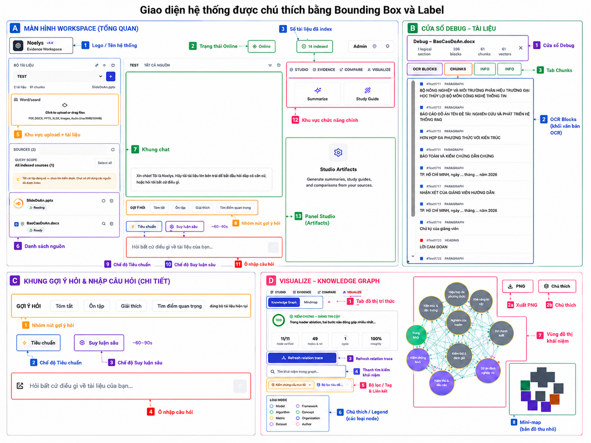
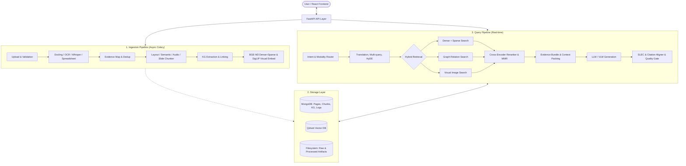

<h1 align="center">AgentBook (Noelys): Bilingual Multimodal RAG</h1>

<p align="center">
  
</p>

<p align="center">
  <strong>An Evidence-Preserving Multimodal RAG System for Bilingual (Vietnamese & English) Document Q&A</strong>
</p>

<p align="center">
  <a href="https://fastapi.tiangolo.com/"></a>
  <a href="https://react.dev/"></a>
  <a href="https://www.typescriptlang.org/"></a>
  <a href="https://www.mongodb.com/"></a>
  <a href="https://qdrant.tech/"></a>
  <a href="https://celeryproject.org/"></a>
  <a href="https://redis.io/"></a>
  <a href="https://ollama.com/"></a>
</p>

---

## 📋 Table of Contents

- [🌟 System Overview](#-system-overview)
- [✨ Core Features](#-core-features)
- [🏗️ System Architecture](#️-system-architecture)
  - [Functional Components](#functional-components)
- [📁 Project Directory Structure](#-project-directory-structure)
- [🛠️ Installation & Setup](#️-installation--setup)
  - [Prerequisites](#prerequisites)
  - [Option A: Docker Compose Deployment (Recommended)](#option-a-docker-compose-deployment-recommended)
  - [Option B: Manual Local Setup (Development)](#option-b-manual-local-setup-development)
- [⚙️ Configuration Guide](#️-configuration-guide)
- [📡 API Documentation](#-api-documentation)
- [📈 Experimental Evaluation](#-experimental-evaluation)
  - [Overall Performance Comparison](#overall-performance-comparison)
  - [Ablation Study](#ablation-study)
- [📜 License & Academic Citation](#-license--academic-citation)

---

## 🌟 System Overview

**AgentBook** (codename: **Noelys**) is a state-of-the-art multimodal RAG (Retrieval-Augmented Generation) system designed to tackle document Q&A challenges for enterprises and academic research. 

Unlike traditional RAG systems that flatten document structures into simple text blocks and produce loose citations, AgentBook centers its entire lifecycle around the **Evidence Unit**. By preserving precise layout coordinates (bounding boxes), page numbers, audio timestamps, and extraction confidence, AgentBook ensures that every claim in a generated answer can be verified and audited back to the exact source.

It fully supports multi-modal files: **multi-column PDFs, PowerPoint slides, Excel spreadsheets, scanned images, handwritten notes, and audio recordings.**

It is natively optimized for **Vietnamese and Bilingual (Vietnamese & English) Q&A**, featuring robust cross-lingual retrieval (translating and searching across language barriers) and native Vietnamese OCR parsing.

<p align="center">
  
</p>

---

## ✨ Core Features

1. **Evidence-Preserving Multimodal Ingestion**:
   - **Structured Ingestion**: Parses files using `Docling` to extract headings, paragraphs, tables, and reading order.
   - **Spreadsheets**: Restructures spreadsheets (CSV, Excel) into structured tabular grids indexed in MongoDB.
   - **Handwriting & Scans**: Transcribes handwritten images and low-quality scans using EasyOCR/VietOCR, falling back to Vision-Language Models (Qwen2.5-VL) for complex visual details.
   - **Audio Transcription**: Process speech to text via `faster-whisper`, keeping word/sentence level timestamped segments.

2. **Multi-Strategy Chunking**:
   - **Slide-Aware**: PPTX files chunked by slide boundaries.
   - **Audio-Aware**: Audio transcripts grouped dynamically by timeline windows.
   - **Semantic Chunking**: Employs BGE-M3 similarity thresholds to construct cohesive text chunks.
   - **Layout-Aware**: Splits documents respecting layouts, lists, and tables without destroying reading order or provenance.

3. **Hybrid & Graph-Augmented Retrieval**:
   - Combines BGE-M3 dense embeddings and sparse lexical tokens through Reciprocal Rank Fusion (Dense-Sparse RRF).
   - Features a **lightweight Knowledge Graph** (Entities, Relations, Events) stored directly in MongoDB, enabling relation-path traversal and graph probe context extension without the resource overhead of Neo4j.
   - Supports **Visual Retrieval** via SigLIP visual embeddings for charts, diagrams, and cropped images.
   - **Bilingual & Cross-Lingual Search**: Handles cross-lingual queries (e.g., asking in Vietnamese about English documents or vice-versa) using `BGE-M3` multilingual alignment, query translation caching, and matching.

4. **Deterministic Table Reasoning**:
   - Automatically routing math and aggregation table questions to a **deterministic computation executor** instead of the LLM generator, eliminating mathematical hallucinations and arithmetic errors.

5. **Post-Generation Verification**:
   - **Sentence-Level Evidence Coverage (SLEC)**: Splits answers into individual assertions and verifies them against the retrieved evidence using Natural Language Inference (NLI) scores.
   - **Citation Aligner & Quality Gate**: Checks citation markers, aligns them with concrete source coordinates, and filters out unverified statements.
   - **Controlled Refusal**: Triggers an automated refusal when evidence coverage or retrieval confidence falls below thresholds.

6. **Bounded Agentic Planning & Routing**:
   - For multi-hop, comparative, or graph-dependent queries, AgentBook routes requests through a **bounded multi-agent orchestration layer** (`backend/src/agentic/`).
   - A `PlannerAgent` decomposes complex questions into sequential sub-questions.
   - A `RetrieverDirectorAgent` coordinates specific tools (`HybridTextSearchTool`, `GraphRelationSearchTool`, `VisualImageSearchTool`) to extract evidence.
   - A `SynthesizerAgent` compiles the retrieved evidence bundles into a unified response, which is then verified by the same post-generation guardrails to ensure correctness.

---

## 🏗️ System Architecture

The core data flow of the ingestion, storage, retrieval, and verification pipelines is designed as follows:



### Functional Components

| Layer | Primary Files / Directory | Core Responsibility |
| :--- | :--- | :--- |
| **API** | [materials.py](file:///d:/GenAI/TanPhatRag/backend/src/api/v1/endpoints/materials.py), [query.py](file:///d:/GenAI/TanPhatRag/backend/src/api/v1/endpoints/query.py) | Exposes REST endpoints, validates scopes, and manages rate limiting. |
| **Services** | `query_service.py`, `material_service.py` | Core orchestration and business logic interfaces. |
| **Processing** | `backend/src/processing/` | Document conversions, EasyOCR/VLM layout analysis, entity extraction. |
| **RAG Retrieval** | `backend/src/rag/` | Employs dense+sparse vectors, knowledge graph relation search, and cross-encoders. |
| **Agentic Planning** | `backend/src/agentic/` | Bounded agentic planner, multi-agent director, and retrieval tool coordinator. |
| **Inference** | `backend/src/inference/` | Intent routing, LLM/VLM prompting, and deterministic table calculation engine. |
| **Guardrails** | `backend/src/guardrails/` | SLEC verification, citation alignment checks, and quality-controlled refusals. |

---

## 📁 Project Directory Structure

```text
├── backend/                  # FastAPI Backend Source Code
│   ├── src/
│   │   ├── api/              # REST API Endpoints (v1 endpoints)
│   │   ├── agentic/          # Bounded Multi-Agent Planning & Orchestration
│   │   ├── processing/       # Document Parsing (Docling, Whisper, EasyOCR, Normalizers)
│   │   ├── rag/              # Hybrid Retrieval (Qdrant, MongoDB KG, Reranking, MMR)
│   │   ├── inference/        # LLM/VLM Inference & Deterministic Table Execution
│   │   └── guardrails/       # Post-generation Verification (SLEC, Citation Aligner)
│   ├── tests/                # Unit & integration testing suites
│   ├── Dockerfile
│   └── requirements.txt      # Python dependencies
├── frontend/                 # React + TypeScript + Vite Frontend UI
│   ├── src/
│   │   ├── components/       # Chat window, Citation source cards, GraphCanvas visualizers
│   │   └── pages/            # Workspace dashboard, Collection views, Authentication
│   ├── Dockerfile
│   └── package.json
├── config/                   # System Configuration files (.yaml)
├── docs/                     # Design Documents & Architectural Diagrams
├── evaluation/               # Gold benchmark evaluation dataset & Ablation scripts
└── docker-compose.yml        # Docker Multi-service container definitions
```

---

## 🛠️ Installation & Setup

### Prerequisites

- **Docker** & **Docker Compose**
- **Node.js** (v18+) & **npm** (if running the frontend natively)
- **Python** (3.10+) (if running the backend natively)
- **Ollama** running locally or accessible via network. Pre-download the models:
  ```bash
  ollama pull qwen2.5:7b
  ollama pull qwen2.5-vl:3b
  ```

---

### Option A: Docker Compose Deployment (Recommended)

This compiles and runs the API backend, frontend client, Celery task worker, Redis broker, MongoDB instance, and Qdrant vector database in a unified cluster.

A utility script `run.ps1` is provided to easily orchestrate the deployment lifecycle:

```powershell
# 1. Start all services in the background
.\run.ps1 up

# 2. Check the status and connectivity of running containers
.\run.ps1 status

# 3. Stream real-time logs from a specific container (e.g., api or worker)
.\run.ps1 logs api

# 4. Tear down the cluster and clean up volumes
.\run.ps1 down
```

#### Running with NVIDIA GPU (CUDA Acceleration)

If your host machine is equipped with an NVIDIA GPU (e.g., RTX 4060 or better), you can leverage CUDA to run embedding models, cross-encoder rerankers, and vision models on the GPU, while keeping lightweight ingestion operations on the CPU to avoid VRAM congestion.

1. **System Requirements**:
   - Ensure the latest **NVIDIA Driver** is installed on the host.
   - Install **nvidia-container-toolkit** to allow Docker containers to access GPU devices.

2. **Bootstrapping the GPU Stack**:
   - Run the setup option with the `-Gpu` flag to pull the required Ollama models and build the Docker images configured with PyTorch CUDA (`cu121`):
     ```powershell
     .\run.ps1 setup -Gpu
     ```
   - For subsequent runs, start the stack using:
     ```powershell
     .\run.ps1 up -Gpu
     ```

3. **Manual Docker Compose Command**:
   - If not using PowerShell, launch the GPU services using the override file:
     ```bash
     docker compose -f docker-compose.yml -f docker-compose.gpu.yml up -d --build
     ```

4. **Resource & VRAM Considerations**:
   - **VRAM Allocation**: On a standard 8GB GPU (like an RTX 4060), running the local LLM (`qwen2.5:7b`) consumes around 5–6GB. The rest is allocated to BGE-M3 text embeddings, cross-encoder reranking, and SigLIP visual embeddings.
   - **Ingestion Fallback**: Whisper (audio transcribing) and EasyOCR (image parsing) are deliberately pinned to the CPU (`AGENTBOOK_AUDIO_WHISPER_DEVICE: cpu`) to prevent Out-of-Memory (OOM) failures when multiple files are processed concurrently.
   - **OOM Mitigation**: If your GPU runs out of memory:
     - Set `AGENTBOOK_RERANKER_DEVICE: cpu` in `docker-compose.gpu.yml` to move the cross-encoder to the CPU.
     - Pull and run a smaller LLM model such as `qwen2.5:3b` in Ollama.

---

### Option B: Manual Local Setup (Development)

If you prefer to run services natively for active debugging, follow these steps:

#### 1. Setup Storage Engines
Make sure MongoDB, Redis, and Qdrant are running locally on their default ports.

#### 2. Configure Backend
Navigate to the `backend` directory, create a virtual environment, and install dependencies:
```bash
cd backend
python -m venv venv
source venv/bin/activate  # On Windows use: venv\Scripts\activate
pip install -r requirements.txt
```
Copy `.env.example` to `.env` and adjust the variables (MongoDB URI, Qdrant URI, Redis URI, Ollama Host, etc.) to match your local setup:
```bash
cp .env.example .env
```

Start the FastAPI application:
```bash
uvicorn src.main:app --host 0.0.0.0 --port 8000 --reload
```

In a separate terminal (with the virtual environment activated), start the Celery worker task queue:
```bash
celery -A src.tasks.worker worker --loglevel=info
```

#### 3. Configure Frontend
Navigate to the `frontend` directory, install Node packages, and run the Vite dev server:
```bash
cd frontend
npm install
npm run dev
```

---

## ⚙️ Configuration Guide

The files under the [/config](file:///d:/GenAI/TanPhatRag/config) directory control the system's behavior:

- **[retrieval_config.yaml](file:///d:/GenAI/TanPhatRag/config/retrieval_config.yaml)**: Configures parameters like `dense_top_k`, `sparse_top_k`, reranking weights, RRF constant (`rrf_k`), and graph search parameters (e.g. `graph_max_hops`).
- **[guardrails_config.yaml](file:///d:/GenAI/TanPhatRag/config/guardrails_config.yaml)**: Controls verification thresholds like SLEC limits (`refuse_below` percentage), and allows/disallows file formats and file upload sizes.
- **[model_config.yaml](file:///d:/GenAI/TanPhatRag/config/model_config.yaml)**: Manages routing settings for LLMs and VLMs (temperature, max output tokens, local Ollama URLs).
- **[extraction_config.yaml](file:///d:/GenAI/TanPhatRag/config/extraction_config.yaml)**: Manages how structures, entities, and events are processed during Knowledge Graph generation.

---

## 📡 API Documentation

Once the backend is up and running, you can access the interactive Swagger API documentation at:
👉 **[http://localhost:8000/docs](http://localhost:8000/docs)**

### Quick API Examples

#### 1. Ingest a Document
```bash
curl -X 'POST' \
  'http://localhost:8000/api/v1/materials/upload' \
  -H 'accept: application/json' \
  -H 'Content-Type: multipart/form-data' \
  -F 'file=@/path/to/document.pdf;type=application/pdf' \
  -F 'collection_id=research_papers' \
  -F 'owner_id=admin'
```

#### 2. Submit a Query
```bash
curl -X 'POST' \
  'http://localhost:8000/api/v1/query/ask' \
  -H 'accept: application/json' \
  -H 'Content-Type: application/json' \
  -d '{
  "query": "What is the Recall@5 of the proposed configuration?",
  "collection_id": "research_papers",
  "owner_id": "admin"
}'
```

---

## 📈 Experimental Evaluation

The performance of AgentBook was evaluated on a benchmark consisting of **294 complex questions mapped to 12 documents** (academic papers, corporate audits, financial statements, slide decks, and audio-recorded meetings).

### Overall Performance Comparison

| Configuration | Recall@5 $\uparrow$ | Answer F1 $\uparrow$ | Citation F1 $\uparrow$ | Groundedness $\uparrow$ | Refusal F1 $\uparrow$ | p95 Latency (s) $\downarrow$ |
| :--- | :---: | :---: | :---: | :---: | :---: | :---: |
| **Plain Vector RAG** | 0.22 | 0.11 | 0.34 | 0.47 | 0.00 | **113** |
| **Hybrid RAG** | 0.61 | 0.58 | 0.59 | 0.71 | 0.00 | 260 |
| **Hybrid + Graph** | 0.75 | **0.70** | **0.69** | **0.80** | 0.33 | 363 |
| **Full AgentBook (Proposed)** | **0.79** | 0.67 | 0.59 | 0.76 | **0.36** | 346 |

> [!NOTE]
> *The proposed Full AgentBook configuration yields the highest Recall@5 (0.79) and Refusal F1 (0.36). The slight trade-off in Answer F1 and Groundedness arises from the post-generation verification layers, which actively prune unverified statements and force refusals to prevent hallucinations.*

### Ablation Study

A ladder ablation study reveals the impact of each modular component:

| Stage | Config | Recall@5 | Groundedness | Citation F1 | Refusal F1 | p50 Latency (s) |
| :--- | :--- | :---: | :---: | :---: | :---: | :---: |
| **C0** | Dense-only Retrieval | 0.22 | 0.47 | 0.34 | 0.00 | 34 |
| **C1** | + Hybrid Sparse (RRF) | 0.61 | 0.71 | 0.59 | 0.00 | 93 |
| **C2** | + Cross-Encoder Reranker | 0.78 | 0.75 | 0.65 | 0.00 | 201 |
| **C3** | + Pre-gen Correctness Check | 0.74 | **0.84** | **0.73** | 0.33 | 201 |
| **C4** | + SLEC Verification | 0.78 | 0.77 | 0.69 | **0.36** | 220 |
| **Full** | Full Pipeline (inc. Graph Probe) | **0.79** | 0.76 | 0.59 | **0.36** | 275 |

---

## 📜 License & Academic Citation

The source code and prototype configurations of this system are released for academic and research purposes.

For further scientific details and architecture discussions, please refer to the thesis report [BaoCaoDoAn.pdf](BaoCaoDoAn.pdf) or the research paper [paper.pdf](paper.pdf).

If you find this research helpful in your work, please cite it using the following BibTeX format:

```bibtex
@article{phat2026agentbook,
  title={AgentBook: Hệ thống RAG đa phương thức bảo toàn và kiểm chứng dẫn chứng cho hỏi đáp tài liệu},
  author={Nguyễn Văn Tấn Phát},
  journal={Department of Information Technology, Thuyloi University HCMC Campus},
  year={2026},
  address={Ho Chi Minh City, Vietnam}
}
```
