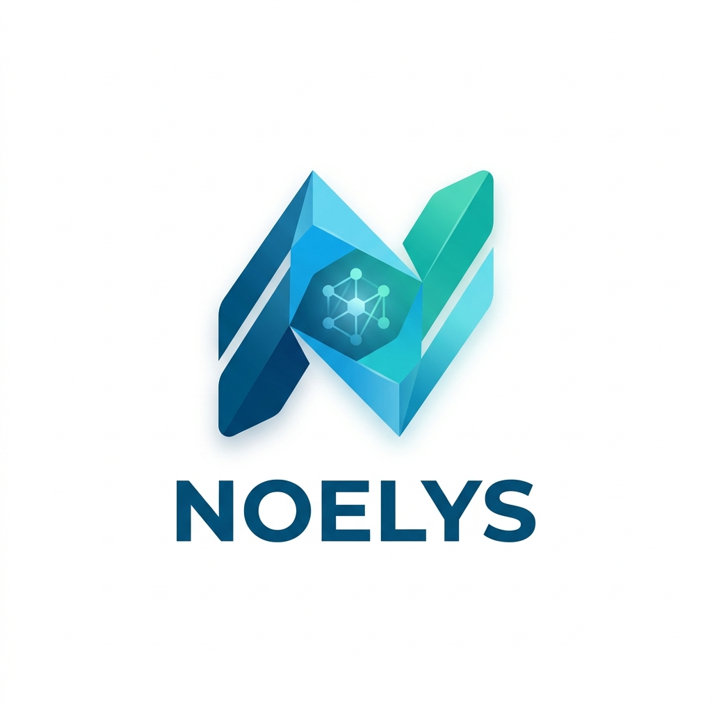
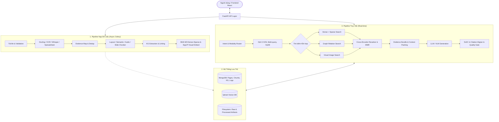

<h1 align="center">AgentBook: Hệ thống RAG đa phương thức bảo toàn và kiểm chứng dẫn chứng cho hỏi đáp tài liệu</h1>

<p align="center">
  
</p>

<p align="center">
  <strong>(AgentBook: An Evidence-Preserving Multimodal RAG System for Document Q&A)</strong>
</p>

<p align="center">
  <a href="https://fastapi.tiangolo.com/"></a>
  <a href="https://react.dev/"></a>
  <a href="https://www.mongodb.com/"></a>
  <a href="https://qdrant.tech/"></a>
  <a href="https://celeryproject.org/"></a>
  <a href="https://redis.io/"></a>
</p>

---

## 🌟 Giới thiệu tổng quan

**AgentBook** (tên mã: **Noelys**) là một hệ thống RAG (Retrieval-Augmented Generation) đa phương thức được thiết kế để giải quyết bài toán hỏi đáp tài liệu thực tế của doanh nghiệp và học thuật. Khác với các hệ thống RAG thông thường làm phẳng văn bản và trích dẫn mơ hồ, AgentBook đặt **Evidence Unit (Đơn vị bằng chứng)** làm trung tâm của toàn bộ vòng đời hệ thống (nạp liệu, tìm kiếm, sinh câu trả lời và kiểm chứng).

Hệ thống bảo toàn tuyệt đối thông tin tọa độ hình học (bounding box), số trang, nhãn thời gian âm thanh (audio timestamp) và độ tin cậy trích xuất trên nhiều loại tài liệu: **PDF nhiều cột, PowerPoint, Excel, ảnh quét scan, chữ viết tay và file ghi âm.**

---

## ✨ Các tính năng cốt lõi

1. **Pipeline nạp liệu đa phương thức bảo toàn dẫn chứng**:
   * **Văn bản & Bố cục**: Phân tách tài liệu bằng `Docling` để giữ nguyên cấu trúc tiêu đề, đoạn văn và thứ tự đọc.
   * **Bảng biểu & Bảng tính**: Nạp và cấu trúc lại bảng tính Excel/CSV dưới dạng lưới (grid) trong MongoDB.
   * **Ảnh quét & Chữ viết tay**: Nhận dạng thông qua EasyOCR và chuyển hướng VLM (Qwen2.5-VL) xử lý chữ viết tay hoặc biểu đồ phức tạp.
   * **Âm thanh**: Chuyển đổi giọng nói thành văn bản bằng `faster-whisper` giữ nguyên nhãn thời gian từng giây để phát lại citation dạng âm thanh.

2. **Tìm kiếm lai kết hợp Đồ thị tri thức nhẹ (Lightweight Graph-augmented RAG)**:
   * Kết hợp tìm kiếm dày-thưa (Dense-Sparse RRF) sử dụng mô hình đa ngôn ngữ `BGE-M3`.
   * Tích hợp Đồ thị tri thức (Knowledge Graph gồm Entities, Relations, Events) lưu trữ trực tiếp trên MongoDB thay vì Neo4j để tối ưu tài nguyên và hỗ trợ câu hỏi multi-hop.

3. **Tái xếp hạng & Đóng gói ngữ cảnh thông minh**:
   * Tái xếp hạng các ứng viên bằng Cross-Encoder và phân tán đa dạng bằng thuật toán MMR.
   * Áp dụng chiến lược đóng gói ngữ cảnh nhằm giảm thiểu hiện tượng LLM bỏ sót thông tin ở giữa ngữ cảnh dài (*Lost in the Middle*).

4. **Kiểm chứng sau sinh (Post-generation Verification)**:
   * **Sentence-Level Evidence Coverage (SLEC)**: Đối soát độ phủ bằng chứng ở cấp độ từng câu khẳng định của LLM bằng suy luận tự nhiên (NLI).
   * **Citation Alignment**: Đảm bảo các marker trích dẫn trỏ đúng tới các khối bằng chứng thực sự hỗ trợ câu đó.
   * **Controlled Refusal**: Tự động từ chối trả lời một cách an toàn nếu độ tin cậy hoặc lượng bằng chứng hợp lệ dưới ngưỡng cấu hình.

5. **Suy luận bảng tất định (Deterministic Table Reasoning)**:
   * Tự động phát hiện câu hỏi tính toán trên bảng và chuyển đổi sang bộ thực thi tính toán tất định thay vì để LLM tự suy luận số học, giúp loại bỏ hoàn toàn sai số.

---

## 🏗️ Kiến trúc hệ thống



---

## 📈 Kết quả thực nghiệm

Hệ thống được thử nghiệm trên bộ đánh giá gồm **294 câu hỏi trên 12 tài liệu thực tế** (báo cáo tài chính, hợp đồng pháp lý, tài liệu kỹ thuật, slide bài giảng, ghi âm cuộc họp).

### So sánh hiệu năng tổng thể
| Cấu hình | Recall@5 $\uparrow$ | Answer F1 $\uparrow$ | Citation F1 $\uparrow$ | Groundedness $\uparrow$ | Refusal F1 $\uparrow$ | Độ trễ p95 (s) $\downarrow$ |
| :--- | :---: | :---: | :---: | :---: | :---: | :---: |
| **Plain Vector RAG** | 0.22 | 0.11 | 0.34 | 0.47 | 0.00 | **113** |
| **Hybrid RAG** | 0.61 | 0.58 | 0.59 | 0.71 | 0.00 | 260 |
| **Hybrid + Graph** | 0.75 | **0.70** | **0.69** | **0.80** | 0.33 | 363 |
| **Full AgentBook (Đề xuất)** | **0.79** | 0.67 | 0.59 | 0.76 | **0.36** | 346 |

> [!NOTE]
> *Hệ thống đề xuất đạt Recall@5 cao nhất (0.79) và Refusal F1 tốt nhất (0.36). Điểm Answer F1 và Groundedness có sự thỏa hiệp nhẹ do lớp kiểm chứng chủ động cắt bỏ các câu trả lời thiếu bằng chứng hoặc tự động từ chối để ngăn chặn hiện tượng hallucination.*

---

## 🛠️ Hướng dẫn cài đặt & Chạy cục bộ

### Yêu cầu hệ thống
* Docker & Docker Compose
* Ollama chạy trên máy host (đã cài đặt và tải về mô hình `qwen2.5:7b` và `qwen2.5-vl:3b` nếu sử dụng tính năng thị giác).

### Khởi chạy hệ thống bằng Docker Compose
Hệ thống cung cấp một script PowerShell duy nhất `run.ps1` để quản lý toàn bộ vòng đời dịch vụ:

```powershell
# 1. Kiểm tra môi trường và khởi động toàn bộ dịch vụ (API, Worker, Frontend, Qdrant, Redis)
.\run.ps1

# 2. Kiểm tra trạng thái sức khỏe của các service và kết nối Ollama
.\run.ps1 status

# 3. Xem log của service cụ thể (ví dụ: api hoặc worker)
.\run.ps1 logs api

# 4. Dừng và gỡ bỏ các container
.\run.ps1 down
```

### Các cổng dịch vụ mặc định:
* **Giao diện người dùng (Frontend)**: [http://localhost](http://localhost) (Nginx proxy)
* **Backend API Swagger**: [http://localhost:8000/docs](http://localhost:8000/docs)
* **Qdrant Dashboard**: [http://localhost:6333/dashboard](http://localhost:6333/dashboard)

---

## 📁 Cấu trúc thư mục dự án

```text
├── backend/                  # Mã nguồn Backend FastAPI
│   ├── src/
│   │   ├── api/              # Đầu mút API REST
│   │   ├── agentic/          # Bounded Multi-Agent Planning & Orchestration
│   │   ├── processing/       # Phân tách tài liệu (Docling, Whisper, EasyOCR)
│   │   ├── rag/              # Tìm kiếm lai (Qdrant, MongoDB KG, Reranker)
│   │   ├── inference/        # Gọi LLM/VLM và xử lý bảng tất định
│   │   └── guardrails/       # Tầng kiểm chứng sau sinh (SLEC, Citation Aligner)
│   └── Dockerfile
├── frontend/                 # Giao diện người dùng React + TypeScript + Vite
│   ├── src/
│   │   ├── components/       # Các panel Chat, Source, Evidence, GraphCanvas
│   │   └── pages/            # Workspace và Login
│   └── Dockerfile
├── config/                   # Các tệp cấu hình tham số hệ thống (.yaml)
├── docs/                     # Tài liệu thiết kế và sơ đồ kiến trúc
├── evaluation/               # Tập dữ liệu gold benchmark & Scripts đánh giá ablation
└── docker-compose.yml        # Định nghĩa môi trường deploy đa dịch vụ
```

---

## 📜 Giấy phép & Thông tin nghiên cứu
Mã nguồn của hệ thống được công bố phục vụ mục đích học thuật và nghiên cứu. Chi tiết về báo cáo khoa học hệ thống của AgentBook tham khảo tại [paper.pdf](paper.pdf) hoặc [BaoCaoDoAn.pdf](BaoCaoDoAn.pdf).
