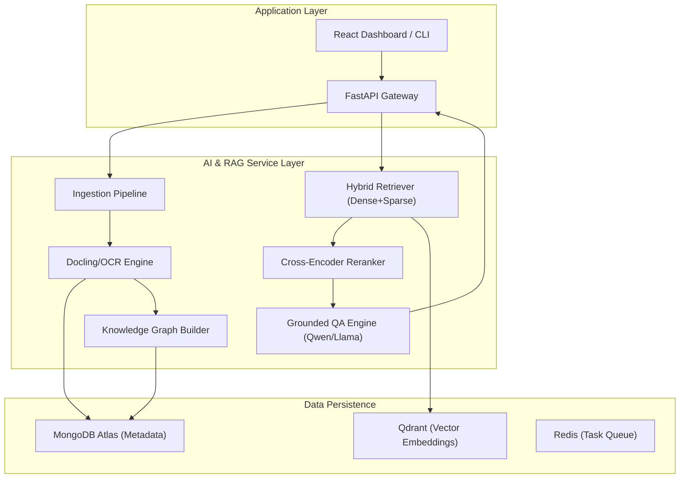

<div align="center">
  
  <h1>🚀 AgentBook-Platform</h1>
  <p><b>Graph RAG Document Intelligence for Advanced Cross-Document Reasoning</b></p>

  [](https://www.python.org/)
  [](https://fastapi.tiangolo.com/)
  [](https://reactjs.org/)
  [](https://qdrant.tech/)
  [](https://www.mongodb.com/)
  [](LICENSE)
</div>

---

## 🌟 Overview

**AgentBook** is a state-of-the-art Document Intelligence platform that goes beyond simple keyword search. By leveraging **Graph RAG** technology, it transforms static documents (PDFs, PPTXs, Images) into a dynamic Knowledge Graph. This allows users to perform **Cross-Document Reasoning**, trace evidence with pinpoint accuracy, and explore complex topics through interactive mindmaps.

Designed specifically for the Vietnamese academic and research context, AgentBook handles bilingual (EN-VI) sources, scanned documents, and even clear handwritten notes.

## ✨ Key Features

- **🔍 Hybrid & Graph Retrieval**: 
  - BGE-M3 Dense + Sparse vectors with RRF fusion
  - Lexical fallback for robustness
  - Knowledge Graph traversal for multi-hop reasoning
  - Redis-backed embedding cache for 2-3x throughput
- **📄 Multimodal Document Parsing**: 
  - Layout-aware parsing with Docling
  - EasyOCR for printed text and clear handwritten notes
  - Multi-variant preprocessing (grayscale, contrast enhancement) for low-quality scans
  - Table, figure, and equation extraction
  - Semantic chunking with tokenizer-accurate counting
- **🖇️ Evidence Tracing & Citations**: 
  - Every response includes verifiable citations with document names, page numbers, block IDs, and bounding boxes
  - Complete evidence trace preserved through entire pipeline
  - Confidence scoring and refusal when evidence insufficient
- **⚖️ Cross-Document Comparison**: 
  - Automatically generate comparison tables between multiple sources
  - Detect contradictions using NLI-based claim verification
  - Cross-lingual support (Vietnamese query → English documents)
- **🧠 Interactive Mindmaps**: 
  - Visualize knowledge base as dynamic mindmap powered by React Flow
  - Entity and relation extraction with evidence references
  - Click nodes to view supporting evidence
- **🛡️ Guardrails & Safe Refusal**: 
  - Confidence-based refusal (min reranker score, min evidence confidence)
  - Claim verification to detect contradictions
  - Image quality gates for handwriting OCR
  - No hallucinations - strictly grounded in uploaded documents

## 🏗️ System Architecture



## 🛠️ Tech Stack

### Backend
- **Framework**: FastAPI (Python 3.12+)
- **Task Management**: Celery + Redis
- **RAG Core**: 
  - **Embedding**: BGE-M3 (Dense + Sparse vectors)
  - **Reranking**: BGE-reranker-v2-m3 (CrossEncoder)
  - **Retrieval**: Hybrid (Dense + Sparse + Lexical) with RRF fusion
  - **Chunking**: Semantic chunking (Kamradt 2023) with tokenizer-accurate counting
  - **Query Processing**: LLM-based Multi-Query rewriting + Dictionary fallback
- **LLM**: Qwen2.5 3B (Local via Ollama) with OpenAI API fallback
- **Parsing**: IBM Docling, EasyOCR (for printed text and handwriting)
- **Graph**: MongoDB edge collections for knowledge graph

### Databases
- **Vector DB**: Qdrant (Docker / Cloud) with dense + sparse vectors
- **Metadata DB**: MongoDB Atlas + Beanie ODM
- **Cache**: Redis (embedding cache + task queue)

### Frontend
- **Framework**: Vite + React + TypeScript
- **State**: Zustand + TanStack Query
- **Visualization**: React Flow (for Graphs & Mindmaps)
- **UI**: Tailwind CSS + shadcn/ui

## 🚀 Getting Started

### Prerequisites
- Docker & Docker Compose
- Python 3.11+
- MongoDB Atlas account (or local MongoDB)

### Installation

1. **Clone the repository**:
   ```bash
   git clone https://github.com/nvtanphat/AgentBook-Platform.git
   cd AgentBook-Platform
   ```

2. **Configure Environment**:
   Create a `.env` file in the `backend/` directory based on `.env.example`.
   ```bash
   cp backend/.env.example backend/.env
   # Edit backend/.env with your MONGODB_URI and API keys
   ```

3. **Spin up Infrastructure**:
   ```bash
   docker compose up -d
   ```

4. **Start the Backend**:
   ```bash
   cd backend
   pip install -r requirements.txt
   uvicorn src.main:app --reload
   ```

5. **Start the Frontend**:
   ```bash
   cd frontend
   npm install
   npm run dev
   ```

## 📊 Evaluation & Benchmarking

AgentBook includes a comprehensive evaluation suite to ensure retrieval accuracy and answer quality:

### Retrieval Metrics
- **Recall@k**: Proportion of relevant documents in top-k results
- **MRR (Mean Reciprocal Rank)**: Rank of first relevant document
- **nDCG@k**: Normalized Discounted Cumulative Gain
- **MAP (Mean Average Precision)**: Average precision across queries

Run evaluation:
```bash
cd backend
pytest tests/test_evaluation/test_retrieval_metrics.py -v
```

### RAG Quality
- **Faithfulness**: Answers grounded in evidence
- **Relevancy**: Answers address the query
- **Citation Accuracy**: Citations point to correct sources
- **Cross-lingual Quality**: Vietnamese query → English document retrieval

### Performance Benchmarks
- **Indexing**: ~2-5 documents/minute (with contextual enrichment)
- **Query Latency**: 2-8 seconds (local LLM), 1-3 seconds (API fallback)
- **Retrieval Recall@5**: >80% on test corpus
- **Cache Hit Rate**: 70-80% with Redis cache

## 🤝 Contributing

Contributions are welcome! Please feel free to submit a Pull Request.

## 📜 License

This project is licensed under the MIT License - see the [LICENSE](LICENSE) file for details.

---
<div align="center">
  Built with ❤️ by the AgentBook Team
</div>
