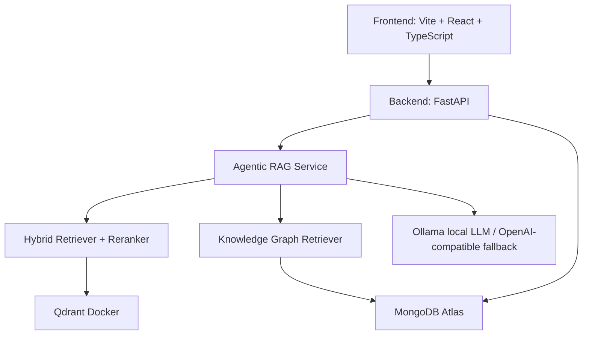

# Noelys

Noelys là nền tảng Document Intelligence dùng Hybrid RAG, Graph RAG và agentic orchestration để hỏi đáp trên tài liệu học tập. Dự án hiện chạy theo mô hình local-first: frontend Vite, backend FastAPI, Qdrant qua Docker, MongoDB Atlas và LLM local qua Ollama.

## Tính năng chính

- Hỏi đáp có căn cứ trên PDF, DOCX, PPTX, ảnh, CSV/XLSX.
- Agentic RAG bật mặc định: lập kế hoạch truy xuất, multi-query retrieval, truy xuất theo từng nguồn, kiểm tra độ phủ, repair retrieval, rerank, tổng hợp và kiểm chứng claim.
- Citation đầy đủ: tên tài liệu, trang, block, bounding box và confidence.
- Hybrid retrieval: BGE-M3 dense + sparse vectors, RRF fusion, reranker BGE-reranker-v2-m3.
- Knowledge Graph và mindmap: entity/relation extraction, graph traversal, React Flow visualization.
- Tóm tắt, study guide, bảng so sánh nhiều nguồn và phát hiện mâu thuẫn cơ bản.
- Hỗ trợ tiếng Việt/English, OCR cho ảnh/scanned PDF và pipeline xử lý multimodal.

## Kiến trúc hiện tại



## Yêu cầu

- Windows PowerShell
- Python 3.11+
- Node.js 18+
- Docker Desktop
- MongoDB Atlas URI trong `backend/.env`
- Ollama đang chạy với model trong `config/model_config.yaml`

Model local mặc định trong config hiện tại:

```text
qwen2.5:3b
```

Cài model nếu chưa có:

```powershell
ollama pull qwen2.5:3b
ollama serve
```

## Cấu hình môi trường

Tạo file env backend từ mẫu:

```powershell
Copy-Item backend\.env.example backend\.env
```

Các biến quan trọng:

```env
MONGODB_URI=mongodb+srv://...
AGENTBOOK_MONGODB_DATABASE=agentbook
AGENTBOOK_QDRANT_URL=http://localhost:6333
AGENTBOOK_AGENTIC_RAG_ENABLED=true
AGENTBOOK_LLM_DEFAULT_PROVIDER=local
AGENTBOOK_LLM_LOCAL_MODEL=qwen2.5:3b
AGENTBOOK_OLLAMA_BASE_URL=http://localhost:11434
```

`start_all.ps1` sẽ kiểm tra Qdrant Docker và patch `.env` sang `http://localhost:6333` nếu đang trỏ nhầm local path.

## Chạy dự án

Cách khuyến nghị:

```powershell
powershell.exe -ExecutionPolicy Bypass -File .\start_all.ps1
```

Script sẽ:

- Dừng process cũ trên port `8000` và `5173`.
- Khởi động Qdrant bằng `docker compose up -d qdrant`.
- Chờ Qdrant sẵn sàng ở `http://localhost:6333/readyz`.
- Chạy backend ở `http://localhost:8000`.
- Chạy frontend ở `http://localhost:5173`.
- Ghi log vào `backend.out.log`, `backend.err.log`, `frontend.out.log`, `frontend.err.log`.

URL sau khi chạy:

- Frontend: http://localhost:5173
- Backend: http://localhost:8000
- API docs: http://localhost:8000/docs
- Qdrant dashboard: http://localhost:6333/dashboard

## Chạy thủ công

Backend:

```powershell
cd backend
pip install -r requirements.txt
python -m uvicorn src.main:app --port 8000
```

Frontend:

```powershell
cd frontend
npm install
npm run dev
```

Qdrant:

```powershell
docker compose up -d qdrant
```

## API chính

- `GET /health`: kiểm tra backend.
- `POST /api/v1/materials/upload`: upload một tài liệu.
- `POST /api/v1/materials/batch_upload`: upload nhiều tài liệu.
- `GET /api/v1/materials`: danh sách tài liệu.
- `POST /api/v1/query/ask`: hỏi đáp RAG.
- `POST /api/v1/query/ask-stream`: SSE stream, có `agent_step` và `done`.
- `POST /api/v1/query/compare`: so sánh theo khía cạnh.
- `POST /api/v1/query/summarize`: tóm tắt.
- `POST /api/v1/query/study-guide`: tạo study guide.
- `POST /api/v1/graph`: graph view.
- `POST /api/v1/graph/mindmap`: mindmap.

## Agentic RAG

Agentic RAG hiện nằm trong `backend/src/agentic/` và được gọi từ `QueryService` khi `AGENTBOOK_AGENTIC_RAG_ENABLED=true`.

Luồng xử lý chính:

- `plan_query`: chọn route và kế hoạch.
- `retrieve_multi_query` hoặc `retrieve_text`: tìm bằng chứng.
- `retrieve_per_source`: đảm bảo nhiều nguồn đều được xét.
- `trace_graph`: dùng Knowledge Graph cho câu hỏi quan hệ.
- `verify_coverage`: kiểm tra nguồn nào đã có bằng chứng.
- `repair_retrieval`: truy xuất bổ sung cho nguồn còn thiếu.
- `rerank_evidence`: chọn context cuối.
- `synthesize_answer`: gọi LLM để tổng hợp.
- `verify_claims`: kiểm chứng claim bằng evidence.

Frontend hiển thị agent status, coverage badge, verification badge, reasoning trace và citation footer trong chat.

## Test và build

Backend tests đã dùng để kiểm tra trạng thái hiện tại:

```powershell
python -m pytest backend\tests\test_agentic backend\tests\test_inference\test_query_endpoint.py -q
python -m pytest backend\tests\test_inference backend\tests\test_rag -q
```

Frontend build:

```powershell
npm.cmd --prefix frontend run build
```

Lưu ý: Vite hiện có warning chunk lớn hơn 500 kB sau minification; build vẫn thành công.

## Troubleshooting

Backend không lên:

```powershell
Get-Content backend.err.log -Tail 80
Invoke-WebRequest http://127.0.0.1:8000/health -UseBasicParsing
```

Frontend không lên:

```powershell
Get-Content frontend.err.log -Tail 80
Invoke-WebRequest http://localhost:5173 -UseBasicParsing
```

Qdrant không sẵn sàng:

```powershell
docker compose ps
Invoke-WebRequest http://localhost:6333/readyz -UseBasicParsing
```

Ollama/model lỗi:

```powershell
ollama list
ollama pull qwen2.5:3b
```

Port bị chiếm:

```powershell
Get-NetTCPConnection -LocalPort 8000,5173,6333 -State Listen | Select-Object LocalPort,OwningProcess
```

## Ghi chú phát triển

- Không cần chạy Redis/Celery worker riêng cho workflow local hiện tại nếu task eager mode được bật trong môi trường chạy.
- Qdrant hiện chạy qua Docker theo `start_all.ps1`.
- MongoDB metadata dùng Atlas qua `MONGODB_URI`.
- Prompt tiếng Việt và các UI text đã được chuẩn hóa UTF-8; nếu thấy mojibake kiểu `Báº...` hoặc `Ã...`, cần sửa file ở encoding UTF-8.
