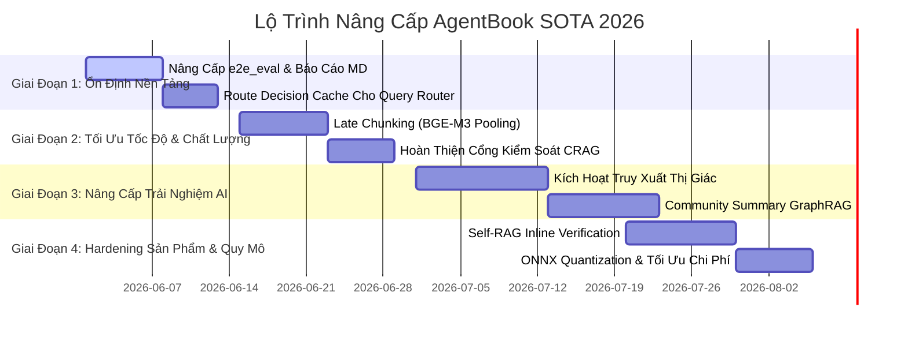

# 🏆 AgentBook: Bản Phân Tích Kiến Trúc & Lộ Trình Nâng Cấp SOTA 2026

Tài liệu này cung cấp một bản phân tích chuyên sâu, chuyên nghiệp và chặt chẽ về nền tảng AgentBook. Chúng tôi đánh giá thiết kế hệ thống, stack công nghệ, pipeline dữ liệu và các mẫu thiết kế frontend/backend đối chiếu với **tiêu chuẩn State-of-the-Art (SOTA) năm 2026**, từ đó vạch ra lộ trình nâng cấp từng bước nhằm tối ưu hiệu năng, độ an toàn và trải nghiệm người dùng ở quy mô enterprise.

---

## 📌 1. Tóm Tắt Dự Án (Executive Summary)

AgentBook là một trợ lý RAG (Retrieval-Augmented Generation) phục vụ mục đích giáo dục, định hướng bằng tài liệu học tập tải lên từ người dùng. Hệ thống sở hữu khả năng truy vết nguồn dẫn chứng (citation tracing) độ chính xác cao, hỗ trợ truy vấn đa ngôn ngữ (Tiếng Việt trên tài liệu Tiếng Anh), nhận dạng chữ viết tay và biểu diễn đồ thị tri thức (knowledge graph).

### 📊 Đánh Giá Tech Stack & Điểm Mạnh Hiện Tại
- **Backend API & Điều Phối**: FastAPI (async) kết hợp Celery & Redis để xử lý các tác vụ phân tích layout và ingestion nặng, tốn tài nguyên CPU.
- **Lưu Trữ Dữ Liệu & Vector**: Beanie ODM trên MongoDB lưu trữ schema tài liệu cấu trúc; Qdrant làm cơ sở dữ liệu vector đa đại diện (dense + sparse). Môi trường có thể dùng MongoDB local hoặc Atlas tùy `MONGODB_URI`.
- **Pipeline RAG**: Tìm kiếm hybrid BGE-M3 (dense + sparse), kết hợp Reciprocal Rank Fusion (RRF) và mô hình Reranker BGE v2.
- **Tư Duy Thiết Kế**: Truy vấn được cô lập chặt chẽ theo phạm vi (`owner_id` + `collection_id`), các ngưỡng và prompt được quản lý tập trung qua file cấu hình.
- **Tối Ưu Hóa Sẵn Có**: Đã tích hợp lớp định tuyến lai LLM + Regex (`QueryRouter`), semantic query cache ở tầng inference, CRAG evaluator theo feature flag, visual embedding/indexing theo feature flag, Selective Ingestion để giảm số lượt gọi LLM và tập lệnh đánh giá tự động E2E (`backend/scripts/e2e_eval.py`).

### ⚠️ Trạng Thái Kỹ Thuật & Khoảng Cách Công Nghệ (Góc Nhìn SOTA 2026)
1. **Ingestion Tài Liệu Lớn Cần Tối Ưu Thêm**: Selective Contextual Ingestion đã giúp giảm số chunk cần gọi LLM, nhưng với PDF dài, Late Chunking vẫn là hướng nâng cấp hợp lý để giữ ngữ cảnh mà giảm phụ thuộc vào LLM enrichment.
2. **Semantic Cache Đã Có Ở Tầng Inference**: Code hiện tại đã có `SemanticQueryCache` để cache câu hỏi/câu trả lời gần nghĩa. Khoảng cách còn lại là cache riêng cho quyết định định tuyến của `QueryRouter` nếu muốn giảm thêm thời gian routing khi bật LLM router.
3. **CRAG Đã Có Module, Cần Hoàn Thiện Luồng Bật/Tắt**: `CRAGEvaluator` đã được nối vào inference engine theo feature flag. Việc cần làm là chuẩn hóa tiêu chí bật trong cấu hình, đo chất lượng trước/sau và bổ sung test cho các truy vấn biên.
4. **Claim Verification Đang Là Hậu Kiểm**: Luồng xác thực dẫn chứng hiện chạy sau khi sinh câu trả lời. Có thể nâng cấp sang kiểm soát từng tuyên bố trong quá trình sinh để giảm vòng sửa lại.
5. **Visual Retrieval Đã Có Nền Tảng**: Code đã có visual embedder, visual indexing và endpoint hỏi bằng ảnh; cấu hình mặc định đang tắt. Khoảng cách còn lại là bật theo môi trường, bổ sung dữ liệu test và đo hiệu quả với tài liệu nhiều biểu đồ/bảng.
6. **Benchmark E2E Cần Báo Cáo Dễ Đọc Hơn**: Tập lệnh `backend/scripts/e2e_eval.py` đã xuất JSONL; nên bổ sung báo cáo Markdown/HTML và ngưỡng chất lượng để dùng trong CI.

---

## 🗺️ 2. Bản Đồ Kiến Trúc Hiện Tại

Sơ đồ dưới đây mô tả hành trình thực tế của một truy vấn đi qua hệ thống AgentBook. Các nhánh CRAG, LLM router, agentic planning và visual retrieval là nhánh có điều kiện, phụ thuộc vào cấu hình feature flag.

```mermaid
graph TD
    %% Styling
    classDef client fill:#f9f,stroke:#333,stroke-width:2px;
    classDef process fill:#bbf,stroke:#333,stroke-width:1px;
    classDef storage fill:#fdd,stroke:#333,stroke-width:1px;
    classDef AI fill:#dfd,stroke:#333,stroke-width:2px;

    %% Ingestion Pipeline
    subgraph "Pipeline Ingestion (Celery Tasks)"
        Doc[Tài Liệu Học Tập] --> Docling[Docling Layout Parser]
        Docling --> OCR[EasyOCR / Handwriting OCR]
        Docling --> VisualIndex[Visual Figure/Page Indexing - optional]
        OCR --> Chunker[Layout-Aware & Semantic Chunker]
        Chunker --> Context[LLM Contextual Enricher: Selective, Concurrency=4]
        Context --> Embed[BGE-M3 Dense + Sparse Embedder]
        Embed --> Qdrant[(Qdrant Vector DB)]
        VisualIndex --> Qdrant
        Docling --> GraphBuild[Graph Builder: Relations & Communities]
        GraphBuild --> Mongo[(MongoDB)]
    end

    %% Query Pipeline
    subgraph "Pipeline Truy Xuất & Sinh Câu Trả Lời"
        User([Truy Vấn Người Dùng]) --> Cache[Semantic Query Cache]
        Cache --> Router[Query Router: Regex + LLM khi bật]
        Router --> |Chitchat / Off-topic| Refuse[Chính Sách Từ Chối / Phản Hồi Chitchat]
        Router --> |Truy Vấn RAG Hợp Lệ| Planner[Agentic Planner]
        
        Planner --> MQE[Bản Mở Rộng Đa Truy Vấn]
        MQE --> Hybrid[Qdrant Hybrid Search: Dense + Sparse]
        Hybrid --> RRF[RRF Fusion & BGE Reranker v2]
        
        %% Graph Branch
        Planner --> GraphSearch[Graph Retriever: 2-Hop Entity Path]
        
        RRF --> FuseBoth[Bộ Gom Tự Truy Xuất]
        GraphSearch --> FuseBoth
        
        FuseBoth --> CRAG{CRAG Evaluator - optional}
        CRAG -->|Không Liên Quan| Strip[Cắt Bỏ Câu Thừa / Rác]
        CRAG -->|Mơ Hồ| Decompose[Phân Rã Câu Hỏi & Truy Xuất Lại]
        CRAG -->|Chính Xác| Synthesis[LLM Tổng Hợp Câu Trả Lời]
        
        Strip --> Synthesis
        
        Synthesis --> ClaimVerify{Xác Thực Tuyên Bố: NLI / DeBERTa}
        ClaimVerify -->|Thiếu Căn Cứ| Repair[LLM Sửa Lỗi Câu Trả Lời]
        ClaimVerify -->|Vượt Qua| Output[Câu Trả Lời Grounded + Nguồn Dẫn Chứng]
        Repair --> Output
    end
    
    class User,Output client;
    class Docling,OCR,VisualIndex,Chunker,Context,Cache,Router,Planner,MQE,Hybrid,RRF,CRAG,ClaimVerify process;
    class Qdrant,Mongo storage;
    class Doc,Refuse,Synthesis,Repair AI;
```

---

## 🧭 3. Danh Sách Điểm Cần Hoàn Thiện Theo Ưu Tiên

Qua kiểm tra mã nguồn hiện tại, dưới đây là các điểm nên hoàn thiện để lộ trình khớp đúng trạng thái code thay vì ghi nhận sai là “chưa có”:

| Ưu Tiên | Hạng Mục | Module Liên Quan | Trạng Thái Khớp Code Hiện Tại |
|---|---|---|---|
| **P0** | **Báo cáo benchmark E2E** | `backend/scripts/e2e_eval.py` | Script đã tồn tại và xuất JSONL. Nên bổ sung báo cáo Markdown/HTML, bảng tổng hợp chỉ số và ngưỡng kiểm tra chất lượng cho CI. |
| **P0** | **Feature flag cho CRAG** | `rag/crag_evaluator.py`, `inference/inference_engine.py`, `core/config.py` | Module và luồng gọi đã có, mặc định `crag_evaluator_enabled=False`. Cần chuẩn hóa cấu hình, tiêu chí bật và test trước/sau. |
| **P1** | **Semantic cache cho routing** | `rag/query_router.py`, `services/semantic_query_cache.py`, `rag/embedding_cache.py` | Semantic query cache đã có ở tầng inference. Cần thêm hoặc tái sử dụng cache cho `RouteDecision` nếu LLM router được bật. |
| **P1** | **Visual retrieval** | `rag/visual_embedder.py`, `rag/indexer.py`, `services/parse_index_pipeline.py`, `services/query_service.py` | Visual embed/index/query đã có nền tảng, mặc định `visual_embedding_enabled=False`. Cần bật theo môi trường, thêm benchmark và kiểm tra UX. |
| **P1** | **Graph community summary** | `rag/graph_builder.py`, `api/v1/endpoints/graph.py`, `rag/graph_retriever.py` | Code đã có tính community ở đồ thị. Còn thiếu lớp lưu/tóm tắt community cấp cao để trả lời câu hỏi tổng quan toàn bộ bộ tài liệu. |
| **P2** | **Late Chunking** | `rag/embedder.py`, `processing/chunking.py`, `tasks/celery_tasks.py` | Chưa thấy triển khai late chunking token-pooling. Đây là nâng cấp tối ưu ingestion, không phải điều kiện để hệ thống hiện tại chạy đúng. |

---

## 📈 4. Phân Tích Khoảng Cách SOTA 2026

Để định vị AgentBook đi đầu trong các hệ thống RAG xử lý tài liệu thông minh vào năm 2026, kiến trúc hệ thống cần chuyển đổi từ các quy trình tuần tự, dựa trên luật (heuristics) sang **pipeline bảo toàn ngữ cảnh, tự thích ứng và nhận thức thị giác**.

### A. Quy Trình Ingestion & Biểu Diễn Tài Liệu
- **Tiêu chuẩn SOTA 2026**: Kết hợp OCR/layout parser với mô hình thị giác-ngôn ngữ như SigLIP, ColPali hoặc ColQwen để giữ cả nội dung chữ, bảng, biểu đồ và sơ đồ.
- **Khoảng cách hiện tại**: AgentBook đã có Docling + EasyOCR cho text/layout và đã có nền tảng visual embedding/indexing, nhưng visual retrieval đang phụ thuộc cấu hình và chưa có bộ benchmark riêng cho tài liệu nhiều hình/bảng.
- **Hướng nâng cấp SOTA**: Giữ Docling làm nguồn cấu trúc chính, bật và chuẩn hóa **SigLIP/Visual Embedding** cho các sơ đồ, đồ thị hoặc trang nhiều bảng biểu phức tạp. Điều này hỗ trợ tìm kiếm bằng hình ảnh và chọn đúng vùng/trang tài liệu trước khi gửi sang VLM.

### B. Embedding & Bảo Toàn Ngữ Cảnh Toàn Cục
- **Tiêu chuẩn SOTA 2026**: Sử dụng **Late Chunking** (Jina AI). Thay vì chia nhỏ văn bản rồi mới nhúng từng đoạn tách biệt, tài liệu đầy đủ được đưa qua mô hình embedding hỗ trợ ngữ cảnh dài (như BGE-M3 lên tới 8192 tokens) để lấy embedding ở mức token. Sau đó, tiến hành gom cụm trung bình (mean-pooling) theo ranh giới của các khối layout. Mỗi chunk kết quả tự động mang thông tin ngữ cảnh của toàn bộ tài liệu mà **không cần bất kỳ lượt gọi LLM nào**.
- **Khoảng cách hiện tại**: AgentBook dùng `ContextualEnricher` (gọi LLM cho các chunk chọn lọc), dù đã giảm 70% chi phí nhưng vẫn tồn tại độ trễ LLM API đáng kể cho tài liệu dài.
- **Hướng nâng cấp SOTA**: Xây dựng thuật toán Late Chunking trong `rag/embedder.py` và `processing/chunking.py`. Gom tụ token embedding theo ranh giới khối semantic. Bỏ hoàn toàn cuộc gọi LLM làm giàu ngữ cảnh cho các trang tài liệu chuẩn, chỉ giữ lại cho các cấu trúc bảng đặc biệt phức tạp.

### C. Pipeline Tìm Kiếm & Lọc Dữ Liệu RAG
- **Tiêu chuẩn SOTA 2026**: Tích hợp **Corrective RAG (CRAG)** kèm bộ định tuyến động. Các kết quả tìm kiếm được đánh giá độ tin cậy bằng một mô hình phân loại cực nhẹ. Loại bỏ ngay thông tin rác, và định tuyến các câu truy vấn mập mờ sang nhánh xử lý phân rã câu hỏi hoặc tìm kiếm bổ trợ.
- **Khoảng cách hiện tại**: `CRAGEvaluator` đã tồn tại và được gọi theo cấu hình, nhưng mặc định đang tắt. Cần đo chất lượng truy xuất khi bật CRAG và chuẩn hóa tiêu chí giữ/bỏ chunk.
- **Hướng nâng cấp SOTA**: Hoàn thiện cách dùng `rag/crag_evaluator.py` trong `inference/inference_engine.py`, thêm test cho các truy vấn ít bằng chứng, truy vấn nhiễu và truy vấn cần từ chối theo chính sách dẫn chứng.

### D. Sinh Câu Trả Lời & Kiểm Soát An Toàn (Guardrails)
- **Tiêu chuẩn SOTA 2026**: Áp dụng **Self-RAG Inline Reflection Tokens** (Asai et al.). LLM tự sinh các thẻ phản hồi tích hợp (ví dụ: `[Retrieve]`, `[FullySupported]`, `[NoSupport]`) trong quá trình tạo từng từ. Điều này cho phép hệ thống streaming dừng lại hoặc tự điều chỉnh câu ngay lập tức khi phát hiện lỗi logic mà không cần đợi chạy xong toàn bộ đoạn văn.
- **Khoảng cách hiện tại**: Kiểm tra hậu kỳ thông qua Pydantic validation và thực hiện viết lại (rewrite) nếu không khớp nguồn dẫn chứng.
- **Hướng nâng cấp SOTA**: Thay đổi các Prompt template để bắt buộc Qwen đầu ra định dạng XML cấu trúc hoặc các thẻ phản ánh (reflection tags) trên từng tuyên bố dẫn chứng, cho phép frontend streaming trực tiếp trạng thái suy luận thời gian thực.

---

## 🚀 5. Lộ Trình Nâng Cấp SOTA 2026 Theo Giai Đoạn

Dưới đây là kế hoạch triển khai nâng cấp hệ thống được chia làm 4 giai đoạn logic để đảm bảo tính ổn định và liên tục của dự án:

---

## 🛠️ 6. Đề Xuất Nâng Cấp Chi Tiết

### 📍 1. Tích Hợp Late Chunking (Bảo Toàn Ngữ Cảnh Không Tốn LLM)
*   **Vấn đề hiện tại**: Module `ContextualEnricher` bắt buộc gọi LLM cho mỗi chunk riêng lẻ (chọn lọc), gây ra độ trễ cao khi xử lý tài liệu lớn.
*   **Tại sao cần nâng cấp**: Late Chunking giúp nhúng toàn bộ trang tài liệu trước, từ đó các token embedding tự động giữ được mối tương quan ngữ cảnh của các câu xung quanh nó. Việc gom trung bình (pooling) sau đó giúp chunk thu được giữ nguyên chất lượng ngữ cảnh mà **không tốn một lượt gọi LLM nào** khi ingestion.
*   **Hướng nâng cấp cụ thể**:
    1. Trong `rag/embedder.py`, thêm hàm `embed_document_late_chunking(text: str, boundaries: list[tuple[int, int]]) -> list[list[float]]`.
    2. Nạp toàn bộ text khối tài liệu lớn vào BGE-M3 (tận dụng tối đa giới hạn 8192 tokens của model) để lấy ra tensor token-level embeddings.
    3. Thực hiện mean-pooling trên các khoảng token tương ứng với tọa độ kí tự (character spans) trả ra từ `processing/chunking.py`.
    4. Ghi trực tiếp các vector này vào Qdrant.
*   **Module liên quan**: `backend/src/rag/embedder.py`, `backend/src/processing/chunking.py`, `backend/src/tasks/celery_tasks.py`.
*   **Lưu ý khi triển khai**: Các tài liệu quá dài vượt quá 8192 tokens cần được chia cửa sổ trượt có đè gối (overlap window khoảng 6000 tokens) để tránh bị cắt bỏ (truncation) ở biên cuối.
*   **Cách test/verify**: Kiểm tra độ tương đồng cosine (Cosine Similarity) của vector Late Chunking so với vector sinh từ LLM Contextual Enricher trên bộ thử nghiệm `RAGASEvaluator`.
*   **Ước lượng effort**: **M** (Trung bình - ~3-4 ngày)

---

### 📍 2. Hoàn Thiện Cổng Lọc Corrective RAG (CRAG)
*   **Vấn đề hiện tại**: `CRAGEvaluator` đã tồn tại và đã được nối vào inference engine, nhưng mặc định đang tắt bằng cấu hình. Luồng cần được đo lại để xác định khi nào nên giữ chunk, lọc chunk hoặc chuyển sang trả lời theo chính sách không đủ bằng chứng.
*   **Tại sao cần nâng cấp**: Các hệ thống RAG SOTA hiện nay đều áp dụng quy trình kiểm soát độ phù hợp trước khi sinh câu trả lời. Nếu kết quả tìm kiếm kém, hệ thống nên làm sạch ngữ cảnh hoặc phân rã lại câu hỏi trước khi tổng hợp.
*   **Hướng nâng cấp cụ thể**:
    1. Rà soát lại `rag/crag_evaluator.py` và chuẩn hóa nhãn từng chunk trả về là `CORRECT` (Chính xác), `INCORRECT` (Sai lệch), hoặc `AMBIGUOUS` (Mơ hồ) thông qua điểm số của cross-encoder reranker.
    2. Nếu phần lớn các chunk bị gán nhãn `INCORRECT`, lập tức kích hoạt cơ chế từ chối phản hồi an toàn hoặc thực hiện phân rã câu hỏi.
    3. Với các chunk mang nhãn `AMBIGUOUS`, chạy bộ lọc trích xuất ý chính để giữ lại các câu đơn mang từ khóa then chốt, cắt bỏ toàn bộ các câu nhiễu xung quanh.
    4. Chỉ nạp các phần văn bản đã qua xác thực chất lượng vào prompt tổng hợp cuối cùng.
*   **Module liên quan**: `backend/src/rag/crag_evaluator.py`, `backend/src/inference/inference_engine.py`, `backend/src/rag/retriever.py`.
*   **Lưu ý khi triển khai**: Có thể tăng nhẹ độ trễ nếu mô hình phân loại chạy chậm trên CPU. Cần tối ưu bằng ONNX runtime hoặc chỉ bật CRAG cho nhóm truy vấn cần kiểm tra sâu.
*   **Cách test/verify**: Chạy thử nghiệm với các bộ tài liệu nhiễu, kiểm tra xem hệ thống có từ chối trả lời hoặc kích hoạt phân rã câu hỏi chuẩn xác hay không.
*   **Ước lượng effort**: **M** (Trung bình - ~3 ngày)

---

### 📍 3. Mở Rộng Bộ Nhớ Đệm Ngữ Nghĩa Cho Query Router
*   **Vấn đề hiện tại**: Hệ thống đã có `SemanticQueryCache` ở tầng inference để cache kết quả hỏi đáp gần nghĩa. Riêng quyết định định tuyến của `QueryRouter` chưa có cache chuyên biệt, nên khi bật LLM router, các câu hỏi tương tự vẫn có thể phải đi qua bước định tuyến bằng LLM.
*   **Tại sao cần nâng cấp**: Cache cho `RouteDecision` giúp tái sử dụng quyết định định tuyến dựa trên độ tương đồng embedding. Đối với các câu hỏi cùng chủ đề, hệ thống có thể trả về route gần như tức thời mà không cần gọi lại LLM.
*   **Hướng nâng cấp cụ thể**:
    1. Tích hợp một lớp `QueryRouteCache` đơn giản trong `rag/query_router.py` hoặc tái sử dụng hạ tầng `services/semantic_query_cache.py`.
    2. Khi nhận một truy vấn mới, sử dụng `BGEM3Embedder` để tạo vector câu hỏi.
    3. Thực hiện so khớp cosine similarity với danh sách các câu hỏi đã được cache.
    4. Nếu độ tương đồng vượt quá ngưỡng thiết lập (ví dụ: 0.92), tái sử dụng ngay lập tức kết quả `RouteDecision` đã lưu.
    5. Chỉ khi cache miss mới gọi `route_with_llm` để định tuyến và sau đó ghi kết quả mới vào bộ đệm cache.
*   **Module liên quan**: `backend/src/rag/query_router.py`, `backend/src/services/semantic_query_cache.py`, `backend/src/rag/embedding_cache.py`.
*   **Lưu ý khi triển khai**: Cache cần có eviction policy và cần phân tách theo `owner_id`/`collection_id` để không dùng nhầm route giữa các phạm vi dữ liệu khác nhau.
*   **Cách test/verify**: Đo lường thời gian phản hồi định tuyến giữa lần hỏi thứ nhất và lần hỏi thứ hai của cùng một câu hoặc câu đồng nghĩa.
*   **Ước lượng effort**: **S** (Nhỏ - ~2 ngày)

---

### 📍 4. Truy Xuất Tài Liệu Trực Quan (ColPali/SigLIP Style)
*   **Vấn đề hiện tại**: Code đã có `visual_embedder`, `index_visual`, pipeline index hình ảnh và endpoint hỏi bằng ảnh. Tuy nhiên tính năng phụ thuộc `visual_embedding_enabled`, mặc định đang tắt và chưa có benchmark riêng cho nhóm tài liệu trực quan.
*   **Tại sao cần nâng cấp**: Các tài liệu học thuật hiện đại truyền tải nhiều thông tin qua hình ảnh, bảng, biểu đồ và công thức. Visual retrieval giúp bổ sung tín hiệu trực quan bên cạnh OCR/text retrieval.
*   **Hướng nâng cấp cụ thể**:
    1. Kích hoạt cấu hình visual embedding (`google/siglip-base-patch16-224` trên CPU hoặc CUDA).
    2. Chuyển đổi các trang PDF phức tạp, bảng biểu thành các vector trực quan tương ứng khi ingestion.
    3. Định chỉ mục các vector ảnh này vào bộ sưu tập `agentbook_visual` trong Qdrant.
    4. Khi người dùng tải ảnh lên hoặc đặt câu hỏi dạng hình ảnh, tiến hành truy xuất từ `agentbook_visual` và chuyển thẳng trang ảnh lấy được sang VLM làm dữ liệu đầu vào.
*   **Module liên quan**: `backend/src/rag/visual_embedder.py`, `backend/src/rag/indexer.py`, `backend/src/services/parse_index_pipeline.py`, `backend/src/services/query_service.py`.
*   **Lưu ý khi triển khai**: Vector hình ảnh tốn nhiều không gian lưu trữ và bộ nhớ RAM hơn; nên bật theo cấu hình môi trường và có giới hạn số trang/ảnh được index.
*   **Cách test/verify**: Tải lên một biểu đồ luồng phức tạp và thực hiện truy vấn bằng hình ảnh tương đồng, xác thực hệ thống trả về đúng trang tài liệu chứa biểu đồ đó.
*   **Ước lượng effort**: **L** (Lớn - ~6 ngày)

---

### 📍 5. Mở Rộng Community Summary Cho Graph RAG 2.0
*   **Vấn đề hiện tại**: Code đã có `compute_communities` và endpoint graph đã gắn community cho đồ thị. Khoảng cách còn lại là chưa có lớp lưu/tóm tắt community cấp cao để trả lời các câu hỏi tổng quan toàn bộ tập tài liệu.
*   **Tại sao cần nâng cấp**: Community summary giúp gom các thực thể có liên quan mật thiết thành cụm tri thức vĩ mô, từ đó hệ thống có thể trả lời các câu hỏi tổng hợp/toàn cục tốt hơn.
*   **Hướng nâng cấp cụ thể**:
    1. Tái sử dụng `compute_communities` hiện có trong `rag/graph_builder.py` làm lớp phân cụm ban đầu.
    2. Chuẩn hóa đầu ra community trong tác vụ Celery sau bước trích xuất thực thể/quan hệ.
    3. Gọi LLM để sinh tóm tắt tri thức cho từng cộng đồng (community summaries) phân tách được.
    4. Lưu trữ các bản tóm tắt này vào bộ sưu tập mới `GraphCommunity` trên MongoDB.
    5. Cải tiến `rag/graph_retriever.py` để tìm kiếm thông tin trên các bản tóm tắt cộng đồng khi nhận diện thấy ý định câu hỏi mang tính toàn cục.
*   **Module liên quan**: `backend/src/rag/graph_builder.py`, `backend/src/rag/graph_retriever.py`, `backend/src/api/v1/endpoints/graph.py`, `backend/src/models/knowledge_graph.py`.
*   **Lưu ý khi triển khai**: Việc sinh tóm tắt community có thể làm tăng thời gian ingestion, nên cần cache summary và chỉ cập nhật lại khi đồ thị thay đổi.
*   **Cách test/verify**: Xác nhận hệ thống có thể trả lời các câu hỏi tổng hợp dạng vĩ mô bao quát nội dung từ nhiều tài liệu khác nhau.
*   **Ước lượng effort**: **L** (Lớn - ~5 ngày)

---

## 🤖 7. Danh Sách Task Giao Ngay Cho AI Coding Agent

Dưới đây là các tác vụ độc lập, tự chứa (self-contained) có thể giao trực tiếp cho một AI Coding Agent triển khai ngay lập tức mà không ảnh hưởng tới các luồng nghiệp vụ khác:

### Task 1: Nâng Cấp Tập Lệnh `e2e_eval.py` Để Xuất Báo Cáo Markdown Đẹp Mắt
*   **Mục tiêu**: Nâng cấp kịch bản đánh giá hiện có để tự động xuất ra một báo cáo Markdown trực quan chuyên nghiệp (`E2E_Evaluation_Report.md`) lưu vào thư mục `eval_results/` sau khi kết thúc benchmark.
*   **Hướng dẫn thực hiện**:
    1. Sửa đổi file `backend/scripts/e2e_eval.py`.
    2. Sau khi thu được toàn bộ kết quả tổng hợp của 20 câu hỏi (Faithfulness, Relevance, Citation Validity, v.v.), viết logic định dạng Markdown.
    3. Bảng biểu báo cáo phải thể hiện rõ: điểm số từng câu hỏi, phân loại theo nhóm ý định (`factual`, `summarization`, `comparison` v.v.), thời gian phản hồi trung bình và tỷ lệ từ chối sai (false refusals).
    4. Thêm kiểm tra ngưỡng (threshold guard): nếu điểm Faithfulness trung bình giảm xuống dưới 0.85, tự động in thông báo không đạt ngưỡng ra màn hình console để CI có thể dừng bước release.
*   **Cách test**: Chạy `python backend/scripts/e2e_eval.py --owner-id user_demo --collection-id <id>` từ thư mục gốc dự án và đảm bảo file `eval_results/E2E_Evaluation_Report.md` được tạo lập thành công với định dạng chuẩn mực.

### Task 2: Cài Đặt Late Chunking Pooling trong `rag/embedder.py`
*   **Mục tiêu**: Cài đặt lớp gom tụ vector ở mức token để bảo toàn ngữ cảnh toàn tài liệu cho các chunk mà không cần LLM API calls.
*   **Hướng dẫn thực hiện**:
    1. Bổ sung hàm `embed_document_late_chunking` vào lớp `BGEM3Embedder`.
    2. Chuyển văn bản lớn của tài liệu vào mô hình để trích xuất ma trận vector mức token.
    3. Triển khai thuật toán mean-pooling gom tụ ma trận token dựa trên tọa độ ranh giới kí tự (character boundaries) của semantic chunker.
    4. Đảm bảo vector đầu ra được chuẩn hóa (unit-normalized) và khớp chính xác số chiều 1024 của bộ lưu trữ Qdrant.
*   **Cách test**: Viết unit test trong `backend/tests/test_late_chunking.py` để chứng minh vector sinh ra từ Late Chunking có độ tương đồng cosine cực cao với câu đích trong ngữ cảnh tài liệu lớn.

### Task 3: Mở Rộng Semantic Cache Cho Bộ Định Tuyến Ý Định `QueryRouter`
*   **Mục tiêu**: Bổ sung cache ngữ nghĩa riêng cho quyết định định tuyến của `QueryRouter`, tận dụng hạ tầng semantic cache hiện có để giảm thời gian routing khi bật LLM router.
*   **Hướng dẫn thực hiện**:
    1. Thêm lớp `QueryRouteCache` hoặc tích hợp trực tiếp vào `QueryRouter` tại `backend/src/rag/query_router.py`, có thể tái sử dụng `backend/src/services/semantic_query_cache.py`.
    2. Lưu trữ danh sách các cặp khóa-giá trị: `(query_text_vector, RouteDecision)` vào bộ nhớ trong hoặc Redis.
    3. Khi gọi định tuyến, tạo embedding cho truy vấn mới bằng `BGEM3Embedder`.
    4. So khớp Cosine Similarity với tất cả các vector câu hỏi đã được cache. Nếu tương đồng ≥ 0.92, lập tức trả về `RouteDecision` tương ứng.
    5. Đảm bảo cache được cách ly logic bằng `owner_id` để bảo mật thông tin giữa các tài khoản.
*   **Cách test**: Chạy thử nghiệm định tuyến liên tục các câu hỏi tương tự nhau (ví dụ: "F1-score là gì?" và "Định nghĩa F1-score") và kiểm tra độ trễ phản hồi của câu hỏi thứ hai gần như bằng 0ms.

---

## ❓ 8. Các Câu Hỏi Định Hướng Kiến Trúc Cần Thảo Luận

Để định hình chính xác lộ trình nâng cấp này khớp với cơ sở hạ tầng thực tế và mục tiêu kinh doanh của bạn, vui lòng cho chúng tôi biết ý kiến về các điểm sau:

1. **Chiến Lược Phân Bổ Mô Hình (Model Deployment Strategy)**:
   * Bạn định hướng vận hành toàn bộ hệ thống local hoàn toàn (sử dụng Ollama/Qwen chạy trên workstation cá nhân) hay sẽ triển khai lên các cloud API dịch vụ (như OpenAI, Hugging Face Serverless)?
   * *Điều này quyết định việc tập trung tối ưu hóa tài nguyên phần cứng local (ONNX quantization, quantized embedding) hay xây dựng cơ chế phục hồi API (retry logic, fallback routing).*

2. **Ngân Sách Tài Nguyên Cho Visual Retrieval**:
   * Việc nhúng và truy xuất trang tài liệu trực tiếp dưới dạng hình ảnh (như SigLIP/ColPali) yêu cầu bộ nhớ RAM và không gian đĩa trên Qdrant lớn hơn đáng kể so với text thông thường. Máy chủ chạy thực tế của bạn có tối thiểu 16GB RAM và hỗ trợ GPU để tăng tốc độ xử lý vector hình ảnh trực quan hay không?

3. **Phạm Vi Ingestion Của Graph RAG**:
   * Kích thước trung bình của các tập tài liệu học tập của bạn là bao nhiêu? Nếu tập tài liệu chứa hàng trăm trang, việc sinh tóm tắt macro-community sẽ tốn thêm lượt gọi LLM khi ingestion. Việc tải lên tài liệu mới diễn ra chậm hơn một chút để đổi lấy khả năng trả lời toàn cục chất lượng cao có nằm trong mức chấp nhận được của sản phẩm không?

4. **Yêu Cầu Cách Ly Dữ Liệu**:
   * Hệ thống có cần cách ly mã hóa mức khách thuê (ví dụ: mỗi khách hàng/tổ chức sử dụng database collection riêng biệt trên Qdrant/MongoDB) hay cơ chế phân quyền logic lọc theo `owner_id` và `collection_id` hiện tại đã đủ đáp ứng yêu cầu an toàn thông tin?

---
*Lộ trình và phân tích kiến trúc được lập cho nền tảng AgentBook — Tháng 5, năm 2026.*
