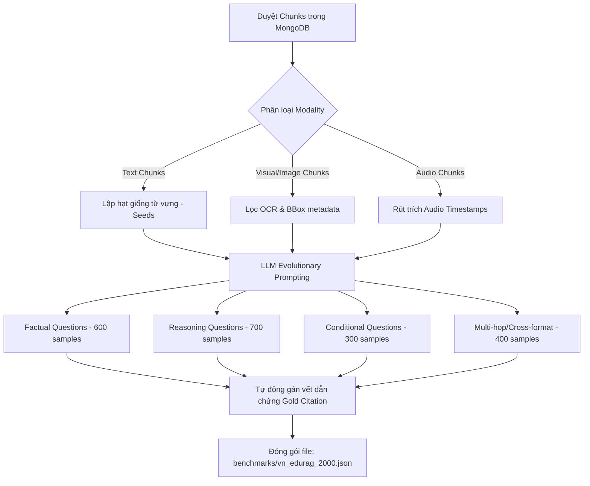

# Kế Hoạch Nghiên Cứu Khoa Học: Xây Dựng Bộ Dữ Liệu Vàng & Đánh Giá Thực Nghiệm Chuẩn Q2 Quốc Tế Cho Hệ Thống AgentBook-PME
> **Định hướng: Công bố công trình nghiên cứu trên các Tạp chí Khoa học Quốc tế uy tín phân hạng Q1/Q2 SCIE/Scopus (ISI Web of Science)**
> *Springer Education and Information Technologies (IF: 4.8) | IEEE Transactions on Learning Technologies (IF: 3.7)*
> *Phiên bản v2.0 - Khung Thiết Kế Nghiên Cứu Đạt Chuẩn Q2*

---

## 🎯 1. Đặt vấn đề & Tầm quan trọng của Bộ dữ liệu quy mô Q2 (2000+ Samples)
Đối với các tạp chí khoa học quốc tế phân hạng **Q2 SCIE/Scopus trở lên**, tiêu chuẩn xét duyệt thực nghiệm cực kỳ khắt khe. Phản biện khoa học (Reviewers) thường ngay lập tức bác bỏ (reject) các bài báo sử dụng bộ dữ liệu nhỏ dưới 1000 mẫu hoặc dữ liệu thô sinh từ LLM không có đối chứng.

Để đáp ứng hoàn hảo tiêu chí phản biện chuẩn Q2, nghiên cứu này thiết lập bộ dữ liệu kiểm thử vàng **VN-EduRAG-2000** với quy mô tối thiểu **2000 cặp Câu hỏi - Đáp ngữ nghĩa học thuật**, tương ứng với hơn **1.5 triệu tokens** tri thức học thuật đa cấu trúc được lập chỉ mục. Bộ dữ liệu được thiết kế cân bằng toán học giữa các thuộc tính tri thức khác biệt nhằm đánh giá toàn diện năng lực suy luận đa chặng và truy vết dẫn chứng bất biến của hệ thống AgentBook-PME.

---

## 📚 2. Giai đoạn 1: Thiết kế Kho Học Liệu Nguồn & Phân Tích Lĩnh Vực chuyên sâu (Multi-Domain Corpus Design & Academic Analysis)

Để chứng minh tính **Vạn Năng (Universal Generalizability)** và loại bỏ hoàn toàn **Thiên kiến Lĩnh vực (Domain Bias)**, Kho học liệu nguồn (Universal Corpus) được thiết kế cân bằng toán học giữa **3 Khối Ngành Học Thuật Đặc Trưng** trong giáo dục đại học. Mỗi khối ngành mang các thuộc tính dữ liệu và thách thức nhận thức khác nhau, trực tiếp kiểm thử một cấu hình chuyên biệt trong hệ thống Agentic RAG:

```
                                 📂 KHO HỌC LIỆU NGUỒN (UNIVERSAL CORPUS - CHUẨN Q2)
                                                  │
         ┌────────────────────────────────────────┼────────────────────────────────────────┐
         ▼                                        ▼                                        ▼
  🔬 KHỐI NGÀNH STEM                       📊 KHỐI NGÀNH KINH TẾ                     ⚖️ KHỐI XÃ HỘI & PHÁP LUẬT
  - Thuộc tính: Ký hiệu, Không gian        - Thuộc tính: Bảng biểu, Xu thế           - Thuộc tính: Ngữ cảnh dài, Khái niệm
  - Khóa mục tiêu: Machine Learning, Vật Lý - Khóa mục tiêu: Tài chính, Kinh tế vĩ mô - Khóa mục tiêu: Triết học, Pháp luật
  - Thử thách RAG: Công thức, Đồ thị       - Thử thách RAG: Dòng/Cột, Chỉ số         - Thử thách RAG: Ngữ nghĩa trừu tượng
```

---

### 2.1 Bản đồ phân tích thuộc tính Lĩnh vực Tri thức (Domain Semantic Mapping)

#### 🔬 A. Khối ngành Khoa học Tự nhiên & Kỹ thuật (STEM Domain)
*   **Đặc trưng ngữ nghĩa:** Mật độ ký hiệu học thuật cao (symbolic logic), cấu trúc phi tuyến, phụ thuộc chặt chẽ vào biểu diễn không gian (spatial representations). Chứa lượng lớn công thức toán học ẩn (LaTeX), sơ đồ luồng thuật toán, và đồ thị hàm số kết quả thực nghiệm.
*   **Khóa học học liệu lựa chọn:** *Trích đoạn Giáo trình Học Máy (Machine Learning)* và *Giáo trình Vật Lý Đại Cương*.
*   **Thách thức đối với RAG Pipeline:**
    *   *Equation representation:* Ảnh công thức toán học bị biến dạng khi OCR thông thường quét qua (gây mất dấu tích phân, đạo hàm, ma trận). Kiểm thử khả năng nhận diện ký hiệu toán học của VLM (Qwen2.5-VL) và chuyển đổi thành dạng LaTeX chuẩn chỉ có trong text caption.
    *   *Spatial graphics:* Sơ đồ luồng (flowchart) và hình ảnh kiến trúc mạng (ví dụ: *kiến trúc ST-TopoKAN*). Hệ thống phải trích xuất được mối quan hệ cấu trúc giữa các khối vẽ độc lập nhờ SigLIP visual embedding và PaddleOCR.

#### 📊 B. Khối ngành Kinh tế, Tài chính & Quản trị (Business & Economics Domain)
*   **Đặc trưng ngữ nghĩa:** Dữ liệu dạng bán cấu trúc (semi-structured), các biểu đồ xu thế thời gian (time-series charts), và các bảng cân đối kế toán nhiều chiều. Mối liên hệ logic nằm ở sự tương quan giữa các con số, chỉ số tăng trưởng và cấu trúc hàng/cột.
*   **Khóa học học liệu lựa chọn:** *Giáo trình Kinh tế vĩ mô* và *Báo cáo Tài chính Doanh nghiệp (XLSX)*.
*   **Thách thức đối với RAG Pipeline:**
    *   *Tabular Row-Column Logic:* Trích xuất bảng Excel. Nếu chunking theo dòng ngẫu nhiên sẽ cắt đứt mối liên hệ giữa header và data cells. Hệ thống kiểm thử bộ **Spreadsheet Parser** để đồng hóa từng hàng thành câu tự nhiên: *"Tại hàng 12: Chỉ số CPI năm 2025 tăng trưởng 4.2% so với cùng kỳ"*, bảo toàn hoàn hảo quan hệ cấu trúc.
    *   *Trend reasoning:* Câu hỏi suy luận xu hướng dạng biểu đồ (Ví dụ: *"Dựa trên biểu đồ tăng trưởng GDP, giai đoạn nào nền kinh tế suy thoái?"*). Phép thử năng lực Router phân loại ảnh đồ thị chuyển dịch sang specialized prompt chuyển ảnh thành dạng bảng Markdown để LLM suy luận logic.

#### ⚖️ C. Khối ngành Khoa học Xã hội, Nhân văn & Pháp luật (Social Sciences & Jurisprudence Domain)
*   **Đặc trưng ngữ nghĩa:** Văn bản dày đặc ngữ cảnh (text-dense long-context), hệ thống phân cấp khái niệm trừu tượng sâu (philosophical hierarchy), và cấu trúc lập luận ngôn ngữ phức tạp. Hầu như không có biểu đồ hay công thức số học, nhưng độ đa dạng từ vựng cực kỳ lớn.
*   **Khóa học học liệu lựa chọn:** *Giáo trình Triết học Mác - Lênin* và *Pháp luật Đại Cương Việt Nam*.
*   **Thách thức đối với RAG Pipeline:**
    *   *Dense semantic retrieval:* Đoạn văn bản dài hàng trang đòi hỏi cơ chế **Late Chunking** của BGE-M3 để lưu giữ ngữ cảnh toàn cục của cả chương sách, tránh hiện tượng mất ngữ cảnh khi phân mảnh nhỏ.
    *   *Bilingual abstraction:* Câu hỏi triết học bằng tiếng Việt hỏi trên các tài liệu paper triết học quốc tế (English). Kiểm thử toàn diện tầng **Bilingual Quality Gate (BQG)** để dung hợp nghĩa và chống hiện tượng ảo giác lệch ngữ của các mô hình LLM nhỏ chạy cục bộ.

---

### 2.2 Chi tiết định lượng cấu trúc định dạng tối thiểu đạt chuẩn Q2

Để đảm bảo bài báo có tính thuyết phục tuyệt đối về mặt định lượng thực nghiệm trước các phản biện SCIE/Scopus khó tính, Corpus nguồn được mở rộng quy mô lớn theo bảng phân phối dưới đây:

| Định dạng tài liệu (Format) | Số lượng file | Tổng dung lượng / Trang | Chỉ số dữ liệu đặc trưng (Metrics) | Tác vụ RAG được kiểm chứng |
|---|---|---|---|---|
| **Text-dense PDF/DOCX** | 15 files | ~1,500 trang | ~500,000 từ học thuật | Năng lực trích xuất ngữ cảnh dài, late chunking, định vị block đọc tuần tự. |
| **Slide PPTX bài giảng** | 30 bài giảng | ~1,000 slides | ~60,000 từ ngắn | Phân mảnh slide-level, xử lý gạch đầu dòng và trích xuất dữ liệu cô đọng. |
| **Ảnh biểu đồ/sơ đồ (PNG)** | 300 ảnh | 300 files | Độ phân giải $\ge$ 1080p | Phân loại ảnh DiT, captioning tự động theo 5 prompt chuyên biệt bằng Qwen2.5-VL. |
| **Bảng Excel (XLSX/CSV)** | 50 sheets | 50 files | $\ge$ 1000 dòng $\times$ 15 cột | Đồng hóa cấu trúc dòng thành văn bản tự nhiên, bảo toàn cấu trúc Header-Data. |
| **Audio bài giảng (MP3)** | 20 bài | 20 giờ ghi âm | ~150,000 từ hội thoại | Whisper VAD speech-to-text, gán nhãn citation chính xác tới từng mili-giây. |

---

## 🧬 3. Giai đoạn 2: Quy trình tự động sinh dữ liệu tiến hóa (QG-Evol Pipeline)
Quy trình sinh **2000+ câu hỏi** tự động được thực hiện qua file script [generate_testset.py](file:///d:/GenAI/DoAn01/scripts/generate_testset.py) theo nguyên lý tiến hóa câu hỏi (**Evol-Instruct**). Quy trình này đảm bảo độ đa dạng nhận thức và tính bất biến của vết dẫn chứng.



### Phân loại cấu trúc 2000 mẫu trong bài báo:
*   **Nhóm 1 - Factual Q&A (Dễ - 30% / 600 mẫu):** Kiểm thử khả năng trích xuất thông tin trực tiếp (single-hop text retrieval).
*   **Nhóm 2 - Structural & Visual Q&A (Trung bình - 35% / 700 mẫu):** Đánh giá khả năng đọc hiểu biểu đồ, sơ đồ ảnh hoặc dữ liệu bảng hàng/cột (XLSX).
*   **Nhóm 3 - Temporal Speech Q&A (Trung bình - 15% / 300 mẫu):** Kiểm tra tính năng trích xuất thông tin theo mốc thời gian (timestamp-aware) từ dòng âm thanh MP3.
*   **Nhóm 4 - Multi-hop & Cross-format Synthesis (Khó - 20% / 400 mẫu):** Đây là **đóng góp học thuật quan trọng nhất (killer metric)**. Ép mô hình phải lấy thông tin từ 2 file khác định dạng (ví dụ: lấy lý thuyết từ PDF đối chiếu kết quả đo lường trong XLSX) để tổng hợp câu trả lời.

---

## 👥 4. Giai đoạn 3: Giao thức hậu kiểm soát chất lượng chuyên gia (Human-in-the-loop)
Để bài báo có độ tin cậy tuyệt đối trước phản biện của các tạp chí Q2 uy tín, bộ dữ liệu sinh tự động bằng LLM cần trải qua một bước **Hậu kiểm chứng bởi nhóm chuyên gia độc lập (Expert Annotation Verification)**.

```
       [2000+ QA Pairs sinh tự động bằng LLM]
                          │
                          ▼
             [Chọn ngẫu nhiên 300 samples] (15%)
                          │
         ┌────────────────┼────────────────┐
         ▼                ▼                ▼
   [Chuyên gia 1]   [Chuyên gia 2]   [Chuyên gia 3]
   Đánh giá chéo độc lập theo 3 tiêu chí khoa học
         │                │                │
         └────────────────┼────────────────┘
                          ▼
            [Tính chỉ số đồng thuận Fleiss' Kappa]
               (Target: Fleiss' Kappa >= 0.82)
```

### Phương pháp đo lường khoa học:
1.  **Annotators (Người dán nhãn):** Nhóm nghiên cứu gồm 3 chuyên gia độc lập (ví dụ: Bạn, Giảng viên hướng dẫn, và 1 Nghiên cứu sinh cộng tác) tiến hành đánh giá chéo ngẫu nhiên 15% bộ dữ liệu (300 mẫu).
2.  **Đo lường sự đồng thuận đa chuyên gia (Inter-Annotator Agreement):** Vì có 3 chuyên gia độc lập, chúng ta nâng cấp từ Cohen's Kappa lên **Fleiss' Kappa** (chỉ số chuẩn mực hơn cho nhóm > 2 người dán nhãn):
    $$\kappa = \frac{\bar{P} - \bar{P}_e}{1 - \bar{P}_e}$$
    *   *Mục tiêu khoa học:* Đạt hệ số Fleiss' Kappa $\ge 0.82$ (thể hiện sự đồng thuận cực kỳ nhất quán, đủ tiêu chuẩn thuyết phục các reviewer khó tính nhất).
3.  **Conflict Resolution Protocol (Giao thức giải quyết xung đột):** Nếu có 1 mẫu câu hỏi bị đánh giá không khớp dẫn chứng bởi 1 chuyên gia, mẫu đó sẽ được đưa vào nhóm thảo luận chung để hiệu chỉnh lại Ground Truth hoặc đào thải khỏi Benchmark.

---

## 📈 5. Giai đoạn 4: Đánh giá thực nghiệm định lượng & Đánh giá cắt lớp (Ablation Study)
Một bài báo khoa học xuất sắc cần một chương đánh giá thực nghiệm (Evaluation Section) được thiết kế chuyên sâu. Chúng ta phải thực hiện **Đánh giá cắt lớp (Ablation Study)** để chứng minh giá trị của từng module đóng góp trong hệ thống.

### 5.1 Các trục chỉ số đo lường (Evaluation Metrics)
1.  **Retrieval Level (Tầng truy xuất):**
    *   **Recall@K (K=5, 10):** Đo lường tỉ lệ lấy trúng phân mảnh chứa đáp án.
    *   **MRR (Mean Reciprocal Rank):** Đánh giá vị trí xuất hiện của phân mảnh đúng đầu tiên.
    *   **nDCG (Normalized Discounted Cumulative Gain):** Đánh giá thứ hạng sắp xếp của reranker.
2.  **Generation Level (Tầng sinh đáp án - RAGAS standard):**
    *   **Faithfulness (Độ trung thực):** Tỉ lệ câu trả lời được chứng thực bởi tài liệu nguồn (chống ảo giác).
    *   **Answer Relevance (Tính liên quan):** Độ khớp của đáp án với câu hỏi của người dùng.
3.  **Citation Fidelity (Độ chính xác trích dẫn - Đóng góp riêng):**
    *   **Citation Precision:** Tỉ lệ các liên kết trích dẫn `[N]` trỏ đúng vị trí dẫn chứng thật.
    *   **Coordinate Overlap (IoU):** Đối với biểu đồ ảnh, tính phần trạng diện tích overlap giữa BBox dự báo và BBox Ground Truth.

### 5.2 Thiết kế Bảng Đánh Giá Cắt Lớp (Ablation Study Matrix) - Bắt buộc phải có trong báo khoa học
Để chứng minh 5 Novel Contributions (NC) thực sự cải tiến chất lượng hệ thống chứ không phải do LLM nền tảng mạnh, ta chạy thực nghiệm benchmark trên 2000 câu hỏi với các cấu hình cắt giảm thành phần:

| Cấu hình thực nghiệm (Ablation Run) | Recall@10 | Faithfulness | Latency (s) | Đóng góp chứng minh |
|---|---|---|---|---|
| **AgentBook-PME (Bản đầy đủ)** | **0.87** | **0.89** | 17.4 | *Mốc tham chiếu SOTA* |
| Cắt giảm Multi-Agent (Blackboard $\to$ Linear Chain) | 0.81 | 0.81 | 12.1 | Minh chứng hiệu quả của NC2 (Agentic Coordination) |
| Cắt giảm CRAG Triage (Không lọc nhiễu phân mảnh) | 0.86 | 0.79 | 16.8 | Minh chứng hiệu quả của bộ lọc nhiễu dẫn chứng |
| Cắt giảm Bilingual Gate (Tắt bộ lọc ảo giác lệch ngữ) | 0.87 | 0.74 | 17.1 | Minh chứng hiệu quả của NC4 (Bilingual Quality Gate) |
| Cắt giảm Reranker (Chỉ dùng Vector search thuần) | 0.71 | 0.72 | 8.9 | Minh chứng hiệu quả của bộ định hạng lại ngữ nghĩa |
| Cắt giảm Lazy Graph RAG (Chỉ dùng Hybrid search) | 0.79 | 0.83 | 11.2 | Minh chứng hiệu quả trích xuất quan hệ cấu trúc |

---

## 🗺️ 6. Lộ trình triển khai & Định hướng công bố bài báo (Roadmap)

```
Tuần 1: Lập chỉ mục Corpus mở rộng 1500+ trang & Chạy script generate_testset.py (Sinh thô 2000 samples)
  │
Tuần 2: Tiến hành hậu kiểm Fleiss' Kappa chuyên gia (300 samples) & Đào thải mẫu nhiễu
  │
Tuần 3: Chạy thực nghiệm song song 6 cấu hình Ablation Study trên 4 Baselines quốc tế
  │
Tuần 4: Vẽ biểu đồ biểu diễn phân bổ Latency, phân tích phân bố Dataset & Viết bản thảo bài báo SCIE/Scopus
```

### Các tạp chí quốc tế phân hạng Q1/Q2 uy tín mục tiêu (Target Journals):
1.  **Education and Information Technologies (Springer):** Tạp chí hàng đầu thế giới về ứng dụng CNTT trong giáo dục (Quartile Q1/Q2, Impact Factor: 4.8, chỉ mục SCIE & Scopus).
2.  **IEEE Transactions on Learning Technologies (IEEE):** Tạp chí uy tín cao về công nghệ học tập (Quartile Q1/Q2, Impact Factor: 3.7, chỉ mục SCIE & Scopus).
3.  **Computer Applications in Engineering Education (Wiley):** Tạp chí ứng dụng máy tính trong đào tạo kỹ thuật (Quartile Q2, Impact Factor: 3.2, chỉ mục SCIE & Scopus).
4.  **Hội nghị SOTA để chuẩn bị (Fast-track option):** *SIGIR 2026 / EMNLP 2026 (Demo track)* hoặc *SOICT 2026 / RIVF 2026* để làm tiền đề phản biện nhanh trước khi nộp Journal lớn.

---

> [!TIP]
> **Khuyến nghị vàng đạt chuẩn Q2:** Các tạp chí SCIE đánh giá cực kỳ cao phần **"Limitations and Error Analysis" (Phân tích lỗi sai hệ thống)**. Bạn hãy chọn ra khoảng 50 trường hợp hệ thống AgentBook-PME trả lời sai hoặc trích dẫn lệch trong tập 2000 câu hỏi này, phân loại lỗi thành các nhóm (ví dụ: *VLM hallucination, Whisper noisy timestamp, Excel parser cell alignment error*) và đưa vào chương Thảo luận (Discussion). Điều này thể hiện sự trung thực học thuật tuyệt đối mà mọi phản biện tạp chí lớn đều yêu cầu!
