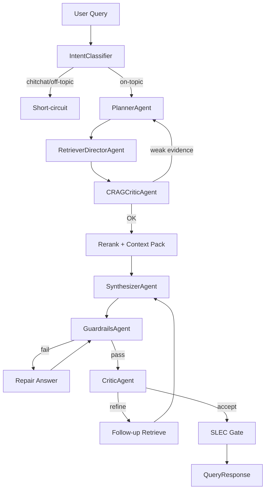
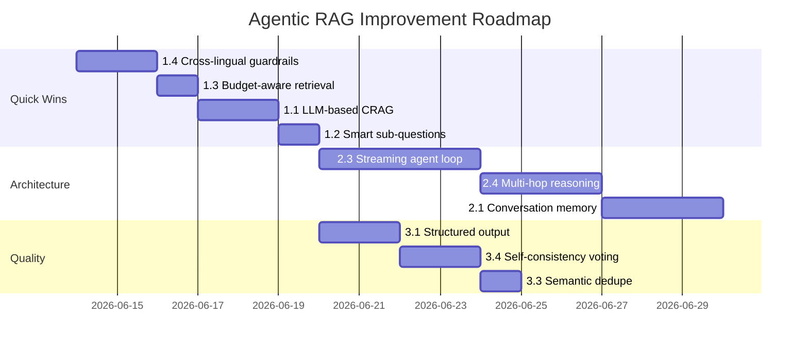

# 🚀 AgentBook Agentic RAG — Gợi ý cải thiện

> [!NOTE]
> Phân tích dựa trên code review toàn bộ: `agentic/service.py`, `planner.py`, `state.py`, 6 agents, 6 tools, `retriever.py`, `query_processor.py`, `inference_engine.py`, `crag_evaluator.py`, `sentence_coverage.py`, `guardrails_agent.py`, và route pipelines.

---

## Tổng quan kiến trúc hiện tại



**Điểm mạnh hiện tại:**
- Blackboard state pattern rõ ràng, agents mutate shared state
- CRAG evidence triage + iterative retrieval loop
- SLEC sentence-level coverage — rất ít hệ thống RAG có
- Cross-lingual VI↔EN pipeline hoàn chỉnh (dict + LLM + HyDE)
- Config-driven thresholds, không hardcode
- Adaptive retrieval fast-path (skip reranker khi dense đủ mạnh)

---

## Tier 1 — Quick Wins (1-2 ngày mỗi task)

### 1.1 CRAG Evaluator: Chuyển từ score-based sang LLM-based

**Hiện tại:** [crag_evaluator.py](file:///D:/GenAI/DoAn01/backend/src/rag/crag_evaluator.py) chỉ dùng `rerank_score` / `fused_score` để classify CORRECT/AMBIGUOUS/INCORRECT. Đây thực chất là **score thresholding** — không phải CRAG đích thực (Yan et al.).

**Vấn đề:**
- Reranker score đo relevance (query↔chunk), **không** đo correctness (chunk có chứa answer không)
- Một chunk có thể highly relevant nhưng chứa thông tin lỗi thời / không đầy đủ
- Pre-rerank pass-through (L56-59) nghĩa là CRAG gần như no-op khi chưa rerank

**Đề xuất:**
```python
# Thêm LLM-based CRAG khi cần (config-driven)
class LLMCRAGEvaluator:
    """LLM judges: does this chunk actually answer the query?"""
    async def evaluate_chunk(self, query: str, chunk: RetrievedChunk) -> CRAGLabel:
        prompt = f"""Given the query and evidence, classify:
        - CORRECT: evidence directly answers the query
        - AMBIGUOUS: evidence is related but incomplete  
        - INCORRECT: evidence is irrelevant or contradictory
        
        Query: {query}
        Evidence: {chunk.content[:500]}
        
        Output ONLY: CORRECT, AMBIGUOUS, or INCORRECT"""
        ...
```

**File:** [crag_evaluator.py](file:///D:/GenAI/DoAn01/backend/src/rag/crag_evaluator.py), [crag_critic.py](file:///D:/GenAI/DoAn01/backend/src/agentic/agents/crag_critic.py)
**Effort:** 1.5 ngày | **Impact:** Cao — giảm hallucination khi evidence "relevant but wrong"

---

### 1.2 Planner: Sub-question generation thông minh hơn

**Hiện tại:** [planner.py](file:///D:/GenAI/DoAn01/backend/src/agentic/planner.py) L201-250 sinh sub-questions bằng template cứng tiếng Việt (`"điểm giống nhau: {text}"`, `"bằng chứng ủng hộ: {text}"`).

**Vấn đề:**
- Template cứng không adapt theo nội dung query
- Sub-questions cho FACTUAL route trả [] (L246-249) — bỏ lỡ cơ hội multi-hop
- Prefix tiếng Việt trước query gốc có thể degrade BGE-M3 embedding

**Đề xuất:**
```python
# Cho phép LLM sinh sub-questions có ngữ cảnh
# Chỉ khi planner_llm_enabled=True và route phức tạp
async def _llm_sub_questions(self, query: str, route: RouteDecision) -> list[AgenticSubQuestion]:
    """LLM decomposes multi-hop queries into atomic retrieval questions."""
    if route.route_type in {RouteType.FACTUAL, RouteType.GENERAL}:
        # Check if query actually needs decomposition
        needs_decomp = await self._is_multi_hop(query)
        if not needs_decomp:
            return []
    ...
```

**File:** [planner.py](file:///D:/GenAI/DoAn01/backend/src/agentic/planner.py)
**Effort:** 1 ngày | **Impact:** Trung bình — cải thiện multi-hop recall

---

### 1.3 RetrieverDirector: Parallel + Budget-aware execution

**Hiện tại:** [retriever_director.py](file:///D:/GenAI/DoAn01/backend/src/agentic/agents/retriever_director.py) L157 gom tất cả tasks vào 1 `asyncio.gather`. Tốt cho parallelism, nhưng:

**Vấn đề:**
- Không có budget per sub-question (tất cả dùng cùng `limit`)
- Sub-question `critical=False` vẫn dùng cùng resources như `critical=True`
- Không có early termination: nếu main query đã trả strong chunks, sub-questions là phí

**Đề xuất:**
```python
async def act(self, state: AgentState, *, limit: int) -> AgentState:
    # Phase 1: Run main query + critical sub-questions
    critical_tasks = [t for t in tasks if t.critical]
    phase1_results = await asyncio.gather(*critical_tasks)
    
    # Phase 2: Only run non-critical if phase 1 evidence is weak
    if self._evidence_sufficient(phase1_results):
        return state  # skip optional sub-questions
    
    optional_tasks = [t for t in tasks if not t.critical]
    phase2_results = await asyncio.gather(*optional_tasks)
```

**File:** [retriever_director.py](file:///D:/GenAI/DoAn01/backend/src/agentic/agents/retriever_director.py)
**Effort:** 1 ngày | **Impact:** Cao — giảm latency 30-50% cho simple queries

---

### 1.4 Guardrails: Cross-lingual verification thay vì skip

**Hiện tại:** [guardrails_agent.py](file:///D:/GenAI/DoAn01/backend/src/agentic/agents/guardrails_agent.py) L59-69 **skip hoàn toàn** claim verification khi answer language ≠ chunk language.

**Vấn đề:** Cross-lingual là use case chính của AgentBook (VI query → EN docs → VI answer). Skip verification = zero guardrails cho ~30% queries.

**Đề xuất:**
- Dùng NLI model đa ngôn ngữ (multilingual-MiniLM hoặc mDeBERTa) thay vì token overlap
- Hoặc: translate answer sang EN trước khi verify (rẻ hơn multilingual NLI)

**File:** [guardrails_agent.py](file:///D:/GenAI/DoAn01/backend/src/agentic/agents/guardrails_agent.py), [claim_verifier.py](file:///D:/GenAI/DoAn01/backend/src/guardrails/claim_verifier.py)
**Effort:** 2 ngày | **Impact:** Rất cao — đóng lỗ hổng lớn nhất trong guardrails

---

## Tier 2 — Architectural Improvements (3-5 ngày)

### 2.1 Conversation Memory với Semantic Compression

**Hiện tại:** `memory_context` là raw string được truyền từ frontend, cắt 600 chars tại [service.py L579](file:///D:/GenAI/DoAn01/backend/src/agentic/service.py#L579). Anaphora resolution chỉ dùng regex pattern matching.

**Vấn đề:**
- 600 chars = ~3 câu — quá ngắn cho conversation dài
- Không có semantic compression: mọi message đều weight bằng nhau
- Anaphora resolution không handle implicit reference ("Thế còn cái kia?")

**Đề xuất:**
```python
class ConversationMemory:
    """Semantic compression: keep only messages relevant to current query."""
    
    async def compress(self, history: list[Message], current_query: str) -> str:
        # 1. Embed current query
        # 2. Rank history messages by semantic similarity
        # 3. Keep top-K most relevant + always keep last 2 turns
        # 4. Return compressed context string
        relevant = self._rank_by_relevance(history, current_query)
        return self._format_context(relevant[:5])
```

**Files mới:**
- `backend/src/agentic/memory.py` [NEW]
- Sửa [service.py](file:///D:/GenAI/DoAn01/backend/src/agentic/service.py) L178

**Effort:** 3 ngày | **Impact:** Cao — multi-turn conversation quality tăng đáng kể

---

### 2.2 Dynamic Tool Selection (Agent tự chọn tool)

**Hiện tại:** [retriever_director.py](file:///D:/GenAI/DoAn01/backend/src/agentic/agents/retriever_director.py) chọn tool bằng regex keyword matching (`_GRAPH_KEYWORDS`, `_PER_SOURCE_KEYWORDS`). Tool set cố định: `retrieve_text`, `retrieve_per_source`, `trace_graph`.

**Vấn đề:**
- Regex không handle semantic intent (query "How does X work?" → should graph, nhưng không match keyword)
- Không thể extend tool set mà không sửa code
- Không có tool cho: web search fallback, calculator, code execution

**Đề xuất:**
```python
class ToolRegistry:
    """Plugin-style tool registry — agents discover tools at runtime."""
    _tools: dict[str, BaseTool] = {}
    
    def register(self, tool: BaseTool) -> None: ...
    def available_tools(self, context: AgentState) -> list[ToolDescription]: ...

class RetrieverDirectorAgent(BaseAgent):
    async def select_tools(self, state: AgentState) -> list[ToolCall]:
        """LLM-powered tool selection with structured output."""
        tool_descriptions = self.registry.available_tools(state)
        prompt = TOOL_SELECTION_PROMPT.format(
            query=state.query,
            tools=tool_descriptions,
            evidence_so_far=len(state.raw_evidence),
        )
        return await self._parse_tool_calls(prompt)
```

**Files:** [retriever_director.py](file:///D:/GenAI/DoAn01/backend/src/agentic/agents/retriever_director.py), [tools/base.py](file:///D:/GenAI/DoAn01/backend/src/agentic/tools/base.py)
**Effort:** 5 ngày | **Impact:** Rất cao — mở đường cho extensibility

---

### 2.3 Streaming-first Architecture cho Agent Loop

**Hiện tại:** Agentic path không hỗ trợ streaming — `AgenticCoordinatingEngine.answer()` trả `QueryResponse` đồng bộ. `answer_stream()` ở [inference_engine.py](file:///D:/GenAI/DoAn01/backend/src/inference/inference_engine.py) chỉ cho direct path.

**Vấn đề:** User phải chờ 30-120s không có feedback.

**Đề xuất:**
- Stream `AgentTraceStep` events ngay khi mỗi agent hoàn thành
- Stream LLM tokens từ SynthesizerAgent
- Frontend hiển thị reasoning trace real-time

```python
async def answer_stream(self, ...) -> AsyncGenerator[str, None]:
    # Emit planning step
    yield sse_event("agent_step", {"name": "plan_query", "status": "running"})
    await self.agent_planner.act(state)
    yield sse_event("agent_step", {"name": "plan_query", "status": "completed"})
    
    # Emit retrieval progress
    yield sse_event("agent_step", {"name": "retrieve", "status": "running"})
    ...
    
    # Stream LLM tokens
    async for token in self.agent_synthesizer.stream(state):
        yield sse_event("token", {"token": token})
```

**File:** [service.py](file:///D:/GenAI/DoAn01/backend/src/agentic/service.py)
**Effort:** 4 ngày | **Impact:** Rất cao — UX improvement quan trọng nhất

---

### 2.4 Multi-hop Reasoning Chain

**Hiện tại:** Planner decomposes thành parallel sub-questions. Không hỗ trợ **sequential** multi-hop: "Answer of Q1 → becomes context for Q2 → final answer needs both."

**Ví dụ:** "Regularization giảm overfitting bằng cơ chế gì, và cơ chế đó ảnh hưởng thế nào đến loss function?"
- Hop 1: "Regularization giảm overfitting bằng cơ chế gì?" → penalty term
- Hop 2: "Penalty term ảnh hưởng thế nào đến loss function?" (cần output hop 1)

**Đề xuất:** Thêm `depends_on` field vào `AgenticSubQuestion`:

```python
class AgenticSubQuestion(BaseModel):
    text: str
    tool: str = "retrieve_text"
    critical: bool = True
    depends_on: int | None = None  # index of prerequisite sub-question
    
class RetrieverDirectorAgent:
    async def act(self, state, *, limit):
        # Topological sort sub-questions
        ordered = self._topological_sort(state.sub_questions)
        for batch in ordered:
            results = await asyncio.gather(*[self._execute(sq, state) for sq in batch])
            # Inject previous answers into dependent sub-questions
            self._inject_context(batch, results, state)
```

**File:** [planner.py](file:///D:/GenAI/DoAn01/backend/src/agentic/planner.py), [retriever_director.py](file:///D:/GenAI/DoAn01/backend/src/agentic/agents/retriever_director.py)
**Effort:** 3 ngày | **Impact:** Cao — unlock complex reasoning queries

---

## Tier 3 — Quality & Robustness (2-4 ngày)

### 3.1 Structured Output với Pydantic Validation

**Hiện tại:** LLM output parsing dùng regex + `json.loads` ở nhiều nơi: [planner.py L104-158](file:///D:/GenAI/DoAn01/backend/src/agentic/planner.py#L104), [critic.py L136-168](file:///D:/GenAI/DoAn01/backend/src/agentic/agents/critic.py#L136), [query_router.py L135-162](file:///D:/GenAI/DoAn01/backend/src/rag/query_router.py#L135).

**Vấn đề:** Mỗi component tự parse JSON riêng, không chuẩn hoá, dễ fail silently.

**Đề xuất:** Centralize structured output:
```python
# core/structured_output.py
async def structured_generate(
    llm: BaseLLM, 
    prompt: str, 
    response_model: type[BaseModel],
    max_retries: int = 2,
) -> BaseModel:
    """Generate + validate structured output with retry."""
    for attempt in range(max_retries + 1):
        raw = await llm.generate(prompt=prompt)
        try:
            return response_model.model_validate_json(clean_json(raw))
        except ValidationError as e:
            if attempt == max_retries:
                raise
            prompt = f"{prompt}\n\nPrevious output had errors: {e}. Fix and retry."
```

**File:** `backend/src/core/structured_output.py` [NEW]
**Effort:** 2 ngày | **Impact:** Trung bình — reliability tăng, code sạch hơn

---

### 3.2 Confidence Calibration với Historical Data

**Hiện tại:** [confidence_scorer.py](file:///D:/GenAI/DoAn01/backend/src/inference/confidence_scorer.py) tính confidence từ chunk scores. Không calibrated — 0.7 confidence có thể nghĩa là 90% correct hoặc 50% correct tuỳ query type.

**Đề xuất:**
- Log `(confidence_predicted, actual_correctness)` pairs từ GPT-4o judge
- Fit isotonic regression / Platt scaling trên historical data
- Config-driven per-route calibration curves

**File:** [confidence_scorer.py](file:///D:/GenAI/DoAn01/backend/src/inference/confidence_scorer.py)
**Effort:** 2 ngày | **Impact:** Trung bình — refusal precision tăng

---

### 3.3 Evidence Deduplication Semantics

**Hiện tại:** [retriever.py L598-604](file:///D:/GenAI/DoAn01/backend/src/rag/retriever.py#L598) dedupe bằng `chunk_id`. Nhưng 2 chunks từ 2 docs khác nhau có thể chứa gần **cùng nội dung** (copy-paste giữa slides và notes).

**Đề xuất:**
```python
def semantic_dedupe(chunks: list[RetrievedChunk], threshold: float = 0.92) -> list[RetrievedChunk]:
    """Remove near-duplicate chunks based on content similarity."""
    kept = []
    for chunk in chunks:
        if not any(
            jaccard_similarity(chunk.content, k.content) > threshold 
            for k in kept
        ):
            kept.append(chunk)
    return kept
```

**File:** [retriever.py](file:///D:/GenAI/DoAn01/backend/src/rag/retriever.py)
**Effort:** 1 ngày | **Impact:** Trung bình — tránh context window lãng phí

---

### 3.4 Self-Consistency Voting (thay vì single-shot generation)

**Hiện tại:** SynthesizerAgent gọi LLM **1 lần** rồi verify bằng guardrails.

**Đề xuất:** Cho queries khó (low confidence hoặc multi-hop), generate N=3 answers với temperature>0, rồi vote/merge:

```python
class SynthesizerAgent:
    async def act_with_consistency(self, state, n_samples=3):
        if state.confidence_score > 0.8:
            return await self.act(state)  # single-shot for easy queries
        
        answers = await asyncio.gather(*[
            self.run(query=state.query, ..., temperature=0.7)
            for _ in range(n_samples)
        ])
        # Keep claims that appear in ≥2/3 answers
        state.draft_answer = self._majority_vote(answers)
```

**File:** [synthesizer.py](file:///D:/GenAI/DoAn01/backend/src/agentic/agents/synthesizer.py)
**Effort:** 2 ngày | **Impact:** Cao cho hard queries — giảm hallucination

---

## Tier 4 — Frontier (5+ ngày, research-grade)

### 4.1 Reflection Loop (Self-RAG trong Agent)

**Hiện tại:** CriticAgent chạy **sau** synthesis — 1 vòng review duy nhất.

**Đề xuất:** Integrate self-RAG reflection **trong** generation: mỗi sentence, LLM tự đánh giá cần retrieve thêm không.

```
Generate sentence 1 → [ISREL] check → [ISSUP] check → keep/discard
Generate sentence 2 → [ISREL] check → needs more evidence → retrieve → regenerate
```

**Effort:** 7 ngày | **Impact:** Rất cao — SOTA groundedness

---

### 4.2 Adaptive Agent Topology

**Hiện tại:** Agent chain cố định: Planner → Director → CRAG → Synthesizer → Guardrails → Critic.

**Đề xuất:** Route-dependent agent topology:
- FACTUAL: Director → Synthesizer (skip planner, CRAG, critic)
- COMPARISON: Planner → Director × N docs → Merger → Synthesizer → Guardrails
- GRAPH_RELATION: Planner → GraphAgent → TextAgent → Fusion → Synthesizer

**Effort:** 5 ngày | **Impact:** Cao — latency giảm 50% cho simple queries

---

### 4.3 Learned Routing (thay regex + LLM prompt)

**Hiện tại:** [query_router.py](file:///D:/GenAI/DoAn01/backend/src/rag/query_router.py) dùng regex → LLM fallback. Regex bỏ sót many valid patterns, LLM tốn latency.

**Đề xuất:** Fine-tune small classifier (distilBERT hoặc BGE-M3 head) trên labeled routing data từ GPT-4o judge dataset:

```python
class LearnedRouter:
    def __init__(self, model_path: str):
        self.model = AutoModelForSequenceClassification.from_pretrained(model_path)
    
    def route(self, query: str) -> RouteDecision:
        logits = self.model(self.tokenizer(query))
        route_type = RouteType(self.label_map[logits.argmax()])
        ...
```

**Effort:** 5 ngày (+ data collection) | **Impact:** Trung bình-Cao

---

## Priority Matrix

| # | Task | Impact | Effort | ROI |
|---|---|---|---|---|
| **1.4** | Cross-lingual guardrails | 🔴 Rất cao | 2d | ⭐⭐⭐⭐⭐ |
| **2.3** | Streaming agent loop | 🔴 Rất cao | 4d | ⭐⭐⭐⭐ |
| **1.3** | Budget-aware retrieval | 🟠 Cao | 1d | ⭐⭐⭐⭐⭐ |
| **1.1** | LLM-based CRAG | 🟠 Cao | 1.5d | ⭐⭐⭐⭐ |
| **2.4** | Multi-hop reasoning | 🟠 Cao | 3d | ⭐⭐⭐⭐ |
| **3.4** | Self-consistency voting | 🟠 Cao | 2d | ⭐⭐⭐⭐ |
| **2.1** | Conversation memory | 🟠 Cao | 3d | ⭐⭐⭐ |
| **1.2** | Smart sub-questions | 🟡 TB | 1d | ⭐⭐⭐⭐ |
| **3.1** | Structured output | 🟡 TB | 2d | ⭐⭐⭐ |
| **3.3** | Semantic dedupe | 🟡 TB | 1d | ⭐⭐⭐ |
| **2.2** | Dynamic tool selection | 🔴 Rất cao | 5d | ⭐⭐⭐ |
| **4.2** | Adaptive agent topology | 🟠 Cao | 5d | ⭐⭐⭐ |
| **3.2** | Confidence calibration | 🟡 TB | 2d | ⭐⭐ |
| **4.1** | Self-RAG reflection | 🔴 Rất cao | 7d | ⭐⭐ |
| **4.3** | Learned routing | 🟡-🟠 | 5d | ⭐⭐ |

---

## Recommended Execution Order



> [!TIP]
> Bắt đầu với **1.4 (Cross-lingual guardrails)** vì đây là lỗ hổng lớn nhất — ~30% queries hiện tại bypass verification hoàn toàn. Tiếp theo **1.3 (Budget-aware retrieval)** cho latency win nhanh nhất.
