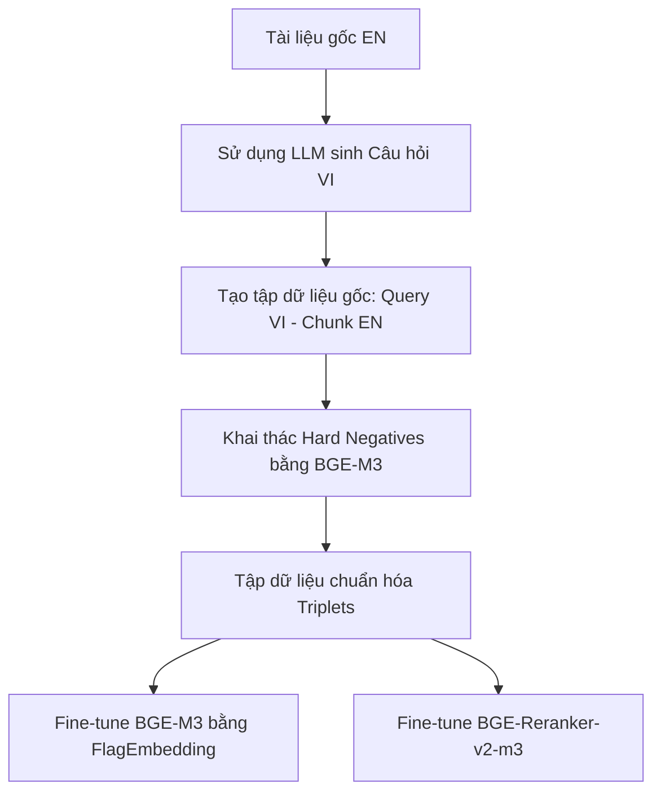

# 🎯 Cẩm Nang Fine-Tuning Nâng Cao: BGE-M3 & BGE-Reranker-v2-m3

Tài liệu này cung cấp quy trình chi tiết để **Fine-tune (tinh chỉnh)** hai mô hình `BAAI/bge-m3` và `BAAI/bge-reranker-v2-m3` nhằm đạt độ chính xác cao nhất cho hệ thống RAG chéo ngôn ngữ (**Truy vấn Tiếng Việt $\leftrightarrow$ Tài liệu Tiếng Anh**) trong dự án **AgentBook**.

---

## 🏗️ Tổng Quan Luồng Fine-Tuning



---

## 📂 Bước 1: Tổng Hợp Dữ Liệu Train Song Ngữ (Bilingual Dataset)

Để mô hình hiểu được truy vấn tiếng Việt ánh xạ vào tài liệu tiếng Anh, bạn cần xây dựng tập dữ liệu dạng **Triplets**: `{query (VI), positive_passage (EN), negative_passages (EN)}`.

### 1.1 Tự Động Sinh Dữ Liệu Bằng LLM (Synthetic Data Generation)
Nếu không có sẵn dữ liệu người dùng thực tế, hãy dùng GPT-4o hoặc Claude 3.5 để sinh câu hỏi từ các tài liệu tiếng Anh hiện có.

**Prompt mẫu cho LLM:**
```text
Bạn là một chuyên gia giáo dục. Dưới đây là một đoạn tài liệu kỹ thuật bằng Tiếng Anh.
Đoạn văn: "[Dán Chunk Tiếng Anh vào đây]"

Nhiệm vụ:
Hãy viết 3 câu hỏi khác nhau bằng Tiếng Việt mà câu trả lời của chúng nằm hoàn toàn trong đoạn văn trên.
Yêu cầu:
- Câu hỏi phải tự nhiên, thực tế (như học sinh đang hỏi).
- Sử dụng các thuật ngữ chuyên ngành tiếng Việt phổ biến.
- Trả về kết quả dưới dạng JSON list: ["câu hỏi 1", "câu hỏi 2", "câu hỏi 3"]
```

### 1.2 Cấu Trúc File Dữ Liệu Đầu Ra (`train_data.jsonl`)
Mỗi dòng là một JSON object có dạng:
```json
{
  "query": "Làm thế nào để cấu hình thời gian timeout trong Celery?",
  "pos": ["Celery workers can be configured with a hard time limit using the --time-limit option..."],
  "neg": [
    "Redis is commonly used as a message broker for Celery...",
    "To restart the FastAPI backend service, run the restart script..."
  ]
}
```

---

## ⛏️ Bước 2: Khai Thác Hard Negatives (Hard Negative Mining)

*Đây là bước quan trọng nhất quyết định độ chính xác của mô hình.* Mô hình sẽ không học được gì nếu các đoạn văn bản sai (negatives) quá khác biệt so với câu hỏi. Chúng ta cần tìm các đoạn văn bản **rất giống** nhưng thực chất **không chứa câu trả lời** (gọi là Hard Negatives).

### Quy trình khai thác tự động bằng script:
Sử dụng chính mô hình `bge-m3` hiện tại để quét:
1. Gửi câu hỏi tiếng Việt truy vấn vào Qdrant.
2. Lấy ra Top 30 kết quả có điểm số cao nhất.
3. Loại bỏ đoạn văn bản đúng (`pos`).
4. Giữ lại các đoạn văn bản từ vị trí số 5 đến 30 làm `neg`. Đây chính là các Hard Negatives chất lượng cao.

Bạn có thể sử dụng công cụ **`FlagEmbedding`** của BAAI để làm việc này tự động:
```bash
python -m FlagEmbedding.baai_general_embedding.candidate_filter \
  --query_vector_file path_to_query_vectors \
  --doc_vector_file path_to_doc_vectors \
  --save_file hard_negatives.jsonl \
  --top_k 30
```

---

## 🧪 Bước 3: Fine-Tuning Mô Hình Embedding BGE-M3

> [!WARNING]
> Không nên dùng thư viện `sentence-transformers` thông thường để fine-tune BGE-M3, vì nó sẽ chỉ cập nhật phần **Dense** mà làm hỏng khả năng trích xuất **Sparse Vector** và **ColBERT** của mô hình.
> Hãy sử dụng công cụ **`FlagEmbedding`** được tối ưu hóa riêng bởi chính tác giả của BGE.

### 3.1 Cài đặt thư viện chuyên dụng
```bash
pip install FlagEmbedding
```

### 3.2 Chạy Lệnh Huấn Luyện (Multi-Task Fine-Tuning)
Sử dụng kỹ thuật học tương phản (Contrastive Learning) với tham số huấn luyện đề xuất sau:

```bash
torchrun --nproc_per_node 1 -m FlagEmbedding.baai_general_embedding.finetuning.run \
    --output_dir ./fine_tuned_bge_m3 \
    --model_name_or_path BAAI/bge-m3 \
    --train_data ./train_data.jsonl \
    --learning_rate 1e-5 \
    --fp16 \
    --num_train_epochs 3 \
    --per_device_train_batch_size 2 \
    --gradient_accumulation_steps 4 \
    --dataloader_drop_last True \
    --normalized True \
    --temperature 0.02 \
    --query_max_len 128 \
    --passage_max_len 512 \
    --negatives_cross_device \
    --temperature 0.02
```

**Các tham số quan trọng cần lưu ý:**
*   `learning_rate`: Giữ ở mức rất nhỏ (`1e-5` đến `3e-5`) để tránh hiện tượng quên kiến thức cũ (catastrophic forgetting).
*   `temperature`: Đặt thấp (`0.02`) giúp tăng cường độ nhạy bén phân biệt giữa Positives và Hard Negatives.

---

## 🎯 Bước 4: Fine-Tuning BGE Reranker v2 M3

Fine-tune Reranker thực chất là huấn luyện một mô hình phân loại nhị phân (Cross-Encoder) để chấm điểm khớp nối giữa `(Query, Passage)`.

### 4.1 Chuẩn bị dữ liệu huấn luyện
Định dạng dữ liệu cho Reranker cần cấu trúc phẳng hơn:
```json
{"query": "truy vấn tiếng việt", "passage": "đoạn văn tiếng anh đúng", "label": 1}
{"query": "truy vấn tiếng việt", "passage": "đoạn văn tiếng anh sai lệch ít", "label": 0}
```

### 4.2 Lệnh Huấn Luyện Reranker
Sử dụng `FlagEmbedding` với cấu hình dành riêng cho Reranker:

```bash
torchrun --nproc_per_node 1 -m FlagEmbedding.reranker.run \
    --output_dir ./fine_tuned_bge_reranker \
    --model_name_or_path BAAI/bge-reranker-v2-m3 \
    --train_data ./reranker_train_data.jsonl \
    --learning_rate 2e-5 \
    --fp16 \
    --num_train_epochs 4 \
    --per_device_train_batch_size 4 \
    --gradient_accumulation_steps 4 \
    --train_group_size 4 \
    --query_max_len 128 \
    --passage_max_len 512
```

**Tham số cốt lõi:**
*   `train_group_size`: Thiết lập tỷ lệ âm/dương. Ví dụ bằng `4` nghĩa là mỗi câu hỏi đi kèm 1 positive và 3 hard negatives.

---

## 🏆 Quy Tắc Vàng Khi Fine-Tune Song Ngữ (Cross-Lingual)

1.  **Tỷ lệ ngôn ngữ trong tập Train**: Không được dùng 100% dữ liệu Anh-Việt. Hãy pha trộn theo tỷ lệ **70% dữ liệu song ngữ (VI-EN)** và **30% dữ liệu đơn ngữ (VI-VI hoặc EN-EN)** để mô hình không bị mất đi khả năng hiểu ngữ nghĩa độc lập của từng ngôn ngữ.
2.  **Khóa các Layer đầu (Optional)**: Nếu tài nguyên GPU yếu, bạn có thể đóng băng (freeze) 6 layer đầu của mô hình transformer và chỉ train các layer phía sau để giảm VRAM tiêu thụ và tăng tốc độ hội tụ.
3.  **Đánh giá định kỳ (Evaluation)**: Hãy trích xuất riêng 10% dữ liệu làm tập Test độc lập. Sử dụng chỉ số **MRR@10** hoặc **NDCG@10** để đánh giá hiệu quả trước và sau khi fine-tune.
