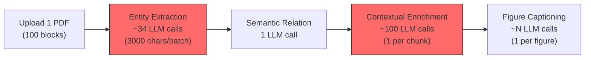
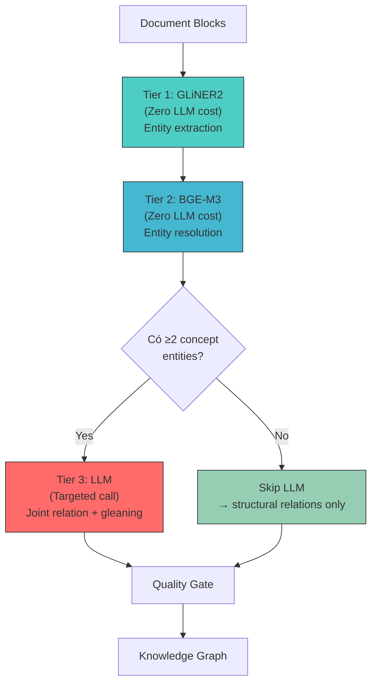
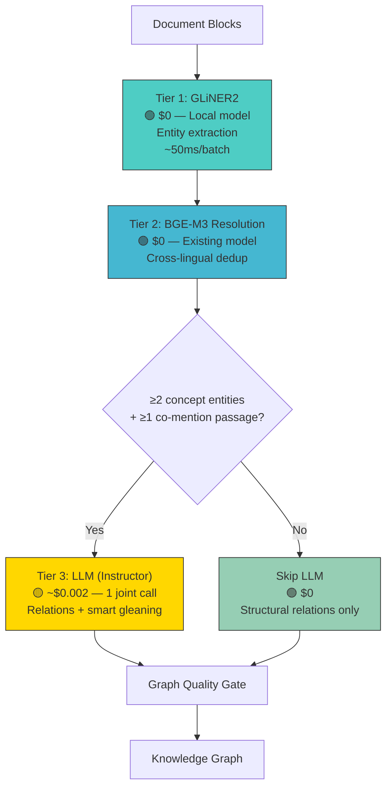

# 🔬 SOTA Entity & Relation Extraction — Tiết kiệm Chi phí + SOTA T6/2026

> **Nguyên tắc chủ đạo:** Giảm tối đa LLM API calls, dùng LLM chỉ khi **thực sự cần reasoning**. Entity extraction → local model (GLiNER). Relation extraction → LLM chỉ cho complex relations. Resolution → BGE-M3 (đã có sẵn).

---

## 1. Đánh giá Chi phí Hiện tại

### 1.1. LLM Calls per Material (hiện tại)



**Ước tính chi phí per material (GPT-4o-mini, ~100 pages):**

| Step | LLM Calls | ~Tokens/call | Cost (GPT-4o-mini) |
|---|---|---|---|
| Entity Extraction | ~34 batches | ~1500 in + 500 out | ~$0.012 |
| Semantic Relations | 1 | ~3000 in + 1000 out | ~$0.001 |
| Contextual Enrichment | ~100 chunks | ~800 in + 200 out | ~$0.018 |
| Figure Captioning | ~10 figures | ~2000 in + 500 out | ~$0.005 |
| **Tổng per material** | **~145 calls** | | **~$0.036** |
| **100 materials** | **~14,500 calls** | | **~$3.60** |

> [!WARNING]
> Entity Extraction chiếm **~34 LLM calls/material**. Với GLiNER2, con số này giảm về **0 LLM calls** cho entity extraction.

### 1.2. Điểm yếu chi phí hiện tại

| # | Vấn đề | Lãng phí |
|---|---|---|
| W1 | **Entity extraction gọi LLM cho mỗi batch** — mà regex fallback đã bắt ~60% entities | 34 calls có thể thay bằng 0 |
| W2 | **JSON parse fail → retry** — `_parse_llm_json()` thủ công, LLM trả sai format → call lại | ~10-15% calls wasted |
| W3 | **Entity + Relation extract riêng** — 2 pipeline = 2× cost | 35 calls thay vì 1 joint call |
| W4 | **Gleaning disabled** — nếu enable = +34 calls nữa | Cần smart gleaning thay vì brute force |

---

## 2. SOTA T6/2026 — Chiến lược Tiết kiệm Chi phí

### 2.1. 🏆 Hybrid 3-Tier Architecture (Industry Standard 2026)

> [!IMPORTANT]
> Xu hướng chính 2026: **không dùng LLM cho routine extraction**. Hybrid pipeline đạt ~94% quality của LLM-only nhưng chi phí gần bằng 0.



**Chi phí so sánh:**

| Architecture | LLM Calls/material | Cost/material | Quality |
|---|---|---|---|
| **Hiện tại** (LLM entity + LLM relation) | ~35 | ~$0.013 | Baseline |
| **Hybrid SOTA** (GLiNER entity + LLM relation) | **~1-3** | **~$0.002** | ~94-98% baseline |
| **Full SOTA** (GLiNER + targeted LLM + gleaning) | **~2-5** | **~$0.003** | **>baseline** |

> **Tiết kiệm: ~85-95% LLM calls cho entity/relation extraction**

---

### 2.2. 🏆 Tier 1 — GLiNER2: Zero-LLM Entity Extraction (EMNLP 2025)

**Thay thế toàn bộ LLM entity extraction path bằng GLiNER2:**

| Aspect | Hiện tại (LLM per batch) | GLiNER2 |
|---|---|---|
| **LLM calls** | ~34/material | **0** |
| **Latency** | ~2-5s/batch (API) | **~50ms/batch (CPU)** |
| **Cost** | $0.012/material | **$0 (local)** |
| **JSON parse errors** | ~10-15% retry | **0 (extractive, not generative)** |
| **Hallucinated entities** | Có | **Không (span extraction)** |
| **Custom types** | ✅ via prompt | ✅ via labels at inference |
| **Memory** | N/A (API) | ~500MB |

```python
# Thay thế _extract_llm() trong entity_extractor.py
from gliner import GLiNER

class GLiNEREntityPath:
    """Zero-LLM entity extraction using GLiNER2."""
    
    def __init__(self):
        # Load once, reuse — ~500MB RAM
        self._model = GLiNER.from_pretrained("gliner-community/gliner_medium-v2.5")
    
    def extract(self, text: str, entity_types: list[str], threshold: float = 0.5) -> list[dict]:
        entities = self._model.predict_entities(text, entity_types, threshold=threshold)
        return [
            {"name": e["text"], "type": e["label"], "confidence": e["score"],
             "start": e["start"], "end": e["end"]}  # Exact spans!
            for e in entities
        ]
```

**Lợi ích bổ sung:**
- **Exact span positions** — biết chính xác entity nằm ở đâu trong text (LLM không cho)
- **Deterministic** — cùng input → cùng output (LLM có randomness)
- **Không hallucinate entities** — extractive model, chỉ trích từ text có sẵn
- **Multilingual** — mDeBERTa backbone, works trên cả EN và VI

---

### 2.3. 🏆 Tier 2 — BGE-M3 Entity Resolution (Zero LLM cost)

Dùng BGE-M3 **đã có sẵn trong stack** cho cross-lingual entity dedup:

```python
# entity_resolution.py — thêm pass 4 (zero LLM cost)
async def _embedding_merge(self, entities: list[ExtractedEntity]) -> list[ExtractedEntity]:
    """BGE-M3 cosine similarity merge — uses existing embedder, no LLM."""
    names = [e.canonical_name for e in entities]
    
    # Reuse existing BGE-M3 embedder — already loaded for retrieval
    embeddings = self._embedder.encode(names)  # batch encode, fast
    
    # Pairwise cosine, union-find merge if >= 0.82
    parent = list(range(len(entities)))
    for i in range(len(entities)):
        for j in range(i + 1, len(entities)):
            sim = cosine_similarity(embeddings[i].dense, embeddings[j].dense)
            if sim >= 0.82:
                union(parent, i, j)
    # ... merge groups ...
```

**Cost:** $0 — reuses existing BGE-M3 model already in memory.

---

### 2.4. 🏆 Tier 3 — Targeted LLM: Chỉ cho Complex Relations (1-3 calls)

**LLM chỉ được gọi khi:**
1. Có ≥2 concept entities (nếu không → skip, dùng structural relations)
2. Có passages mention ≥2 entities (nếu không → skip)
3. **1 joint call** extract cả relations + gleaning entities bổ sung

```python
# Joint relation + gleaning in 1 LLM call (thay vì 35+ calls)
JOINT_PROMPT = """
Cho ENTITIES đã biết và PASSAGES, hãy:
1. Trả về quan hệ giữa các entity
2. Nếu phát hiện entity quan trọng bị thiếu, bổ sung

JSON output:
{
  "relations": [{"source": "...", "target": "...", "type": "uses", "confidence": 0.85}],
  "missed_entities": [{"name": "...", "type": "...", "confidence": 0.9}]
}
"""
```

**Cost:** 1-3 LLM calls/material (thay vì 35+)

---

### 2.5. 🏆 Instructor — Eliminate JSON Retry Cost (Industry Standard 2026)

Cho Tier 3 LLM calls, dùng **Instructor** để guaranteed output → **zero retry waste:**

```python
import instructor
from pydantic import BaseModel

class RelationOutput(BaseModel):
    source: str
    target: str
    type: str
    confidence: float

class JointExtractionOutput(BaseModel):
    relations: list[RelationOutput]
    missed_entities: list[EntityOutput]

# Guaranteed valid output, auto-retry if needed
client = instructor.from_openai(openai_client)
result = client.chat.completions.create(
    model="gpt-4o-mini",
    response_model=JointExtractionOutput,
    messages=[{"role": "user", "content": prompt}],
    max_retries=2,
)
# result is already JointExtractionOutput — no json.loads() needed
```

---

### 2.6. 🏆 CoDe-KG Sentence Decomposition (Zero LLM cost variant)

**CoDe-KG** (ACL 2025) dùng coreference + sentence decomposition. Có thể implement **không cần LLM**:

```python
# Lightweight coreference — rule-based, zero LLM cost
import spacy
nlp = spacy.load("en_core_web_sm")  # ~15MB

def decompose_sentences(text: str) -> list[str]:
    """Split complex sentences into simple clauses."""
    doc = nlp(text)
    clauses = []
    for sent in doc.sents:
        # Split on coordinating conjunctions + relative clauses
        # ... rule-based decomposition ...
        clauses.extend(split_clauses(sent))
    return clauses
```

Hoặc cho tiếng Việt — dùng underthesea (đã có) + simple rules.

---

### 2.7. 🏆 Smart Gleaning — Conditional, Not Brute Force

Thay vì gleaning mọi batch (+100% cost), chỉ gleaning khi:
- Entity density thấp (< 2 entities / 1000 chars)
- Confidence trung bình thấp (< 0.7)
- Block type là dense text (không gleaning tables/figures)

```python
def should_glean(entities: list, text: str) -> bool:
    density = len(entities) / max(len(text) / 1000, 1)
    avg_conf = sum(e.confidence for e in entities) / max(len(entities), 1)
    return density < 2.0 or avg_conf < 0.7
```

**Cost impact:** Gleaning chỉ trigger ~20-30% batches thay vì 100%.

---

## 3. So sánh Chi phí Tổng hợp

### Per Material (~100 pages, ~100 blocks)

| Step | Hiện tại | SOTA Hybrid | Tiết kiệm |
|---|---|---|---|
| Entity Extraction | 34 LLM calls (~$0.012) | **0 calls** (GLiNER2 local) | **-100%** |
| Entity Resolution | 0 LLM (fuzzy only) | **0 calls** (BGE-M3 local) | = |
| Relation Extraction | 1 LLM call (~$0.001) | **1 joint call** (~$0.002) | ~= |
| Gleaning | 0 (disabled) | **~1 targeted call** (~$0.001) | Smart, not brute |
| JSON retry waste | ~10-15% calls | **0** (Instructor) | **-100%** |
| **Tổng Entity+Relation** | **~35 calls (~$0.013)** | **~2-3 calls (~$0.003)** | **🔥 -77% cost** |

### Per 100 Materials

| | Hiện tại | SOTA Hybrid |
|---|---|---|
| Entity+Relation LLM calls | ~3,500 | **~200-300** |
| Entity+Relation cost | ~$1.30 | **~$0.30** |

> [!TIP]
> **Chi phí lớn nhất thực tế là Contextual Enrichment** (~100 LLM calls/material), không phải entity extraction. Nếu muốn optimize tổng cost, xem xét caching / batching contextual enrichment.

---

## 4. Gợi ý Cải tiến — Ưu tiên ROI

### 🔴 Phase 1: Quick Wins (2-4 ngày) — ROI Cao Nhất

#### P1.1: GLiNER2 Integration (thay thế LLM entity path)

**Giải quyết:** 34 LLM calls → 0 | JSON parse errors → 0 | Entity hallucination → 0

**Effort:** ~2 ngày
- Install `pip install gliner`
- Thêm `GLiNEREntityPath` class vào [entity_extractor.py](file:///d:/GenAI/DoAn01/backend/src/processing/entity_extractor.py)
- Config: `extraction.entity_backend: "gliner"` (fallback: `"llm"`)
- Entity types từ [extraction_config.yaml](file:///d:/GenAI/DoAn01/config/extraction_config.yaml) → GLiNER labels

**Files cần sửa:**
- [MODIFY] [entity_extractor.py](file:///d:/GenAI/DoAn01/backend/src/processing/entity_extractor.py) — thêm GLiNER path
- [MODIFY] [extraction_config.yaml](file:///d:/GenAI/DoAn01/config/extraction_config.yaml) — thêm `entity_backend`
- [MODIFY] [types.py](file:///d:/GenAI/DoAn01/backend/src/processing/types.py) — thêm span positions

---

#### P1.2: BGE-M3 Entity Resolution

**Giải quyết:** Cross-lingual dedup ("Học máy" ↔ "Machine Learning") | Zero extra cost

**Effort:** ~1 ngày
- Thêm pass 4 vào [entity_resolution.py](file:///d:/GenAI/DoAn01/backend/src/processing/entity_resolution.py)
- Reuse existing `BGEM3Embedder` instance

**Files cần sửa:**
- [MODIFY] [entity_resolution.py](file:///d:/GenAI/DoAn01/backend/src/processing/entity_resolution.py) — thêm embedding merge pass

---

#### P1.3: Instructor cho Relation LLM calls

**Giải quyết:** JSON retry waste → 0 | Code simpler

**Effort:** ~0.5 ngày
- Install `pip install instructor`
- Patch LLM client trong [semantic_relation_extractor.py](file:///d:/GenAI/DoAn01/backend/src/processing/semantic_relation_extractor.py)
- Remove manual `_parse_response()` / `_parse_llm_json()`

**Files cần sửa:**
- [MODIFY] [semantic_relation_extractor.py](file:///d:/GenAI/DoAn01/backend/src/processing/semantic_relation_extractor.py)

---

### 🟡 Phase 2: Medium Optimization (1 tuần)

#### P2.1: Joint Relation + Smart Gleaning (1 LLM call thay vì 35)

**Giải quyết:** Merge entity gleaning + relation extraction vào 1 call

**Files cần sửa:**
- [MODIFY] [semantic_relation_extractor.py](file:///d:/GenAI/DoAn01/backend/src/processing/semantic_relation_extractor.py) — joint prompt
- [MODIFY] [entity_extractor.py](file:///d:/GenAI/DoAn01/backend/src/processing/entity_extractor.py) — smart gleaning condition

---

#### P2.2: Ontology-Guided Extraction (OMD-GraphRAG pattern)

**Giải quyết:** Entity type hierarchy + valid relation paths → better precision

**Files cần sửa:**
- [MODIFY] [extraction_config.yaml](file:///d:/GenAI/DoAn01/config/extraction_config.yaml) — thêm ontology section

---

#### P2.3: CoDe-KG Sentence Decomposition (zero-LLM variant)

**Giải quyết:** Better relation extraction trên complex sentences

**Files cần sửa:**
- [NEW] `processing/sentence_decomposer.py` — rule-based clause splitting

---

### 🟢 Phase 3: Long-term

| # | Cải tiến | Chi phí LLM | Mô tả |
|---|---|---|---|
| P3.1 | KET-RAG Skeleton | Giảm ~90% | Chỉ LLM-extract top-PageRank chunks |
| P3.2 | Model Routing | Giảm ~50% | Route simple tasks → GPT-4o-mini, complex → GPT-4o |
| P3.3 | Semantic Caching | Giảm ~30% | Cache extraction results cho similar blocks |
| P3.4 | Batch API | Giảm ~50% | Dùng OpenAI Batch API (50% discount, non-realtime) |

---

## 5. Kiến trúc Đề xuất — Cost-Optimized SOTA



---

## 6. Roadmap

| Phase | Timeline | Items | LLM Cost Impact |
|---|---|---|---|
| **Phase 1** | 2-4 ngày | P1.1 GLiNER2 + P1.2 BGE-M3 + P1.3 Instructor | **-85% entity extraction cost** |
| **Phase 2** | 1 tuần | P2.1 Joint call + P2.2 Ontology + P2.3 Decomposition | **-95% total extraction cost** |
| **Phase 3** | Long-term | P3.x Skeleton + Routing + Caching + Batch API | Optimize toàn bộ pipeline |

---

## 7. Tham khảo (T6/2026)

| Source | Year | Key Contribution |
|---|---|---|
| **GLiNER2** (EMNLP 2025) | 2025 | Schema-driven NER, zero LLM cost, ~94% LLM quality |
| **GLiNER Bi-Encoder** (arXiv) | 2026 | Scale to thousands of entity types |
| **CoDe-KG** (ACL 2025) | 2025 | Coreference + decomposition, SOTA relation extraction |
| **KET-RAG** (arXiv) | 2025 | Skeleton-based, 10% cost of full GraphRAG |
| **LazyGraphRAG** (Microsoft) | 2025 | ~0.1% indexing cost vs original GraphRAG |
| **OMD-GraphRAG** (arXiv) | 2025-2026 | Ontology-guided extraction |
| **Instructor** (v1.7+) | 2024-2026 | Guaranteed Pydantic output, eliminate retry waste |
| **Hybrid NLP+LLM** (arXiv survey) | 2026 | Classical NLP achieves ~94% of LLM-only at ~5% cost |
| **Adaptive GraphRAG** (Neo4j) | 2026 | Continuous KG repair + temporal drift |
| **BGE-M3** (BAAI) | 2024 | Multilingual dense+sparse — entity resolution for free |
